

  

 

| **Resultados de aprendizaje de la unidad didáctica:** |
|-|
| **RA. 1:** Planifica la creación de una interfaz web valorando y aplicando especificaciones de diseño.|

|**Criterios de evaluación de la unidad didáctica:**|
|-|
| **CE. a&#41;** Se ha reconocido la importancia de la comunicación visual y sus principios básicos.|
| **CE. b&#41;** Se han analizado y seleccionado los colores y tipografías adecuados para su visualización en pantalla.|
| **CE. c&#41;** Se han analizado alternativas para la presentación de la información en documentos web.|
| **CE. d&#41;** Se ha valorado la importancia de definir y aplicar la guía de estilo en el desarrollo de una aplicación web.|
| **CE. e&#41;** Se han utilizado y valorado distintas tecnologías para el diseño de documentos web.|
| **CE. f&#41;** Se han creado y utilizado plantillas de diseño.|

 

| **Licencia Creative Commons:** ||
| - | - |
|  | **Reconocimiento-NoComercial-CompartirIgual CC BY-NC-SA:** No se permite un uso comercial de la obra original ni de las posibles obras derivadas, la distribución de la cuales se debe hace con una licencia igual a la que regula la obra original. |
---  
 

# 1. Introducción
Las aplicaciones y sitios web son esenciales en nuestra vida diaria para consultar información, gestionar trámites o comunicarnos. 
Independientemente del dispositivo, la web representa la imagen de una entidad, por eso es crucial que el contenido y las funcionalidades sean atractivos, accesibles y fáciles de usar (User Experience), con un diseño agradable que capte la atención del usuario (User Interface). 

# 2. Evolución del diseño web
 

 

>**1991-1994 inicios de la web**  
- **1991:** Tim Berners-Lee crea la primera página web con solo texto y enlaces en HTML.  
- **1993:** Aparece el primer navegador gráfico, Mosaic, permitiendo imágenes junto con texto.  
- **1994:** Netscape Navigator introduce mejoras en el renderizado de páginas y establece el estándar de navegación.  
 

>**1995-1999: HTML y el diseño en tablas**  
- **1995:** Se lanza JavaScript, permitiendo interactividad en el navegador.  
- **1996:** Aparece CSS (Cascading Style Sheets) para separar contenido y presentación. También surge Flash, revolucionando la animación en la web.  
- **1997:** HTML 4.0 se populariza con el uso de tablas para estructurar páginas web.  
- **1998:** Google aparece y cambia la forma de buscar información en la web.  
- **1999:** Se consolida el uso de Flash y JavaScript en la creación de interfaces interactivas.  
 

>**2000-2006: CSS y el auge del diseño web**  
- **2000:** Se adopta CSS para diseños, reemplazando las tablas.  
- **2003:** Aparece WordPress, facilitando la creación de sitios web sin necesidad de programar.  
- **2004:** Se popularizan las técnicas de diseño líquido y adaptable.  
- **2005:** Nace AJAX, permitiendo recargar contenido sin necesidad de actualizar la página completa.  
 

>**2007-2012: Móviles y responsive design**  
- **2007:** Apple lanza el iPhone.  
- **2010:** Ethan Marcotte introduce el término **Responsive Web Design (RWD)**, impulsando el diseño adaptable a cualquier dispositivo.  
- **2011:** HTML5 y CSS3 se consolidan, permitiendo animaciones sin Flash.  
- **2012:** Se expande el diseño minimalista con estilos planos y colores vibrantes.  
 

>**2013-2019: UI/UX, frameworks y accesibilidad**  
- **2013:** Google presenta Material Design, estableciendo un estándar visual con sombras y animaciones realistas.  
- **2015:** Se popularizan frameworks como Bootstrap y Foundation para acelerar el desarrollo web.  
- **2016:** La velocidad y la accesibilidad se convierten en prioridades con la optimización para SEO y Core Web Vitals.  
- **2019:** Dark mode se convierte en una tendencia en muchas interfaces web.  
 

>**2020-presente: IA, diseño sin código y Web 3.0**  
- **2020:** Herramientas como Webflow y Figma facilitan la creación de sitios sin necesidad de programar.  
- **2022:** La IA empieza a usarse para generar diseños y mejorar la experiencia del usuario.  
- **2024-2025:** Web 3.0, con blockchain y aplicaciones descentralizadas, empieza a redefinir la propiedad y seguridad en la web.  
 

# 3. Definiciones
>**Interacción Persona-Ordenador (IPO)**  

La **Interacción Persona-Ordenador (IPO)** es la ciencia que estudia la relación entre los seres humanos y los sistemas informáticos. Su objetivo principal es diseñar interfaces que permitan una comunicación eficiente, intuitiva y accesible entre los usuarios y las computadoras.  

Dentro de la IPO encontramos:  
- **Ergonomía y usabilidad**: Se busca que los sistemas sean fáciles de usar y reduzcan la carga cognitiva del usuario.  
- **Modelos de interacción**: Analiza cómo las personas perciben, aprenden y usan la tecnología.  
- **Diseño centrado en el usuario**: Enfatiza la importancia de diseñar software basado en las necesidades y comportamientos del usuario final.  
- **Accesibilidad**: Considera a usuarios con diferentes capacidades físicas o cognitivas para garantizar una experiencia inclusiva.  

 

>**Interfaz de Usuario (UI - User Interface)**  

  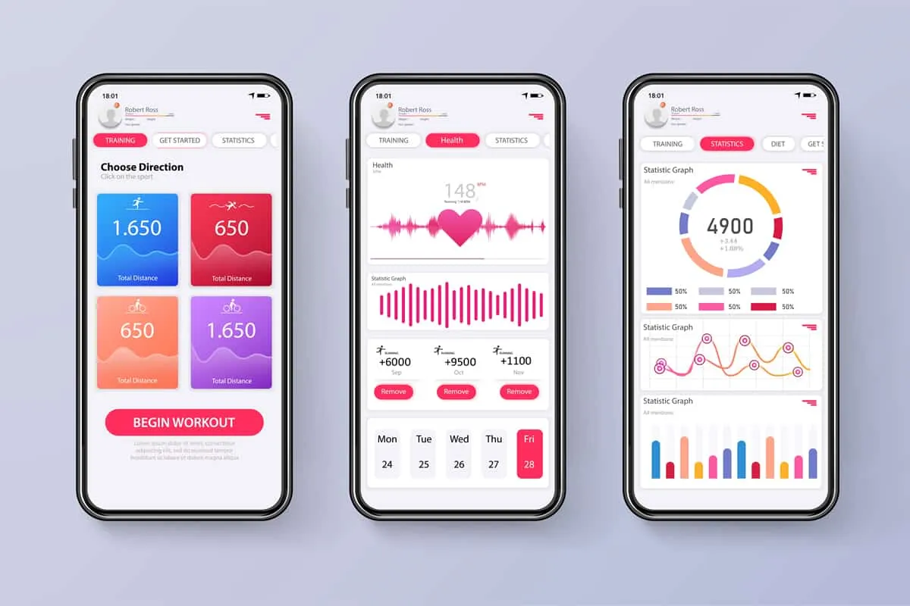

 

La **Interfaz de Usuario** es el medio a través del cual los usuarios interactúan con un sistema o aplicación. Puede incluir elementos visuales, táctiles y auditivos. Existen distintos tipos de interfaces:  

- **Interfaz gráfica (GUI - Graphical User Interface)**: Es la más común y se compone de menús, iconos y ventanas.  
- **Interfaz de línea de comandos (CLI - Command Line Interface)**: Utilizada principalmente por usuarios avanzados, no está diseñada para el gran público.  
- **Interfaces de voz (VUI - Voice User Interface)**: Usadas en asistentes virtuales como Alexa o Google Assistant.  
- **Interfaces hápticas**: Basadas en el tacto, como los dispositivos con retroalimentación por vibración.  

 

>**Experiencia de Usuario (UX - User Experience)** 

  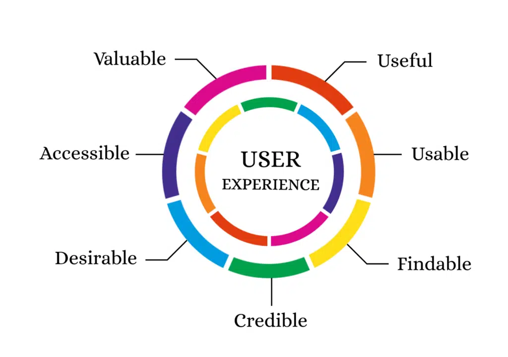

 

La **Experiencia de Usuario (UX)** abarca todos los aspectos de la interacción de una persona con un producto o servicio digital. Va más allá de la interfaz y se enfoca en la percepción global del usuario sobre la usabilidad, accesibilidad y satisfacción con el sistema.  

Los principales factores que influyen en la UX son:  
- **Usabilidad**: Facilidad con la que el usuario puede aprender y utilizar el sistema.  
- **Diseño visual**: La estética y la disposición de los elementos en la interfaz.  
- **Accesibilidad**: Adaptabilidad para usuarios con diversas capacidades.  
- **Flujo de interacción**: La estructura lógica de la navegación dentro de la aplicación o sitio web.  
- **Emoción y confianza**: La percepción del usuario sobre la seguridad y eficiencia del sistema.  

# 4. Componentes de una interfaz web
La **interfaz web** o **interfaz de usuario** es el punto de interacción entre el usuario y un sitio web o una aplicación. Para que sea efectiva, debe ser intuitiva, accesible y atractiva. 

Muchos de los componentes de una interfaz web, como la cabecera, los menús de navegación, el cuerpo, la barra lateral y el pie de página, se replican en la mayoría de los sitios web.  

  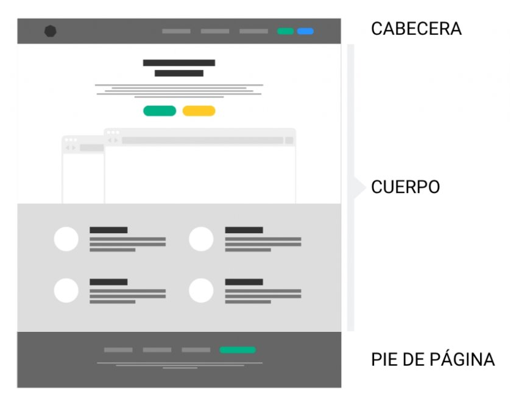

 

Si convertimos esta estructura a código HTML, obtendremos el siguiente resultado.

  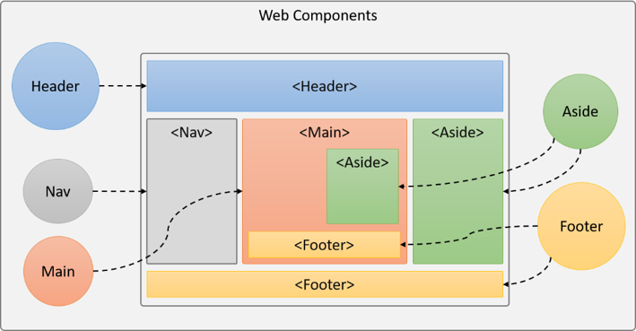

 

A continuación, se enumeran los componentes clave que toda interfaz web debe incorporar y su ubucación dentro de los elementos citados anteriormente:  

## 4.1. - Elementos de identificación  
Los elementos de identificación son aquellos que permiten a los usuarios reconocer y recordar un sitio web específico. Su función principal es establecer la identidad visual y de marca, facilitando la navegación y la confianza del usuario.

- **Logotipo:** Un buen diseño es crucial para el recuerdo y la identidad visual.  
- **Nombre de dominio:** Debe ser claro y fácil de recordar.  
- **Título de la página:** Aparece en la pestaña del navegador y en **los resultados de búsqueda**. Debe ser conciso y descriptivo del contenido de la página.  
- **Imagen de cabecera:** Generalemente, aparece en la parte superior de la página y ayuda a entender el contenido de la web.  
- **Elementos de marca:** Incluyen colores, tipografía y otros elementos visuales que refuerzan la identidad corporativa de una marca.  
- **Favicon:** Icono que aparece en la pestaña del navegador junto al título de la página.  

## 4.2. - Elementos de navegación y acceso a contenidos  
Son los elementos encargados de organizar la información y permiten acceder de forma rápida e intuitiva a los diversos contenidos del sitio:  

- **Cabecera (Header):** Zona de la interfaz web situada en la parte superior y que sirve para identificar la empresa o marca. 
- **Barra de navegación (Navbar):** Menú que facilita el acceso a las diferentes secciones del sitio.
- **Menús y submenús**: Dentro de la barra de navegación, podemos encontrar listas de opciones, organizadas jerárquicamente para mejorar la experiencia de navegación.  
- **Barra lateral (sidebar):** La barra lateral es una área ubicada a la izquierda o derecha del contenido principal y contiene información adicional, enlaces a otras páginas o secciones...
- **Cuerpo de la página:** Parte en la cual se muestran los contenidos.  
- **Pie de página (Footer)**: Contiene enlaces, términos de uso y redes sociales.  

## 4.3. - Elementos de ordenación de contenidos  
Son los componentes que presentan la información al usuario:  

🔹📝 **Encabezados y texto**: Estructuran la jerarquía del contenido.  
🔹📸 **Imágenes e íconos**: Refuerzan el mensaje visual y mejoran la estética del sitio.  
🔹🎬 **Videos y multimedia**: Se utilizan para presentar información de manera más dinámica.  
🔹📂 **Tablas y listas**: Organizan la información en formatos estructurados.  

## 4.4. - Elementos Interactivos  
Facilitan la interacción del usuario con la web, entre ellos tenemos:  

🔹🖱 **Botones**: Permiten realizar acciones como enviar formularios o navegar entre páginas.  
🔹📩 **Formularios y campos de entrada**: Recolectan la información del usuario y realizan consultas a bases de datos.  
🔹🔁 **Sliders y carruseles**: Muestran contenido de forma dinámica en un espacio reducido.  
🔹📌 **Pestañas y acordeones**: Organizan contenido en secciones colapsables para mejorar la usabilidad.  
🔹🎛 **Modales y pop-ups**: Ventanas emergentes que muestran información adicional o alertas.  

## 4.5. - Elementos de Retroalimentación  
En todo momento, informan al usuario del estado de sus acciones o consultas:  

🔹✅ **Mensajes de éxito o error**: Notificaciones sobre el resultado de una acción, como el envío de un formulario.  
🔹📢 **Tooltips y ayudas**: Pequeños textos emergentes que explican el uso de un elemento.  
🔹🔄 **Indicadores de carga (Spinners, progress bars)**: Informan sobre el estado de procesos en ejecución.  

## 4.6. - Tarea RA1-CEa
Elege una página web comercial e identifica sus diferentes componentes.

# 5. Diseño de una interfaz web
Generalmente esta área de desarrollo la llevan a cabo diseñadores gráficos. Entre sus tareas, destacan:
 1. Función estética.
 2. Función publicitaria.
 3. Función comunicativa.

Dentro de los elementos del diseño de interfaces se distinguen cuatro grupos: 

## 5.1. - Elementos conceptuales
**Los elementos conceptuales** son aquellos que son presentes en el diseño, pero que no son visibles a la vista. El punto, la línea, el plano y el volumen son la base del diseño y sobre ellos se asientan los otros elementos.

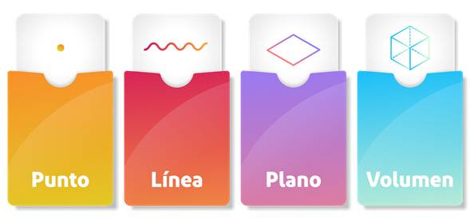

>**Ejercicio**  
Identificar los elementos conceptuales de la siguiente página web.

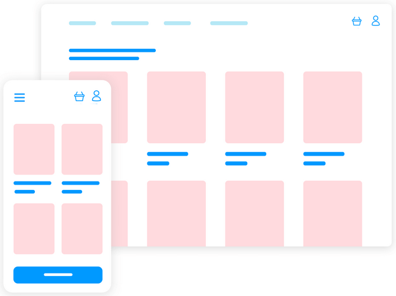

## 5.2. - Elementos visuales
En el diseño web, los elementos visuales fundamentales incluyen **forma, color, medida y textura**.  

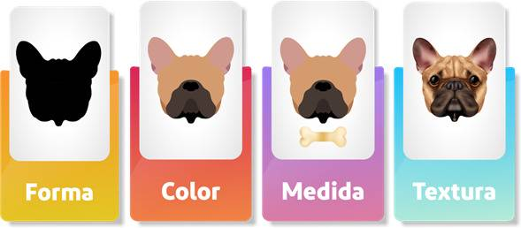

### 5.2.1. - Forma  
Define la estructura visual de los elementos dentro de una página web. Puede ser:  
- **Geométrica**: Cuadrados, círculos, triángulos, usados en botones, iconos o tarjetas. 

- **Orgánica**: Formas irregulares o naturales, aportan dinamismo y originalidad.  
<a href="http://www.sageblue.com/">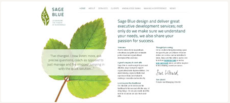</a>

- **Abstracta**: Se utilizan para generar impacto visual sin representar objetos reales.  
<a href="https://lovefreelancing.com/">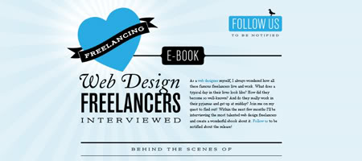</a>

### 5.2.2. - Color  
Influye en la percepción y la emoción del usuario. Se utiliza para:  
- **Generar identidad visual** (branding).  

- **Crear contrastes** y mejorar la accesibilidad.  

- **Diferenciar secciones** o establecer jerarquías.  
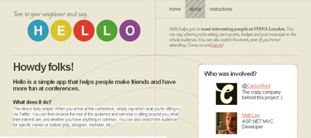

### 5.2.3. - Medida  
Hace referencia al tamaño y la escala de los elementos en una interfaz:  
- **Tipografía**: Tamaños de fuente adaptables para distintos dispositivos o contenidos.
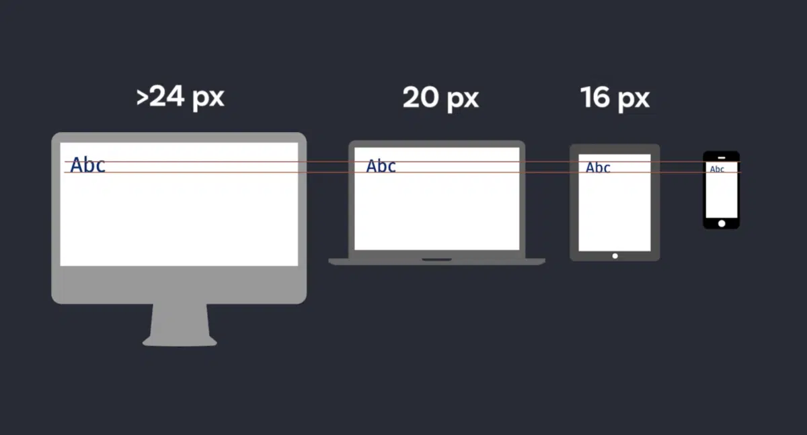

- **Imágenes y gráficos**: Se escalan correctamente para mantener calidad y rendimiento.
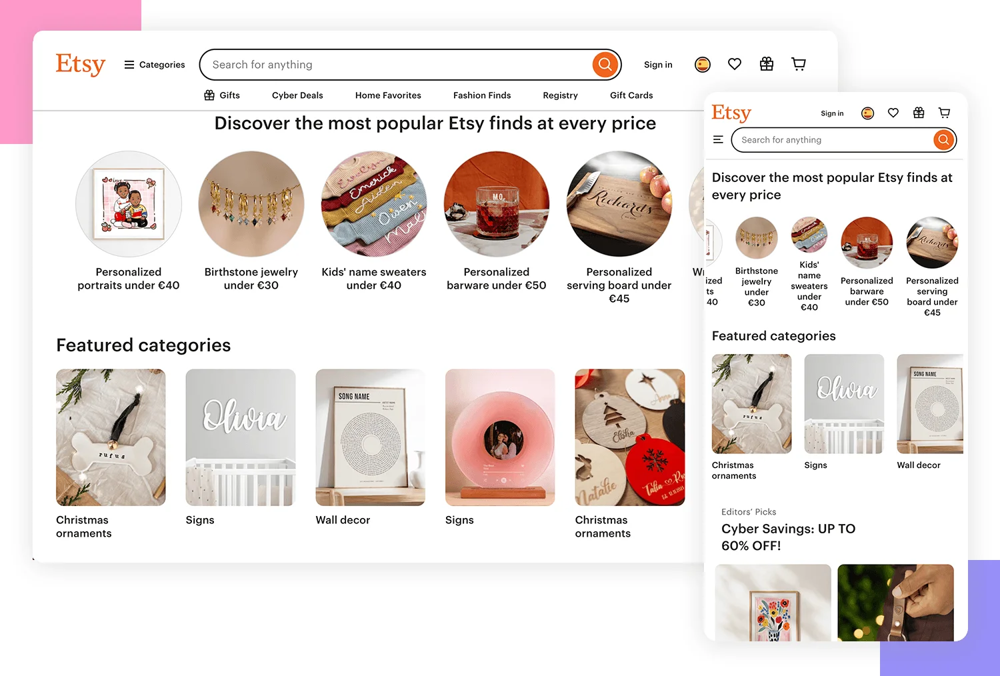

- **Espaciado y proporción**: Márgenes, padding y grids permiten un diseño equilibrado.
  

### 5.2.4. - Textura  
Aunque el diseño web es bidimensional, se pueden simular texturas para dar profundidad y sensación táctil:  
- **Fondos con degradados o patrones** para misterio y sofisticación.  

- **Sombras y efectos de iluminación** para realismo.  

- **Superposiciones y transparencias** para dinamismo.  
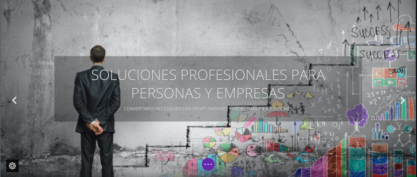

 

### 5.2.5. - Tarea RA1-CEc  
Identificar los errores visuales de las siguientes interfaces web. Comentar el tipo de error encontrado.   

:one: 

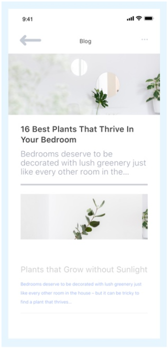

 

:two:

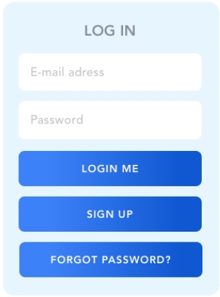

 

:three:

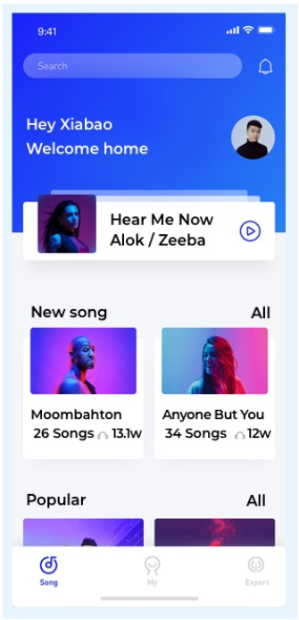

 

:four:

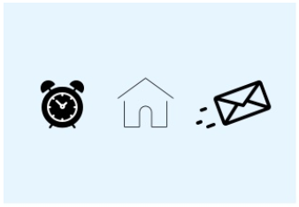

 

:five:

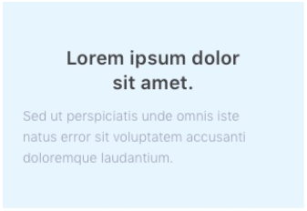

 

:six:

 

:seven:

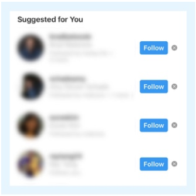

 

:eight:

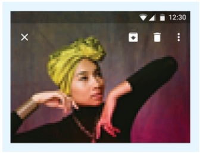

## 5.3. - Elementos de relación
Este grupo de elementos está relacionado con la ubicación y la interrelación de las formas dentro de una composición. La dirección y la posición pueden ser percibidas mientras que el espacio y la gravedad son sentidas.
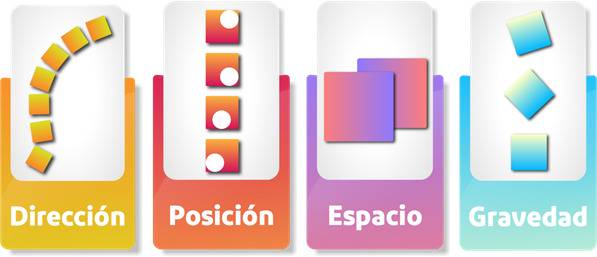

- **Dirección:** Guía la mirada del usuario y se usa para organizar la información y definir el flujo de navegación. Existen tres tipos principales: **Horizontal**, **vertical** y en **diagonal o Z**.   
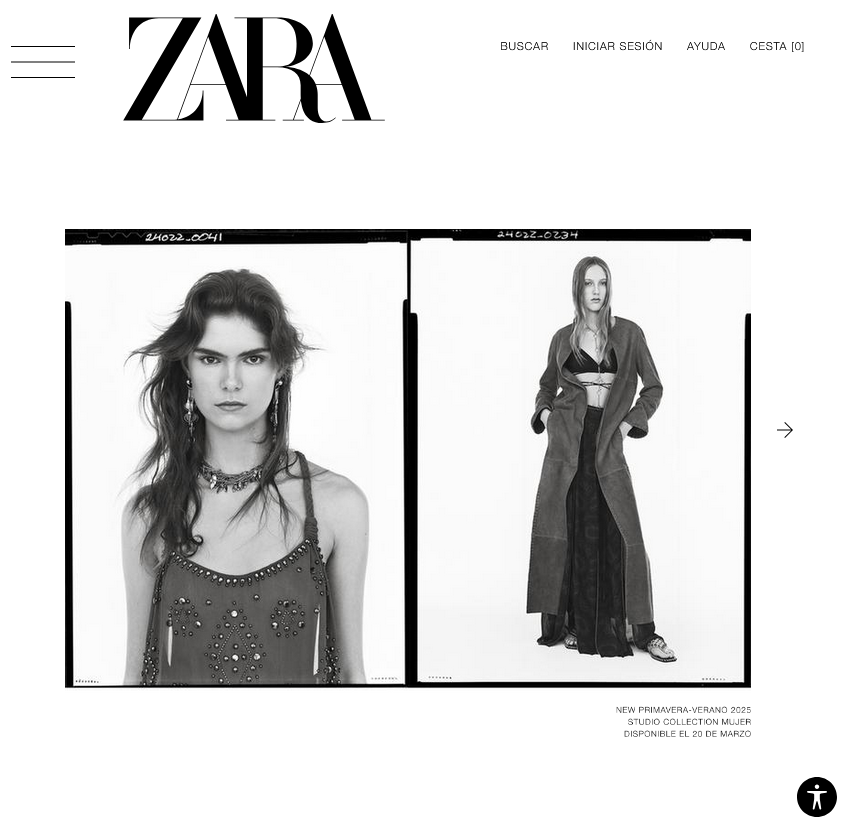

- **Posición:** La posición define dónde se colocan los elementos en la pantalla en relación con otros. Esto afecta la usabilidad y la coherencia visual.  
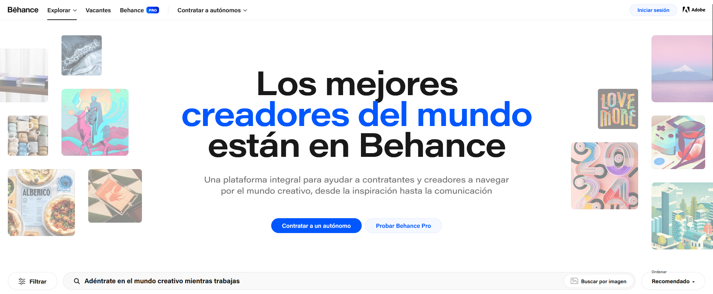

- **Espacio:** El espacio (white space) es fundamental para la legibilidad y la organización del contenido.  
  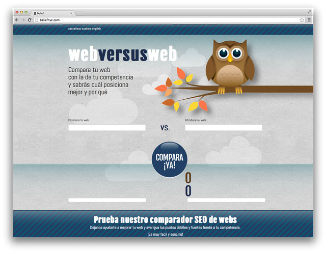

- **Gravedad:** La gravedad visual se refiere a la percepción del peso de los elementos en un diseño. Algunos factores que influyen en ella son: **Tamaño y color**, **sombra y profundidad** y **equilibrio visual**. 
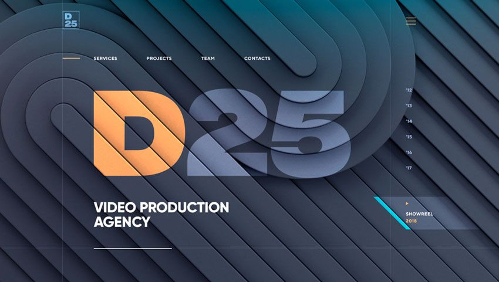

## 5.4. - Elementos prácticos
En el diseño web, los **elementos prácticos** son aquellos que van más allá de la estética y se centran en la comunicación y la experiencia del usuario. Estos incluyen, entre otros, la representación, el significado y la función
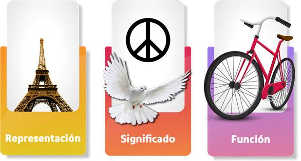

- **Representación:** Se refiere a cómo se presentan los elementos visuales en la interfaz y su relación con la realidad o la abstracción.
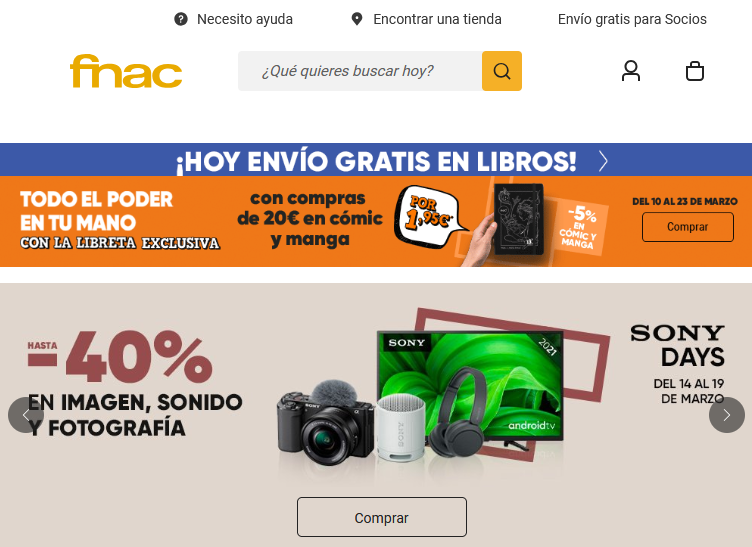

- **Significado:** Es el mensaje o la idea que transmite un elemento dentro del diseño. Puede ser, **explícito** o **implícito**. 

- **Función:** Es el propósito práctico de cada elemento en la interfaz y cómo contribuye a la experiencia del usuario. La función puede ser **informativa**, **interactiva** o **estructural**.
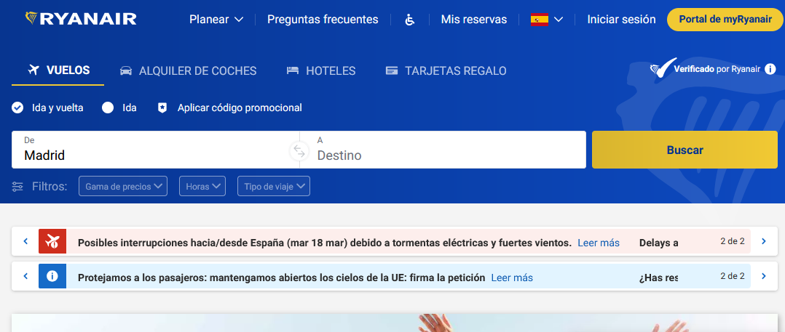

## 5.5. - Patrones de diseño, psicología de la Gestalt
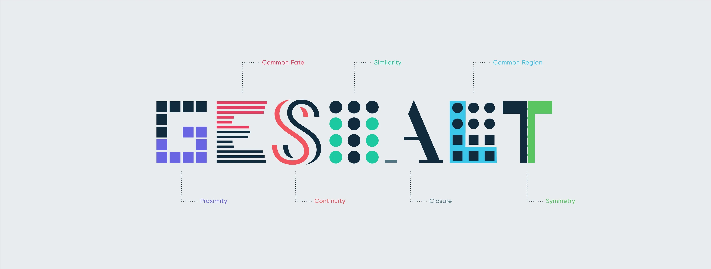

### 5.5.1. - Introducción
La psicología de la Gestalt es una corriente de la psicología moderna, surgida en Alemania a principios del siglo XX, cuyos exponentes más reconocidos fueron Max Wertheimer, Wolfgang Köhler, Kurt Koffka​ y Kurt Lewin.

Su premisa principal es que "el todo es más que la suma de sus partes", es decir, la mente organiza la información **en patrones y estructuras significativas en lugar de procesar elementos aislados**.

### 5.5.2. - Principios de la Gestalt
La Gestalt propone una serie de principios que explican cómo organizamos la información visual y cognitiva. En **el diseño de la UX/UI**, los principios de la Gestalt se aplican para mejorar la experiencia del usuario.

- **Principio de la experiencia**
Este principio se basa en el hecho que la percepción del ser humano está fundamentado de acuerdo **sus propias experiencias**. Así pues, buscaremos que los diseños compartan similitudes con las experiencias de los usuarios.
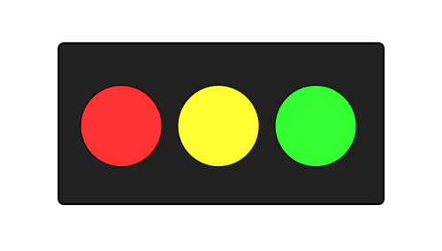
  
    **Iconos de FontAwesome** cuyas acciones identificamos inmediatamente. 
    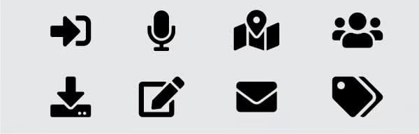
  

- **Principio de simetría**
Las imágenes simétricas son percibidas como iguales, como un solo elemento, en la distancia. 
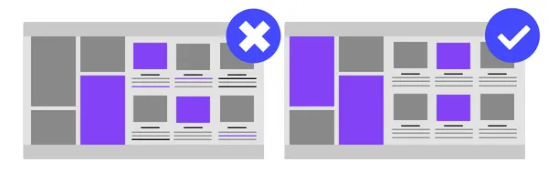
  
    **Contenidos** organizados de forma simetrica. 
    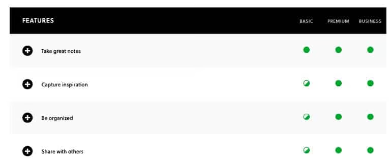
  

- **Principio de proximidad**
Los objetos adjuntos tienden a ser vistos como una unidad. Los estímulos que están próximos tienden a percibirse como parte de la misma unidad.
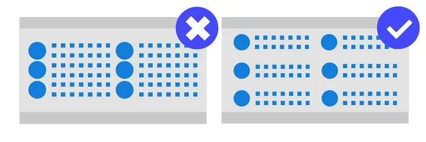
  
    **Organización de contenidos** siguiendo el principio de proximidad. 
    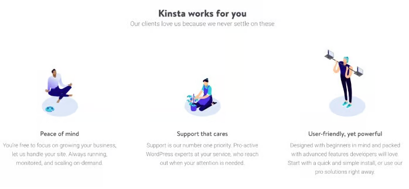
  

- **Principio de similitud**
La mente agrupa los elementos similares en una entidad. La semejanza depende de la forma, del tamaño, del color y de otros aspectos visuales de los elementos. 
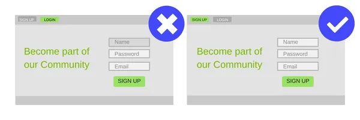
  
    **Similitud** entre 2 secciones de precios.
    
  

- **Principio de continuidad**
Los detalles que mantienen un patrón o dirección tienden a agruparse juntos, como parte de un modelo. Es decir, percibimos elementos continuos, aunque estén interrumpidos entre sí. 
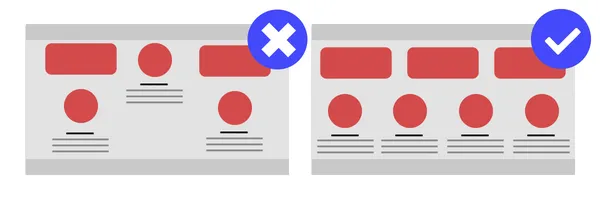
  
    **Percepción de continuidad** del carrusel a pesar de la interrupción abrupta de los contenidos.
    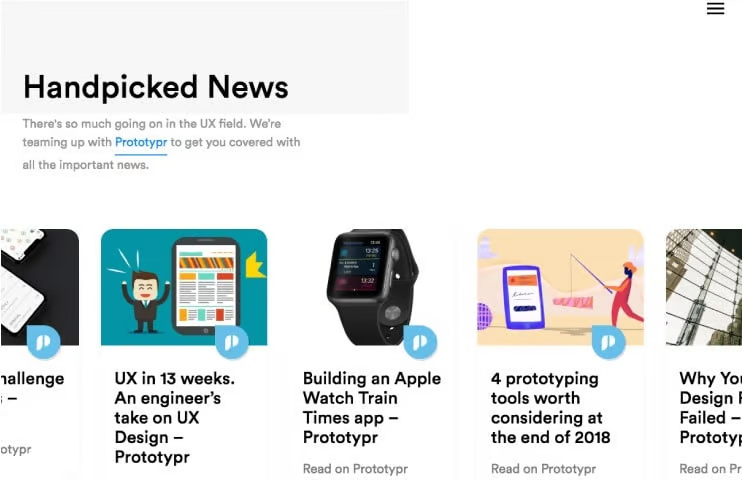
  

- **Principio de simplicidad**
El individuo organiza sus campos perceptuales con rasgos simples y regulares.  
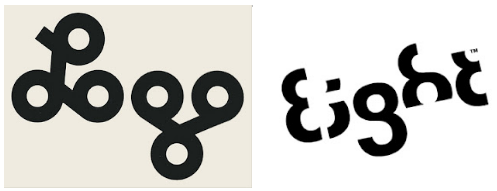
  
    **página simplificada** al máximo para evitar de crear malestar entre los posibles clientes.
    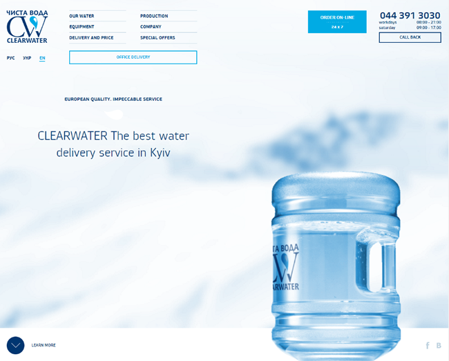
  

- **Principio de dirección común**
Implica que los elementos que parecen construir un patrón o un flujo en la misma dirección se perciben como una figura.
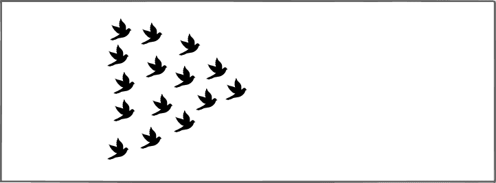  
 
    **Las flechas del carrusel** no indican la posibilidad de movimiento horizontal del elemento.
    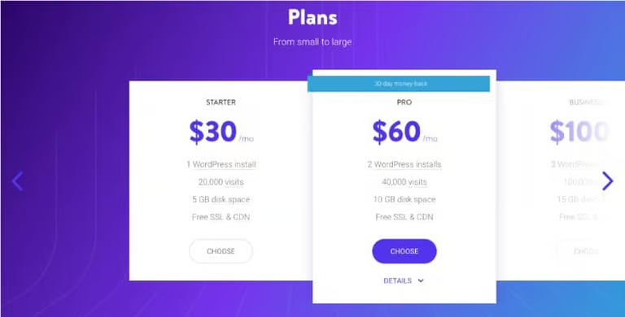
  

- **Principio de Figura y Fondo**
Este principio describe la tendencia del ojo humano a ver y separar los elementos de su entorno. No podemos percibir una misma forma como figura y fondo a la vez. El fondo es todo el que no se percibe como figura.  
 

  
    **El contraste entre figura y fondo** nos hace separar el elemento principal del resto de la imagen.
    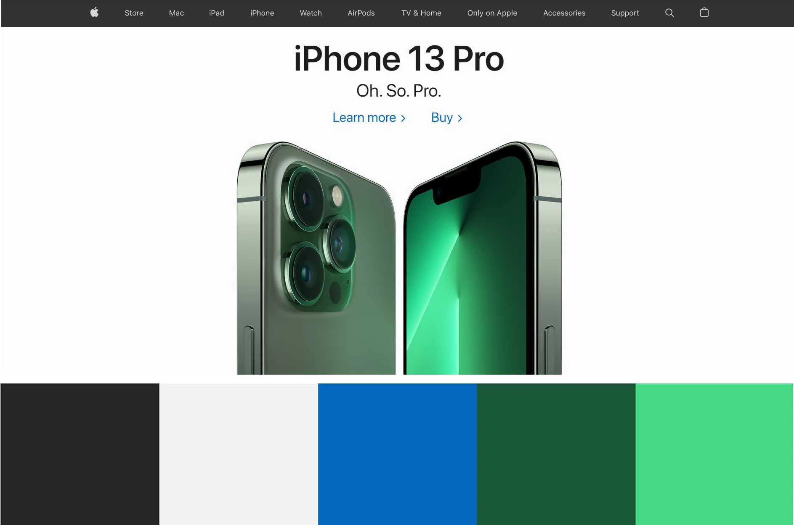
  

- **Principio del cierre**
Es una tendencia del ojo humano a completar una infomración parcial.
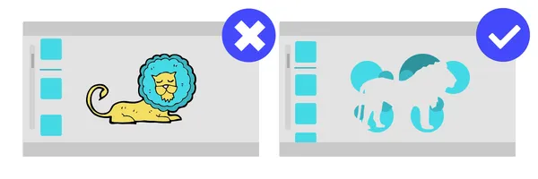
  
    **El contraste de las flechas** nos hace entender que falta información en la página web. 
     
  

## 5.7. - Colores y teoría del color 
El color es el **medio esencial** para tocar las emociones de los visitantes del sitio web porque crea una reacción física y emocional. Los colores son capaces de establecer el tono adecuado (calmar, excitar, estimular a las acciones). 
Cuando se establece un **esquema de color** para el diseño web es importante hacerlo correctamente, guiándose por los principios de la teoría del color.

El color es un **elemento fundamental** en el diseño web, ya que influye en las emociones y reacciones de los visitantes. Puede ayudar a establecer el tono adecuado del sitio (calma, excitación, estímulo a la acción) y generar una conexión emocional con los usuarios. 
Sin embargo, su impacto es más efectivo cuando se combina con otros aspectos del diseño, como la tipografía, la disposición de los elementos y las imágenes. 
Al definir un esquema de color, es importante hacerlo de manera estratégica, basándose en los principios de la **teoría del color** para lograr una experiencia visual coherente y atractiva. 

### 5.7.1. - Círculo cromático

El círculo cromático es una herramienta indispensable para diseñadores. Consiste en 6 colores básicos (rojo, naranja, amarillo, verde, azul y violeta).  
Para elegir una gama o mezcla armoniosa, hay que elegir dos colores opuestos entre sí (por ejemplo 1 y 2), y otros 2 igualmente espaciados entre sí (p.e. 3 y 4).
Al final obtendremos el triángulo de colores de la figura también llamado **esquema de colores**.

Para este ejemplo distinguiremos:
- Colores primarios: **Rojo**, **amarillo** y **azul**.  
- Colores secundarios: **Naranja**, **verde** y **violeta**.
- Colores terciarios: Se obtienen mezclando un color primario con otro secundario.
- Colores complementarios: Son los colores opuestos en el círculo cromático (rojo - verde, azul - naranja, violeta - amarillo).

Cada combinación (esquema) de colores transmite una sensación diferente.

### 5.7.2. - Esquemas de color  
Se pueden aplicar diferentes combinaciones de colores dependiendo de su finalidad. 

1️⃣ **Monocromático**: Usa diferentes tonos de un solo color. Proporciona un diseño limpio y armonioso.  
2️⃣ **Complementario**: Usa colores opuestos en el círculo cromático (ej. azul y naranja). Crea alto contraste y dinamismo.  
3️⃣ **Análogo**: Usa colores adyacentes (ej. azul, azul verdoso y verde). Genera una apariencia equilibrada y natural.  
4️⃣ **Triádico**: Usa tres colores equidistantes (ej. rojo, amarillo y azul). Aporta diversidad y equilibrio.  
5️⃣ **Tetrádico**: Usa dos pares de colores complementarios. Es vibrante, pero requiere equilibrio para no saturar el diseño.  

### 5.7.3. - Enlaces de interés
Para facilitar la selección de colores en diseño web, existen herramientas como:  
✔ [Adobe Color](https://color.adobe.com/)  
✔ [Coolors](https://coolors.co/)  
✔ [Paletton](https://paletton.com/)  

### 5.7.4. - Ejemplos del uso de esquemas de colores en páginas web  
 
El blanco y el negro transmiten elegancia, simplicidad y eficiencia. Es el mismo que busca Apple en todos sus productos. 
   
 
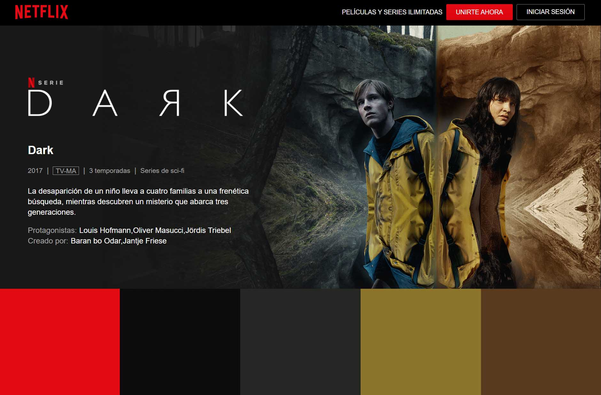
Un fondo negro combinado con colores grises y cafés apagados generan un ambiente lúgubre.
 
 
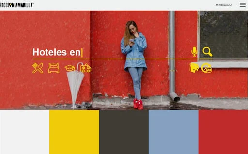   
Sección Amarilla elige el negro y el amarillo para captar la atención.
 
 
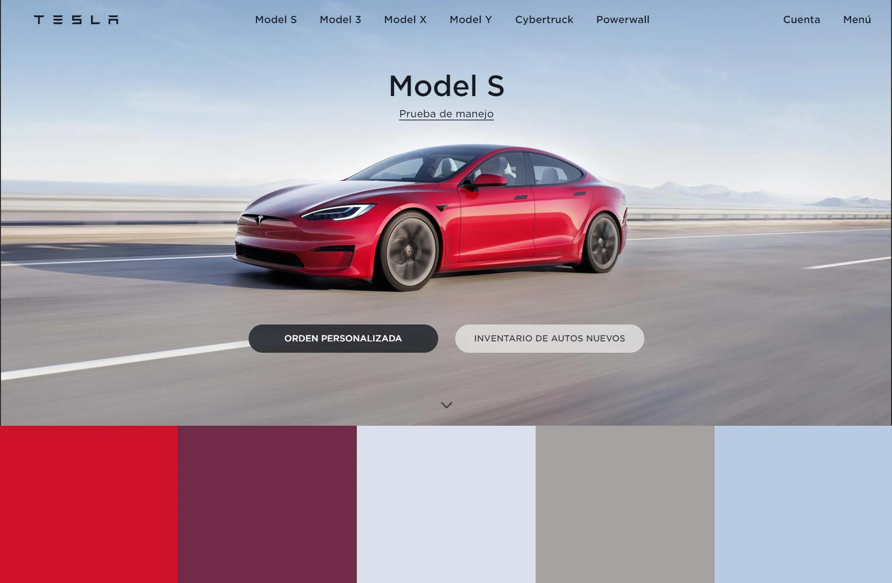    
Los colores claros hacen destacar el color rojo.
 
 
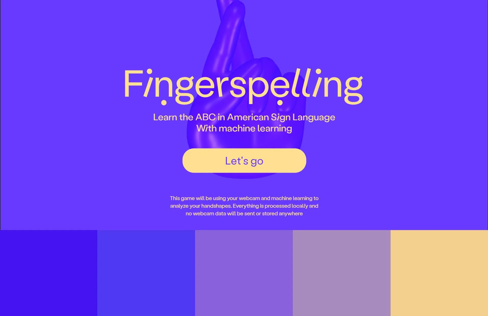
Fingerspelling enseña el lenguaje de signos. En su paleta de colores solo se encuentran el morado y el amarillo que son complementarios entre sí. 
 
 
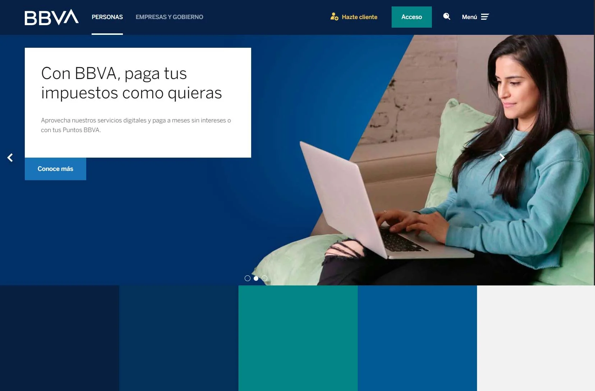 
La combinación del azul y verde transmite calma y seguridad.
 
 

En la página de Schweppes, predomina el amarillo para expresar su personalidad alegre y  desenfadada. 
 
 
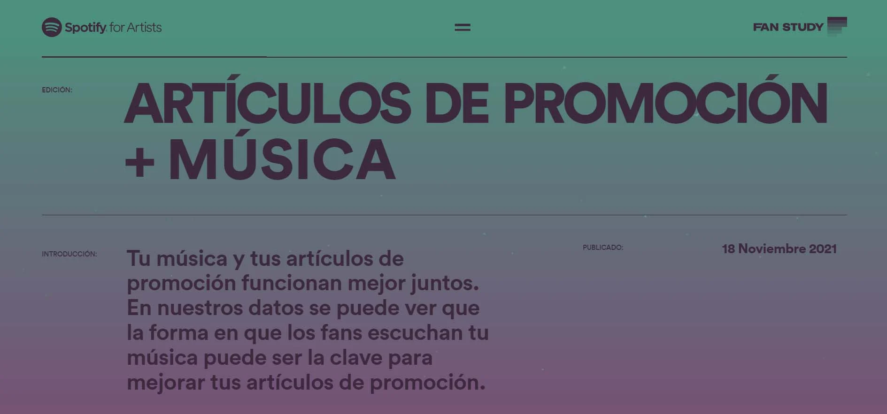  
Los gradientes permiten combinar diferentes tonos de un mismo color de manera suave y gradual, creando añadiendo profundidad a los elementos del sitio web. 
 
 
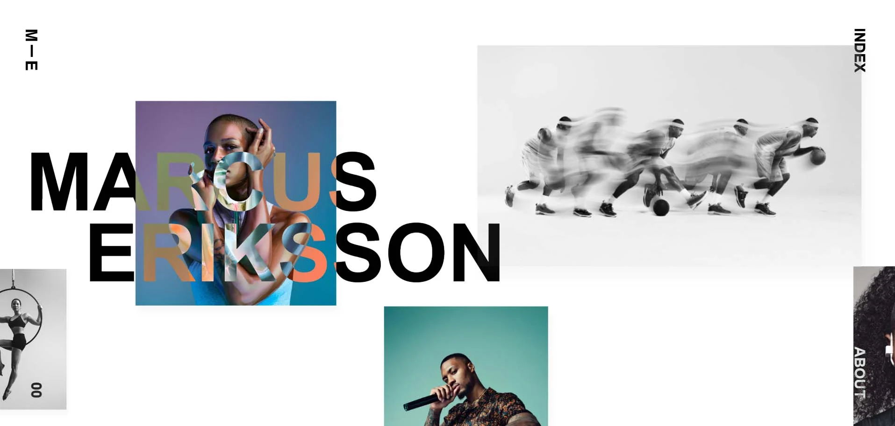 
Las transparencias añaden profundidad y permiten una integración más armoniosa de los elementos en la página. 
 
 

Las ilustraciones en 2D transmiten un aspecto sofisticado y moderno a los diseños. 
 
 
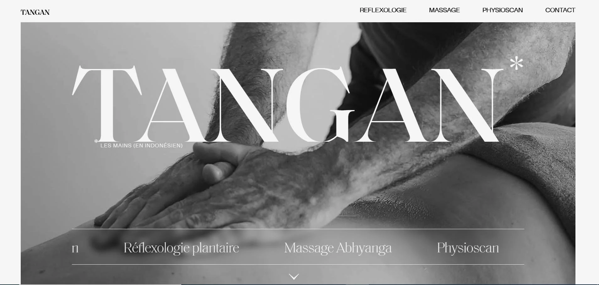 
Los colores suaves y naturales como el beige, marrones y verdes apagados crean una sensación de calma y tranquilidad. 
 
 
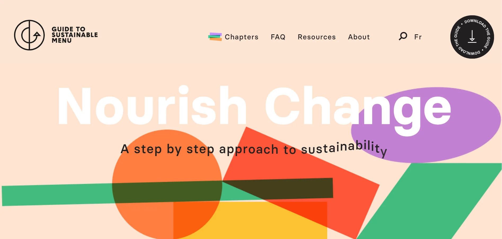 
Los colores brillantes y llamativos se utilizan para atraer la atención del usuario y resaltar elementos importantes. 
 

# 6. Guías de estilo 
Las **guías de estilo** son documentos que establecen las reglas visuales y funcionales para garantizar la coherencia en una página web. Estas guías ayudan a mantener una identidad de marca clara y una experiencia de usuario uniforme en todos los dispositivos y plataformas.

## 6.1. - Elementos clave de una guía de estilo
:one: **Logotipos y colores corporativos**  
   - Logotipos de empresa. 
   - Paleta de colores.   
   - Tamaños y diseños recomendados.  

:two: **Componentes UI**  
   - Botones, formularios, iconos y otros elementos interactivos.  
   - Consistencia en tamaños, bordes y sombreados.

:three: **Paleta de colores**  
   - Colores primarios y secundarios.  
   - Variaciones y usos específicos (botones, fondos, enlaces, etc.).  
   - Contraste y accesibilidad.

:four: **Tipografía**  
   - Fuentes principales y secundarias.  
   - Tamaños y pesos para títulos, subtítulos y cuerpo de texto.  
   - Espaciado entre líneas y párrafos.

:five: **Imágenes e Ilustraciones**  
   - Logotipos de empresa.
   - Estilo de imágenes (fotografía, ilustración, gráficos SVG).  
    
:six: **Espaciado y Layout**  
   - Márgenes y paddings para mantener una estructura uniforme.  
   - Breakpoints y diseño responsivo.

:seven: **Estilo de Interacciones**  
   - Efectos de hover y transiciones.  
   - Animaciones y microinteracciones.  
   - animaciones visuales en formularios y botones.

:eight: **Accesibilidad**  <svg xmlns="http://www.w3.org/2000/svg" width="12px" heigh="auto" viewBox="0 0 122.88 122.88"><path d="M61.44,0A61.46,61.46,0,1,1,18,18,61.21,61.21,0,0,1,61.44,0Zm-.39,74.18L52.1,98.91a4.94,4.94,0,0,1-2.58,2.83A5,5,0,0,1,42.7,95.5l6.24-17.28a26.3,26.3,0,0,0,1.17-4,40.64,40.64,0,0,0,.54-4.18c.24-2.53.41-5.27.54-7.9s.22-5.18.29-7.29c.09-2.63-.62-2.8-2.73-3.3l-.44-.1-18-3.39A5,5,0,0,1,27.08,46a5,5,0,0,1,5.05-7.74l19.34,3.63c.77.07,1.52.16,2.31.25a57.64,57.64,0,0,0,7.18.53A81.13,81.13,0,0,0,69.9,42c.9-.1,1.75-.21,2.6-.29l18.25-3.42A5,5,0,0,1,94.5,39a5,5,0,0,1,1.3,7,5,5,0,0,1-3.21,2.09L75.15,51.37c-.58.13-1.1.22-1.56.29-1.82.31-2.72.47-2.61,3.06.08,1.89.31,4.15.61,6.51.35,2.77.81,5.71,1.29,8.4.31,1.77.6,3.19,1,4.55s.79,2.75,1.39,4.42l6.11,16.9a5,5,0,0,1-6.82,6.24,4.94,4.94,0,0,1-2.58-2.83L63,74.23,62,72.4l-1,1.78Zm.39-53.52a8.83,8.83,0,1,1-6.24,2.59,8.79,8.79,0,0,1,6.24-2.59Zm36.35,4.43a51.42,51.42,0,1,0,15,36.35,51.27,51.27,0,0,0-15-36.35Z"/></svg>
   - Buen contraste de colores.  
   - Uso correcto de etiquetas semánticas en HTML.  
   - Soporte para lectores de pantalla.

...
## 6.2. - Tarea RA1-CEd
Elegir una página web al azar y extraer la guía de estilos. 

## 6.3. - Ejemplos de guías de estilos 
<strong style="font-size: 20px;">airbnb</strong>
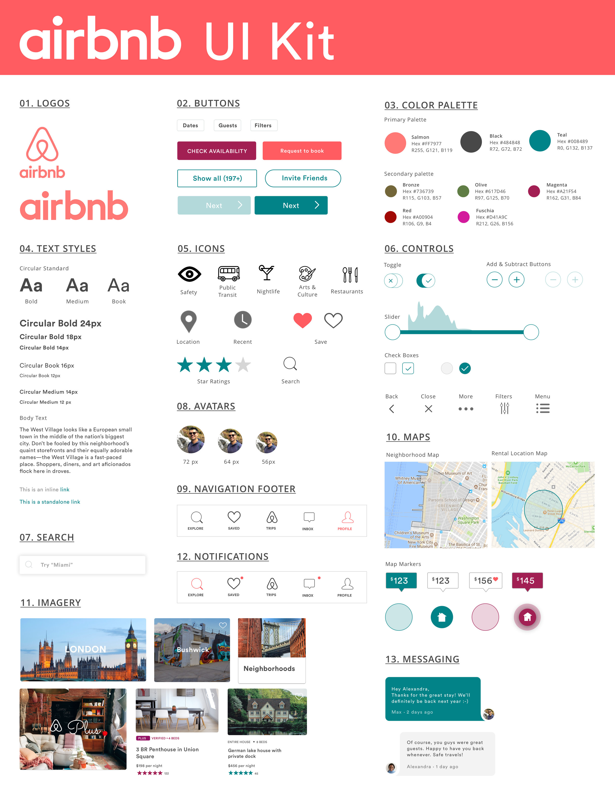

<strong style="font-size: 20px;">Bacardi</strong>  
 

<strong style="font-size: 20px;">Cruz roja Americana</strong>    
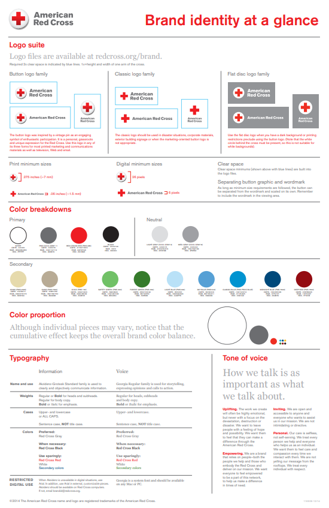
Responsive design 

## 6.4. - Documentación de guías de estilos 
Algunas marcas y plataformas han publicado sus guías de estilo para que los desarrolladores y diseñadores puedan seguir sus estándares:

- <a href="https://material.io/">**Material Design** (Google)</a>
- <a href="https://developer.apple.com/design/">**Human Interface Guidelines** (Apple)</a>
- <a href="https://carbondesignsystem.com/">**Carbon Design System** (IBM)</a>
- <a href="https://design.samsung.com/global/contents/one-ui/download/oneui_design_guide_eng.pdf">**Samsung Design** (Samsung)</a>. <a href="https://design.samsung.com/global/contents/one-ui/download/oneui_design_guide_eng.pdf">Guía de estilo en formato pdf</a>

