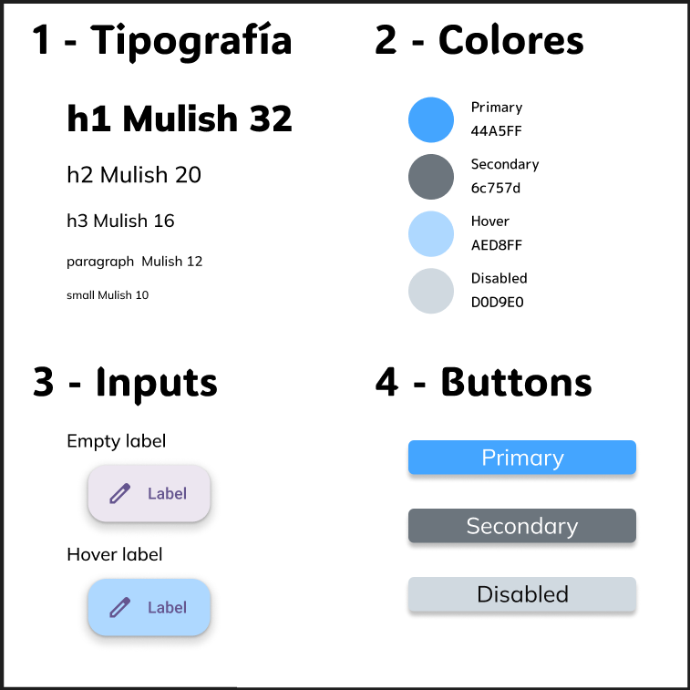

 

  

 

| **Resultados de aprendizaje de la unidad didáctica:** |
|-|
| **RA. 1:** Planifica la creación de una interfaz web valorando y aplicando especificaciones de diseño.|

|**Criterios de evaluación de la unidad didáctica:**|
|-|
| **CE. d&#41;** Se ha valorado la importancia de definir y aplicar la guía de estilo en el desarrollo de una aplicación web.|

| **Licencia Creative Commons:** ||
| - | - |
|  | **Reconocimiento-NoComercial-CompartirIgual CC BY-NC-SA:** No se permite un uso comercial de la obra original ni de las posibles obras derivadas, la distribución de la cuales se debe hace con una licencia igual a la que regula la obra original. |
---  
 

# 1. Primeros pasos con Figma
## 1.1. - ¿Qué es Figma?
Figma es una herramienta de diseño de interfaces y prototipado principalmente basada en la nube. Permite a diseñadores y desarrolladores colaborar en tiempo real en la creación de todo tipo de productos digitales.  
En la actualidad es la herramienta mejor valorada entre diseñadores web para crear guías de estilo y realizar prototipado web gracias a su enfoque colaborativo, su flexibilidad y sus potentes funcionalidades:   

 

<strong style="font-size: 18px;">Guías de estilo</strong>

✅ Componentes reutilizables (botones, tarjetas, iconos, ...) que se actualizan en toda la interfaz al realizar cambios en el componente principal.

✅ Bibliotecas de diseño: Permiten compartir estilos de texto, colores, efectos y componentes entre diferentes proyectos o equipos.

✅ Plugins para documentación: Figma Tokens o Design Lint ayudan a gestionar los estilos y asegurar que todo el diseño siga las guías establecidas.

 

<strong style="font-size: 18px;">Prototipado web</strong>

✅ Interactividad sin código: Se pueden enlazar pantallas, agregar transiciones y simular navegación entre páginas sin necesidad de programar.

✅ Prototipos animados: Figma permite realizar animaciones sin código. 

✅ Diseño colaborativo en tiempo real: Diseñadores, desarrolladores y clientes pueden comentar y editar al mismo tiempo.

✅ Con plugins como **Figma to Code**, es posible extraer **CSS**, **HTML** y hasta frameworks como **React**.

✅ Integración con otras herramientas de desarrollo como, por ejemplo, GitHub..

## 1.2. - Registro, creación de un grupo y un proyecto
:one: El acceso a Figma se realiza desde https://www.figma.com/ .  
:two: Tras el registro y verificación del correo, podremos poner un nombre al equipo de trabajo e invitar a otros colaboradores (existen limitaciones para las cuentas gratuitas).  
:three: Una vez en el área de trabajo, Figma nos propone crear un primer proyecto.  
:four: Una vez dentro de la carpeta del proyecto, podemos empezar a añadir ficheros. En concreto, podemos añadir un nuevo diseño (design file) o un lienzo en blanco sobre el que volcar ideas, diagramas, etc. (FigJam file)

**Nota:** Una de las características de Figma es su comunidad de usuarios. Para acceder a los recursos libres o de pago disponibles, seguir el enlace "Explore Community", ubicado en la parte inferior izquierda de la pantalla `Files` de Figma.

 

## 1.3. - Interfaz de diseño
Después de crear un grupo y un archivo nos aparecerá la interfaz de creación de contenidos de figma.
Esta interfaz de Figma se divide en tres grandes bloques:    
:one: En la parte izquierda encontramos la interfaz para la gestión de los archivos y sus capas.  
:two: La parte central es el área de trabajo, donde iremos diseñando el prototipo.  
:three: En la columna de la derecha encontramos las opciones específicas del elemento que tengamos seleccionado.  
:four: Para terminar, en el area de trabajo encontraremos las herramientas de cursor, frames, formas, pluma, texto, comentarios, acciones y Dev Mode. 

  
 
  
## 1.4. - Page, layers y shortcuts.

 

Dentro de la interfaz de diseño tendremos 3 grandes apartados:  
:one: **Page:** Páginas que utilizaremos para realizar nuestros diseños.  
:two: **Layers:** Como la mayoría de los programas de diseño, `figma` usa el modelo de capas para estructurar los diseños.  
:three: **Shortcuts:** Si pinchamos en `Help` accederemos en una serie de recursos dentro de los cuales tenemos **Keybord shortcuts**, que, con el uso, nos permitirá diseñar de una forma mucho más ágil.  

 
 

## 1.4. - Frame, section y slice

  

:one: **Frame**: Contenedor que funciona como un marco de trabajo donde se organizan y diseñan elementos como pantallas, secciones de una interfaz o componentes reutilizables. Dentro de ese marco crearemos `secciones`.   

:two: **Section**: Área que agrupa múltiples elementos para mejorar la organización del diseño. Se usa principalmente para estructurar proyectos grandes y facilitar la navegación dentro del archivo.  

:three: **Slice**: Es una herramienta que permite definir áreas específicas de un diseño para exportarlas como imágenes, sin necesidad de exportar elementos completos. Útil para extraer partes específicas sin afectar la composición general.  

## 1.5. - Insertar comentarios
**Figma** dispone de la insersión de comentarios que pueden servir para recordatorios o facilitar la colaboración y la retroalimentación en el caso de proyectos donde trabaja un equipo de diseñadores.

 

## 1.6. - Layout y autolayout
**Layout** y **Auto Layout** son conceptos importantes para la organización y distribución de los elementos en el diseño.  

### 1.6.1. - Layout  
El **layout** se refiere a las guías y reglas que ayudan a estructurar el contenido dentro de un **Frame**. Es la opción que se utiliza por defecto.   

El `layout` se compone de:  
✅ **Grids (rejillas)**: Permiten organizar elementos con alineaciones precisas.  
✅ **Columnas y filas**: Útiles para diseños responsivos y basados en cuadrículas.  
✅ **Constraints (Restricciones)**: Definen cómo se ajustan los elementos cuando cambia el tamaño del frame.  

### 1.6.2. - Auto Layout en Figma  
**Auto Layout** es una funcionalidad avanzada que permite a los elementos adaptarse automáticamente según su contenido. Como lo veremos más adelante, esta funcionalidad es sobretodo útil, en la parte de diseño de una interfaz web .  

`Auto layout` permite entre otros:  
✔️ **Distribución automática**: Los elementos se ajustan de forma dinámica según el tamaño y el espaciado definido.  
✔️ **Alineación flexible**: Se pueden alinear elementos en horizontal o vertical con espaciado automático.  
✔️ **Redimensionamiento dinámico**: Los componentes pueden cambiar de tamaño dependiendo del contenido.  
✔️ **Ideal para botones y listas**: Se usa mucho en componentes reutilizables como tarjetas, menús o formularios.  

## 1.7. - Grids
Los **grids** o cuadrículas, permiten estructurar los diseños facilitando el diseño responsivo.

Figma ofrece tres tipos de grids que se pueden aplicar a frames y componentes:  
:one: **Cuadrícula (Grid)**  
:two: **Columnas (Columns)**  
:three: **Filas (Rows)**  

# 2. Tarea RA1-CEd - Creación de una plantilla de guía de estilo con Figma
Crear un diseño de una guía de estilo similar a la de la siguiente imagen.

  

 

**Nota:** La finalidad del ejercicio es iniciarse en el manejo de **Figma** y familiarizarse con las guías de estilos.  

En **Figma**, las **guías de estilo** se crean principalmente mediante **estilos y variables de diseño**, no simplemente dibujándolas en pantalla: 

1. **Variables en Figma** (recomendado)  
   - Desde 2023, Figma permite definir **variables** para colores, tamaños, espaciados, radios de borde, etc.  
   - Se pueden reutilizar en múltiples componentes y actualizar globalmente.  

2. **Estilos de Figma** (obsoleto)  
   - Puedes crear **estilos globales** para colores, tipografías, efectos y grids.  
   - Se aplican a múltiples elementos y permiten cambios consistentes.  

3. **Dibujar manualmente** (mala práctica)  
   - Aunque se puede dibujar guías visuales, este método **no es recomendable** porque no es escalable ni reutilizable.  
