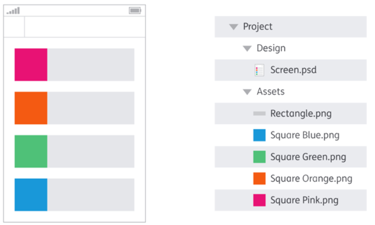
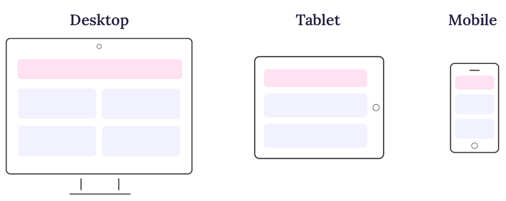

 

  

 

| **Resultados de aprendizaje de la unidad didáctica:** |
|-|
| **Material de ampliación**|

| **Licencia Creative Commons:** ||
| - | - |
|  | **Reconocimiento-NoComercial-CompartirIgual CC BY-NC-SA:** No se permite un uso comercial de la obra original ni de las posibles obras derivadas, la distribución de la cuales se debe hace con una licencia igual a la que regula la obra original. |
---  
 
# 1. Pixel perfect 

## 1.1. - Introducción
**Pixel Perfect** es una técnica de diseño web en la que la maquetación de una página se ajusta exactamente a un diseño previamente definido. Aunque hoy en día el diseño web tiende a ser más **responsive**, aún hay sitios que aplican este principio en ciertas secciones. 
Algunas páginas que han sido reconocidas por su precisión en el diseño incluyen:

- **Apple ([apple.com](https://www.apple.com))**  
- **Google Store ([store.google.com](https://store.google.com))**  
- **Dropbox ([dropbox.com](https://www.dropbox.com))**  
- **Adobe ([adobe.com](https://www.adobe.com))**  

## 1.2. - Beneficios del diseño Pixel Perfect
El Diseño Pixel Perfect, aunque exigente en términos de precisión, ofrece una serie de beneficios valiosos para los diseñadores, los usuarios y la marca en su conjunto. 
1. Apariencia Profesional y Cuidada:
El Diseño Pixel Perfect asegura que cada elemento visual se alinee y renderice con precisión en cada pixel de la pantalla. Esto resulta en una apariencia pulida y profesional que transmite confianza y credibilidad a los usuarios. 

2. Experiencia del Usuario Mejorada:
Los usuarios son altamente sensibles a los detalles visuales y a la coherencia en un sitio web o aplicación. Cuando los elementos están perfectamente alineados y los textos son nítidos, la experiencia del usuario mejora significativamente. 

3. Consistencia en Todos los Dispositivos:
El Diseño Pixel Perfect garantiza que la apariencia y la alineación de los elementos sean consistentes en todas las resoluciones de pantalla. Esto es especialmente valioso en un mundo en el que los usuarios acceden a sitios y aplicaciones desde una variedad de dispositivos y tamaños de pantalla.

4. Mayor Atención al Detalle:
Al implementar el Diseño Pixel Perfect, los diseñadores se ven obligados a prestar atención a los detalles más pequeños. Esto promueve una mentalidad centrada en la calidad y en la búsqueda de la perfección en cada aspecto del diseño. 

5. Fidelidad al Diseño Original:
El Diseño Pixel Perfect asegura que el diseño final refleje fielmente la visión original del diseñador. Evita que los elementos se distorsionen, se vean borrosos o se desalineen en la pantalla. Esta fidelidad a la visión del diseñador es esencial para transmitir el mensaje y la estética deseados.

6. Ventaja Competitiva:
La implementación del Diseño Pixel Perfect puede destacar a una marca por encima de la competencia. Una apariencia visual excepcional y coherente genera una impresión duradera en los usuarios y puede influir en su elección de permanecer en un sitio o aplicar para futuras interacciones.

## 1.3. - Técnicas de Pixel Perfect
El logro de un diseño pixel perfect requiere atención meticulosa a los detalles y la implementación de técnicas específicas que garanticen la alineación y la precisión visual en cada elemento de la composición.

1. Utilizar columnas y cuadrículas y una alineación precisa de los elementos.

   
 
 
1. Controlar los espacios y márgenes.
   
   
 
    
1. Verificar el diseño web en múltiples resoluciones y realizar pruebas exhaustivas en diversos navegadores y dispositivos.

   
    
 
1. Inspección de píxeles y retina. Utilizar herramientas de inspección de píxeles para asegurarse de que las imágenes se rendericen correctamente en pantallas de alta resolución (pantallas Retina).
  
        
    
 
1. Perfección en elementos de texto. Asegúrarse de que las fuentes de texto utilizadas se rendericen correctamente en todo tipo de tamaños de pantalla.

    
 
 
1. Evitar escalar imágenes.

    

También puedes contrastar esta técnica con enfoques más modernos como el **"Fluid Design"** o el **"Mobile First"**, que priorizan la adaptabilidad sobre la perfección visual exacta.  

https://juanbarcia.com/pixel-perfect/
https://torresburriel.com/weblog/que-significa-pixel-perfect/
https://es.wikipedia.org/wiki/Pixel_Perfect
https://andsiosa.medium.com/how-to-create-a-pixel-perfect-ui-design-b38e4c76cb56
https://blog.hubspot.com/website/fluid-design
https://www.marketinhouse.es/mobile-first/
https://okisam.com/blog/diseno-pixel-perfect/