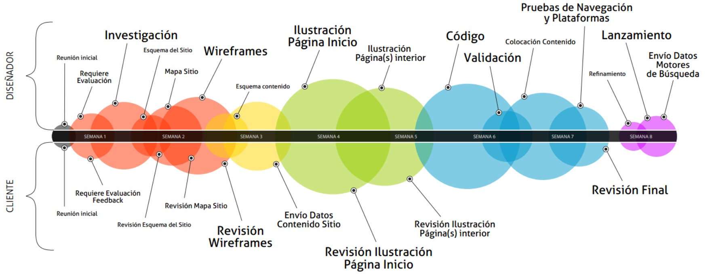
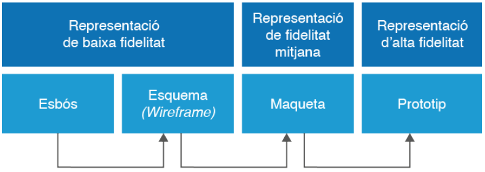
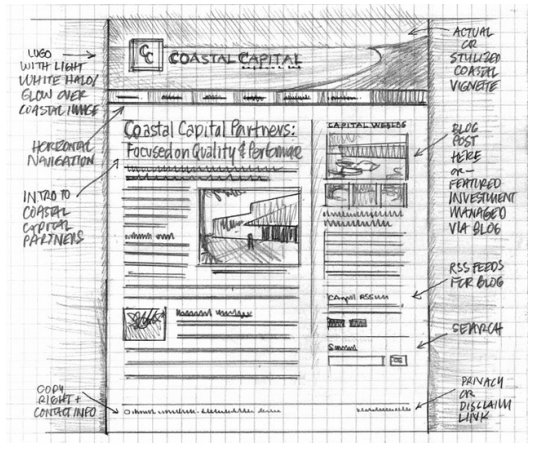
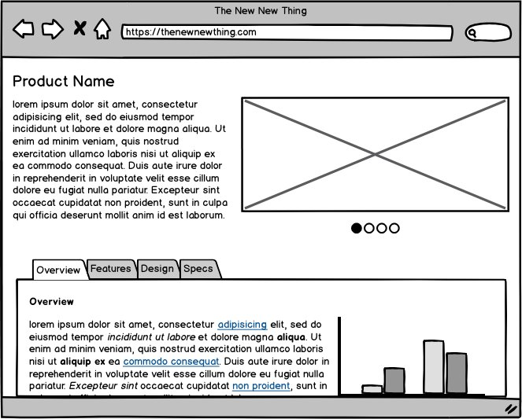
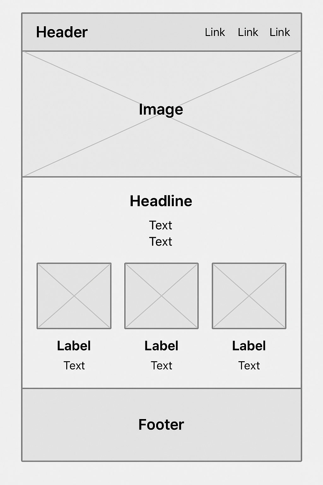
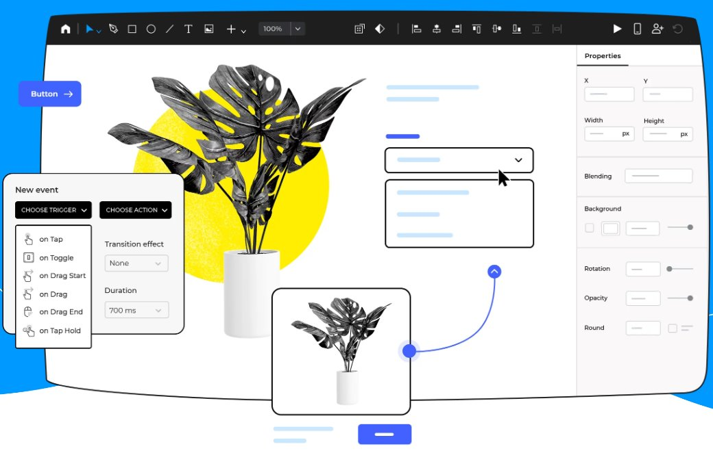
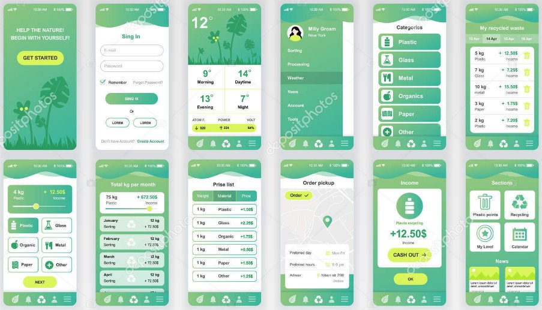
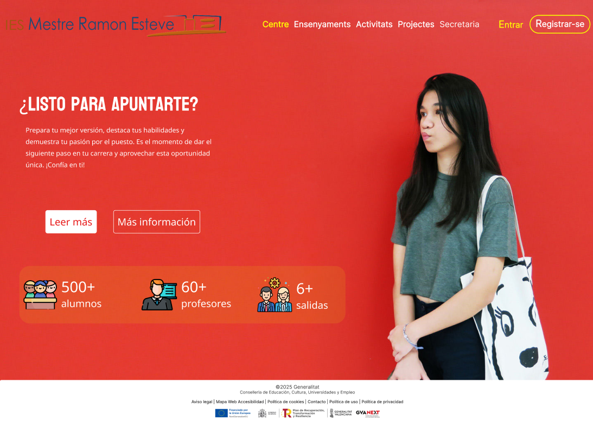

 

  

 

| **Resultados de aprendizaje de la unidad didáctica:** |
|-|
| **RA. 1:** Planifica la creación de una interfaz web valorando y aplicando especificaciones de diseño.|

|**Criterios de evaluación de la unidad didáctica:**|
|-|
| **CE. e&#41;** Se han utilizado y valorado distintas tecnologías para el diseño de documentos web.|
| **CE. f&#41;** Se han creado y utilizado plantillas de diseño.|

| **Licencia Creative Commons:** ||
| - | - |
|  | **Reconocimiento-NoComercial-CompartirIgual CC BY-NC-SA:** No se permite un uso comercial de la obra original ni de las posibles obras derivadas, la distribución de la cuales se debe hace con una licencia igual a la que regula la obra original. |
---  

 # 1. - Introducción
El diseño web es un proceso estructurado que se desarrolla en varias fases:  

:one: **Planificación**: Se definen los objetivos del sitio, el público objetivo y los requisitos funcionales.  
:two: **Prototipado**: Se crean bocetos, wireframes y maquetas para visualizar la estructura y el diseño antes del desarrollo.   
:three: **Desarrollo**: Se transforma el diseño en código utilizando HTML, CSS, JavaScript y otras tecnologías.  
:four: **Pruebas y ajustes**: Se verifican la usabilidad, compatibilidad y rendimiento del sitio, realizando correcciones si es necesario.  
:five: **Lanzamiento y mantenimiento**: Se publica el sitio y se realizan actualizaciones periódicas para mejorar su funcionamiento y seguridad.  

De todas estas fases, el **prototipado** y el **diseño visual** son las que le corresponde plenamente al diseñador web. 

El prototipado ayuda a dar forma a las ideas y a explorar las diferentes alternativas para resolver visualmente la página web.  

En la figura, podemos ver las fases del prototipado según la fidelidad de los prototipos, de menor a mayor fidelidad:  
- Boceto (sketch)  
- Esquema (wireframe)  
- Maqueta (mockup) 
- Prototipo (prototype)
        
    

## 1.1. - Boceto
La primera fase del prototipado es el boceto. Aunque es menos estructurado que las etapas posteriores, el boceto captura la esencia pura de la visión. Herramientas como lápiz y papel, o software de dibujo digital, sirven como medios para dar vida a estos primeros momentos de creatividad.

## 1.2. - Esquema (wireframe)
El wireframe, también conocido como esquema de página, establece las bases estructurales del diseño. Con una representación visual básica y esquemática.  
El wireframe traza la disposición de elementos clave, como bloques de contenido y menús de navegación.  

Es una representación visual sencilla y esquemática de la estructura de una página web o aplicación. Suele ser una versión simplificada que muestra la distribución de los elementos en la interfaz. No incluye detalles de diseño ni funcionalidades interactivas, centrándose principalmente en la disposición y organización de los elementos.

 

Programas para realizar wireframes.
- <a href="https://www.moqups.com">**Moqups**</a>  
- <a href="https://www.balsamiq.com​">**Balsamiq Wireframes**</a>  
- <a href="https://www.mockflow.com">**Mockflow**</a>  
- <a href="https://www.gliffy.com">**Gliffy**</a>  
- <a href="https://www.diagrams.net">**Diagrams.net (draw.io)**</a> 

### 1.2.1. - Tarea RA1 CEe
Con el programa **Moqups** realizar un wireframe similar al del siguiente dibujo.

 

## 1.3. - Maqueta (mockup)
La etapa de la maqueta eleva la representación visual a otro nivel. Ofrece una vista previa más detallada y estilizada del diseño final. Se aplican colores, tipografía, imágenes y estilos visuales, proporcionando una visión más realista del producto.  

Es una representación estática y visualmente más detallada de un diseño, que muestra cómo se verá la interfaz final. No es totalmente funcional y no permite la interacción completa del usuario. Su propósito es mostrar el aspecto visual del diseño.

 

Ejemplos de programas que usa la comunidad para realizar maquetación.
- <a href="https://www.sketch.com/">**Sketch**</a>: Especializado en diseño de interfaces web y dispositivos móviles, es un estándar de facto en la industria.
- <a href="https://iconos8.es/lunacy">**Lunacy**</a>: Incorpora bibliotecas de elementos de interfaz de Windows, macOS y Android.
- <a href="www.figma.com">**Figma**</a>: Además del prototipado, también permite realizar animaciones. Muy aceptado por la comunidad.
- <a href="https://www.canva.com/">**Canva**</a>
- <a href="www.marvelapp.com">**Marvel**</a>
- <a href="www.marvelapp.com">**Plantillas HTML**</a>: Permiten elaborar prototipos de alta fidelidad. Con poco trabajo de personalización, se puede obtener un prototipo navegable.  
- **Gestores de contenidos (CMS)**: Wordpress o Wix permiten implementar rápidamente un prototipo de alta fidelidad muy operativo de lo que queremos.

## 1.3. - Prototipo (prototype) 
El prototipo incorpora la interactividad y la funcionalidad. Esta versión avanzada del diseño simula el comportamiento interactivo de la página web o aplicación, permitiendo pruebas exhaustivas de navegación y experiencia de usuario.  

Incluye elementos como botones, campos de entrada y menús desplegables que pueden ser clicables y funcionales.  

Permite a los diseñadores y desarrolladores probar la navegación y la interacción del usuario antes de la implementación final.

 

Programas que permiten realizar prototipos:
- VSC
- Sublime
- Netbeans
- Dreamweaver
- ...

## 1.4. - Necesidad de pasar por todas las fases SWMP  
Cada una de las fases del proceso SWMP (Sketch, Wireframe, Mockup, Prototype) ofrece un valor único en el refinamiento de la visión inicial y la optimización de la experiencia del usuario. Sin embargo, no todas son esenciales en cada proyecto.  

En algunos casos, el equipo de desarrollo podría optar por omitir la fase de Mockup (Maqueta) si el enfoque principal del proyecto es la funcionalidad. De este modo, podrían pasar directamente del Wireframe al Prototype, centrándose en la estructura y funcionalidad del sitio web sin invertir tiempo y recursos en la creación de un mockup visualmente elaborado.

# 2. Tarea RA1-CEf
Maquetación de una página web con **Figma**.  
Crear un diseño de página web similar a la siguiente imagen.  
- Para el frame usar la plantilla **TV**.
- Para la maquetación usar el `auto layout`.  
- Se os dan todos los elementos que tendreis que organizar dentro de `auto layouts` para dar una estructura consistente y ampliable al proyecto, <a href="./tasks/Tarea RA1CEef.fig">**descargar aquí**</a>.

 

**Resultado final:**

