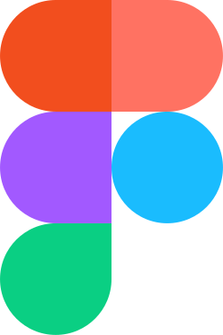

 

  

 

| **Resultados de aprendizaje de la unidad didáctica:** |
|-|
| **RA. 1:** Planifica la creación de una interfaz web valorando y aplicando especificaciones de diseño.|

|**Criterios de evaluación de la unidad didáctica:**|
|-|

| **CE. e&#41;** Se han utilizado y valorado distintas tecnologías para el diseño de documentos web.|
| **CE. f&#41;** Se han creado y utilizado plantillas de diseño.|

| **Licencia Creative Commons:** ||
| - | - |
|  | **Reconocimiento-NoComercial-CompartirIgual CC BY-NC-SA:** No se permite un uso comercial de la obra original ni de las posibles obras derivadas, la distribución de la cuales se debe hace con una licencia igual a la que regula la obra original. |
---  

 5.9. Prototipatge web
En el cicle de vida del disseny web el prototipatge és una de les etapes inicials. És molt important, perquè ajuda a donar forma a les idees i explorar les diferents alternatives per resoldre visualment la pàgina web. 
A la figura podem veure les fases del prototipatge segons la fidelitat dels prototips, de menys a més fidelitat: 
    • Esbós (sketch), 
    • Esquema (wireframes), 
    • Maqueta (mockup) i 
    • Prototip (prototype). 

5.9.1. Esbós (Sketch)
 El primer del prototipatge és l'esbós. Encara que menys estructurat que les etapes posteriors, l'esbós captura l'essència crua de la visió. Ferramentes com llapis i paper, o com programari de dibuix digital, servixen com a mitjans per a donar vida a estos primers moments de creativitat.

https://www.flickr.com/photos/rohdesign/

5.9.2. Esquema (Wireframe).
El wireframe, també conegut com a esquema de pàgina, establix les bases estructurals del disseny. Amb una representació visual bàsica i esquemàtica, el wireframe traça la disposició d'elements clau, com a blocs de contingut i menús de navegació.
 És una representació visual bàsica i esquemàtica de l'estructura d'una pàgina web o aplicació. Sol ser una versió simplificada que mostra la disposició dels elements en la interfície. No inclou detalls de disseny ni funcionalitats interactives, centrant-se principalment en la disposició i organització dels elements.
 

Exemples de programari per a fer esquemes:
    • Balsamiq Wireframes: www.balsamiq.com​
    • Moqups: www.moqups.com ​
    • Mockflow: www.mockflow.com ​
    • Gliffy: www.gliffy.com ​
    • Diagrams.net (draw.io): www.diagrams.net

5.9.3. Maqueta (mockup)
L'etapa de la maqueta eleva la representació visual a un altre nivell. Ofereix una vista prèvia més detallada i estilitzada del disseny final. Els colors, tipografia, imatges i estils visuals s’apliquen, proporcionant una visió més realista del producte. 
És una representació estàtica i visualment més detallada d'un disseny, que mostra com lluirà la interfície final. No és totalment funcional i no permet la interacció total de l'usuari. El seu propòsit és mostrar l'aspecte visual del disseny.

Exemples de programari per a fer maquetes:
    • Sketch. Especialitzat en disseny d'interfícies web i dispositius mòbils és un estàndard de facto de la indústria https://www.sketch.com/
    • Lunacy (gratuït). Incorpora llibreries elements d'interfície de Windows, MacOs i Android. https://iconos8.es/lunacy
    • Figma. www.figma.com
    • Canva (gratuït). Té funcionalitats limitades en la seua versió gratuïta. www.canva.com 
    • Marvel (gratuït amb funcions limitades). www.hmarvelapp.com 
    • Plantilles HTML. Permeten elaborar prototips d'alta fidelitat. Amb poc treball de personalització es pot tindre un prototip navegable d'un lloc web. https://html5up.net/ , https://html5-templates.com/ 
    • Gestors de continguts (CMS): Wordpress o wix permeten implementar ràpidament un prototip d'alta fidelitat molt operatiu del que volem.
5.9.4. Prototip (prototype) 
El prototip, incorpora l'interactivitat i la funcionalitat. Esta versió avançada del disseny simula el comportament interactiu de la pàgina web o aplicació, permetent proves exhaustives de navegació i experiència d'usuari.
Inclou elements com a botons, camps d'entrada i menús desplegables que poden ser clickables i funcionals.
Permet als dissenyadors i desenrotlladors provar la navegació i la interacció de l'usuari abans de la implementació final.
Exemple de prototip:

Programari per a fer prototips:
    • VSC
    • Sublime
    • Netbeans
    • Dreamweaver
    • Qualsevol IDE del mercat.

5.9.5. És necessari passar per totes les fases SWMP?
Cadascuna de les fases del procés SWMP (Sketch, Wireframe, Mockup, Prototype) oferix un valor únic en el refinament de la visió inicial i l'optimització de l'experiència de l'usuari, no obstant, no totes són essencials en cada projecte.
 En este cas, l'equip de desenrotllament podria optar per ometre la fase del Mockup (Maqueta) si l'enfocament principal del projecte és la funcionalitat. Per tant, l'equip podria procedir directament des del Wireframe al Prototype, centrant-se en l'estructura i funcionalitat del lloc web sense dedicar temps i recursos a la creació d'un mockup visualment elaborat. 
Això demostra com l'adaptació del procés de prototipatge a les necessitats específiques de cada projecte pot optimitzar l'eficiència i els resultats finals.

Para hacer el contenido.
https://www.eniun.com/guia-estilo-diseno-interfaces-web/
https://logongas.es/doku.php?id=clase:daw:diw:1eval:tema01

https://www.eniun.com/componentes-interfaz-web/​
https://www.eniun.com/elementos-relacion-direccion-posicion-espacio-gravedad/

diferencia entre UI y UX
https://prismic.io/glossary/style-guide

enlaces de interes. Coger tambien los enlaces de las presentaciones.
https://www.learnui.design/blog/
https://careerfoundry.com/en/blog/ui-design/common-ui-design-mistakes/
https://spaceberry.studio/blog/common-user-interface-mistakes-and-how-to-do-it-right/

---

https://www.eniun.com/tutorial-figma/
https://www.youtube.com/results?search_query=figma+style+guide+tutorial
https://diposit.ub.edu/dspace/bitstream/2445/189524/1/guia_uso_figma.pdf

## 6.2. - Tarea RA1-CEe

# X. Ciclo de vida de un diseño web.

# X.  Prototipado con Figma

## 6.2. - Tarea RA1-CEf
https://www.eniun.com/tutorial-figma/

https://www.eniun.com/guia-estilo-diseno-interfaces-web/

https://www.maxrosero.com/airbnb
