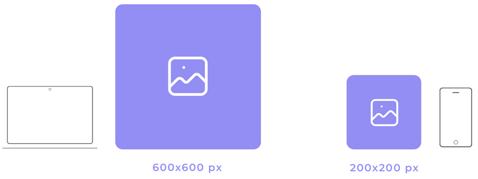

 

  

 

| **Resultados de aprendizaje de la unidad didáctica:** |
|-|
| **RA1 - Material de ampliación**|

| **Licencia Creative Commons:** ||
| - | - |
|  | **Reconocimiento-NoComercial-CompartirIgual CC BY-NC-SA:** No se permite un uso comercial de la obra original ni de las posibles obras derivadas, la distribución de la cuales se debe hace con una licencia igual a la que regula la obra original. |
---  
 
# 1. Pixel perfect 

## 1.1. - Introducción
**Pixel Perfect** es una técnica de diseño web en la que la maquetación de una página se ajusta exactamente a un diseño previamente definido. Aunque hoy en día el diseño web tiende a ser más **responsive**, aún hay sitios que aplican este principio en ciertas secciones. 
Algunas páginas que han sido reconocidas por su precisión en el diseño incluyen:

- **Apple ([apple.com](https://www.apple.com))**  
- **Google Store ([store.google.com](https://store.google.com))**  
- **Dropbox ([dropbox.com](https://www.dropbox.com))**  
- **Adobe ([adobe.com](https://www.adobe.com))**  

## 1.2. - Beneficios del diseño Pixel Perfect
El Diseño Pixel Perfect, aunque exigente en términos de precisión, ofrece una serie de beneficios valiosos para los diseñadores, los usuarios y la marca en su conjunto. 
1. Apariencia profesional y cuidada:
El Diseño Pixel Perfect asegura que cada elemento visual se alinee y renderice con precisión en cada pixel de la pantalla. Esto resulta en una apariencia pulida y profesional que transmite confianza y credibilidad a los usuarios. 

2. Experiencia del usuario mejorada:
Los usuarios son altamente sensibles a los detalles visuales y a la coherencia en un sitio web o aplicación. Cuando los elementos están perfectamente alineados y los textos son nítidos, la experiencia del usuario mejora significativamente. 

3. Consistencia en todos los dispositivos:
El Diseño Pixel Perfect garantiza que la apariencia y la alineación de los elementos sean consistentes en todas las resoluciones de pantalla. Esto es especialmente valioso en un mundo en el que los usuarios acceden a sitios y aplicaciones desde una variedad de dispositivos y tamaños de pantalla.

4. Mayor atención al detalle:
Al implementar el Diseño Pixel Perfect, los diseñadores se ven obligados a prestar atención a los detalles más pequeños. Esto promueve una mentalidad centrada en la calidad y en la búsqueda de la perfección en cada aspecto del diseño. 

5. Fidelidad al diseño original:
El Diseño Pixel Perfect asegura que el diseño final refleje fielmente la visión original del diseñador. Evita que los elementos se distorsionen, se vean borrosos o se desalineen en la pantalla. Esta fidelidad a la visión del diseñador es esencial para transmitir el mensaje y la estética deseados.

6. Ventaja competitiva:
La implementación del Diseño Pixel Perfect puede destacar a una marca por encima de la competencia. Una apariencia visual excepcional y coherente genera una impresión duradera en los usuarios y puede influir en su elección de permanecer en un sitio o aplicar para futuras interacciones.

## 1.3. - Técnicas de Pixel Perfect
El logro de un diseño pixel perfect requiere atención meticulosa a los detalles y la implementación de técnicas específicas que garanticen la alineación y la precisión visual en cada elemento de la composición.

1. Utilizar columnas y cuadrículas y una alineación precisa de los elementos.

   
 
 
1. Controlar los espacios y márgenes.
   
   
 
    
1. Verificar el diseño web en múltiples resoluciones y realizar pruebas exhaustivas en diversos navegadores y dispositivos.

   
    
 
1. Inspección de píxeles y retina. Utilizar herramientas de inspección de píxeles para asegurarse de que las imágenes se rendericen correctamente en pantallas de alta resolución (pantallas Retina).
  
        
    
 
1. Perfección en elementos de texto. Asegúrarse de que las fuentes de texto utilizadas se rendericen correctamente en todo tipo de tamaños de pantalla.

    
 
 
1. Evitar escalar imágenes.

    

# 2. Fluid design
## 2.1. - Introducción
Fluid design is a way of building websites so that the layout and content automatically adjust to fit any screen size, from a phone to a computer. New applications and device settings have always aimed to align themselves with this fluid design. Smartphones, tablets, computers, and even smartwatches have undergone a flowing transformation.

Fluid design is a flexible, scalable approach to designing interfaces that fit screen sizes or different devices. 

## 2.2. - Fluid Design vs. Other Layout Approaches
---
***
---
HASTA AQUI
---
***
---

https://tabular.email/blog/what-is-fluid-design
In UI/UX terminology, you may have heard of other design layouts such as responsive, adaptive, fixed design, and so on. Now, let’s take a look at the differences and comparisons between different design layouts like adaptive vs responsive vs fluid design.
	
  Fluid Design	Fixed Design	Responsive Design
Layout Behavior	Adjusts smoothly to any screen size or window.	Stays the same size, regardless of screen.	Uses predefined breakpoints for adjustments.
Flexibility	Highly flexible and scales proportionally.	Not flexible; can cause horizontal scroll.	Flexible but adjusts in steps (breakpoints).
Development Effort	Moderate; requires careful percentage-based units.	Easier to develop; uses fixed pixel widths.	More complex due to breakpoints for devices.
Best For	Websites needing smooth adaptation across sizes.	Simple, desktop-focused websites.	Multi-device designs with defined layouts.
User Experience	Consistent on all screen sizes.	Poor on smaller screens.	Good, but changes layout at breakpoints.

Key Principles of Fluid Layouts
Fluid Grid Layout

The layout includes three main elements: columns, gutters, and margins. The percentages of each of these elements determine the readability of the website. A fluid grid layout divides the page width into columns of equal size. Thus, when the page is narrowed down either on its own or according to device sizes, these columns adjust their spacing. By applying fluid principles, grids structuring the page content can expand and contract accordingly.

Scalable Typography and Images

Visual content makes up most of the layout. Therefore, when creating your layouts, you will reference typography and images. However, when users view your website or email, you’ll want the images and typography to scale as designed. Fluid layout CSS uses em and rem units to scale elements up and down.

Therefore, maintaining sharp, readable text and visually appealing images is essential. Believe us, your designers, who have spent their time and effort, will appreciate the typography and images scaling accordingly.

Minimal Reliance on Breakpoints

Breakpoints in website design refer to the screen size at which the design should adjust to a different layout. For instance, if you're using responsive or fluid design, you’ll need breakpoints for your columns. The good news is that fluid layout design mostly reduces the complexity of breakpoints and creates flowing content. With proportional sizing, you can use breakpoints for multiple device-specific layouts.
Benefits of Fluid Design
Consistent User Experience Across Devices

No one wants to switch to another device just to check a website in today’s adaptive world—especially Gen Z. Fluid design allows users to access any website and engage with it while maintaining the same content quality. From opening emails to making purchases on your website, users will appreciate the consistent usability. Additionally, this allows you to determine which device is most optimal for usage and update your design choices accordingly.
Future-Proofing Your Designs

Catching up with new updates in devices and technologies is essential for businesses in the 2020s. With new electronic device screen sizes and ratios, you should adapt to them as quickly as possible. As we’ve mentioned, one great advantage of fluid grid layout is that you don’t have to create a new design like you would in adaptive design. Your columns, margins, and gutters can fluidly adjust according to the new layout scales.
Improved Performance and Engagement

The minimal design with reduced breakpoints ensures improved performance. For the user, accessibility and usability are secured through a seamless experience. Since the design features fluid transformations, the digital experience becomes much easier. With a well-crafted layout design, your users won’t have to horizontally scroll, pinch, or zoom constantly. This allows them to focus more on the functional aspects of the site rather than spending their time trying to scale and navigate it properly.
Implementing Fluid Design in Your Projects
Planning Your Fluid Layout

Planning the user experience is essential from the start. To create a website that fits both your user’s needs and your functional goals, you must design your units accordingly. If there is a specific order or relevance hierarchy you want users to follow, you need to place them in a structured way.

To expand on the importance of planning, think of your college website, where you might have spent time just trying to find the homepage. Therefore, if you want users to have a smooth experience on your website, you must be mindful of certain design criteria when designing the units.
CSS Techniques and Tools

By using CSS, you can adapt your website's visual layouts to fluid design. To do this, modern module options like Flexbox and Grid can be used. They create a responsive and flexible layout fluidity.

By using these container queries, .flex utilizes Flexbox to resize layout units based on the available space. On the other hand, .grid uses CSS grid to adjust the size and position of layout items according to the space. Related to the available space, fluid design ensures that the sizes of visuals and text remain clear, regardless of the screen size.
Testing and Iteration

When you have completed your design, testing is the best way to finalize the process. You must test the quality, device adaptability, responsiveness, and design outcome all at once. By trying your design on different devices, you can ensure that your well-tailored design fits all screens. Additionally, you can conduct user tests, such as eye-tracking or user journey analysis, to identify which design elements may be overlooked. You know what they say: the eyes never lie…
Best Practices for Fluid Email Template Design
Fluid Responsive Design in Email

No one waits to sit in front of a computer to check their emails nowadays. Back in the day, our biggest concern was replying to an email with the signature “Sent from my iPhone,” but now it’s a normal practice. Therefore, when sending your email marketing campaigns, you must consider the different devices or screen sizes. From long texts to visuals that divide your email content, you need to plan your units according to different devices. To ensure your design doesn’t get lost on any device, plan ahead. Moreover, there are email template providers like Tabular that allow you to preview the template for both computer and phone screens. You can check if your design choices match your needs using the preview there.

    Use Fluid Tables and Layouts: Instead of using fixed-width tables with specific pixel sizes, work with percentages. As we demonstrated visually earlier in this article, the grid can automatically scale the units if planned correctly.
    Responsive Images in Emails: You wouldn’t want your visual elements, like images, to get lost when you adjust the screen. Therefore, when using container queries, apply max-width: 100% to the images. This way, your images will scale down accordingly without losing any content.
    Scalable Typography and Buttons: Font choice is a crucial part of email design as it significantly affects readability. When designing, select the best font for emails that will remain readable. Additionally, buttons, such as call-to-actions, should maintain a reasonable scale between the text and clickable area. Plan the proportions ahead of time for a better user experience.
    Minimize Reliance on Media Queries: Unlike responsive design, fluid design relies less on complex media queries. Using fewer media queries ensures that proportion-based sizing works more fluidly. Since email design requires low loading times, this also helps ensure quicker access to the content.
    Test Across Devices and Email Clients: Not only the device or your design but also the email client may affect fluid email designs. To ensure your design renders quickly and effectively, test it with different clients, such as Gmail, Apple Mail, Outlook, etc.
    Balance Content Density: As the saying goes, "Less is more." When designing anything visual, remember to maintain balance. Filling the email with too much information or too many visuals won’t benefit your business. Ensure that each design element contributes to your purpose or brand.

Overcoming Challenges in Fluid Design
Balancing Aesthetics and Functionality

From tiny phone screens to curved screens, we have a wide range of options. Therefore, planning your layout is essential when it comes to fluidity. Always remember that even though your design might look fine on typical screens, it can become unreadable on phones or stretched screens. As a result, you must take different design keywords into consideration. With visual elements, you can guide users to follow a specific direction. By using domination and depth, you can direct their focus to particular parts of your design. Additionally, with overall harmony, you can ensure that your design is not only aesthetic but also functional according to your needs.
Performance Considerations

There are performance optimizations you must check with fluid design. Since fluid web design doesn’t automatically guarantee optimized performance, you need to code image and visual text optimizations properly.

If your design takes too long to expand, stretch, or narrow, it could cause readability issues. Therefore, regardless of which device your users are visiting your website from, you must keep loading times low and performance efficient.
Conclusion

We experience life from different perspectives and navigate the internet through a variety of devices. Therefore, if you own a website or send email templates, it's important to be proactive when creating content.

Ensuring flexible units with a proportion- and percentage-based approach will help you achieve fluidity in your templates. To do this effectively, make use of visual elements, images, fonts, and container queries.

As technology evolves daily, staying up-to-date and adapting your designs accordingly is crucial. By investing in proper testing, expanding your knowledge of CSS technologies, and prioritizing responsiveness and fluidity, you can create seamless, adaptable experiences for users. We hope this blog has helped you understand how to design fluid and effective website or email layouts. Happy emailing!

## 3. Mobile First design
https://www.marketinhouse.es/mobile-first/

También puedes contrastar esta técnica con enfoques más modernos como el **"Fluid Design"** o el **"Mobile First"**, que priorizan la adaptabilidad sobre la perfección visual exacta.  

https://juanbarcia.com/pixel-perfect/
https://torresburriel.com/weblog/que-significa-pixel-perfect/
https://es.wikipedia.org/wiki/Pixel_Perfect
https://andsiosa.medium.com/how-to-create-a-pixel-perfect-ui-design-b38e4c76cb56
https://blog.hubspot.com/website/fluid-design
https://www.marketinhouse.es/mobile-first/
https://okisam.com/blog/diseno-pixel-perfect/