 

  

 

| **Resultados de aprendizaje de la unidad didáctica:** |
|-|
| **RA1 - Material de ampliación**|

| **Licencia Creative Commons:** ||
| - | - |
|  | **Reconocimiento-NoComercial-CompartirIgual CC BY-NC-SA:** No se permite un uso comercial de la obra original ni de las posibles obras derivadas, la distribución de la cuales se debe hace con una licencia igual a la que regula la obra original. |
---  
 
# 1. Fixed Design
El **fixed web design**, es aquel diseño que permanece inalterable sea cual sea el dispositivo donde se visualiza el sitio web. Es indiferente al tamaño de la pantalla y a la anchura del navegador web que la visualiza. Sean cuales sean las características del dispositivo, pantalla o navegador, siempre se visualiza el mismo tamaño preestablecido por el diseñador web en píxeles.

# 2. Responsive design
 

  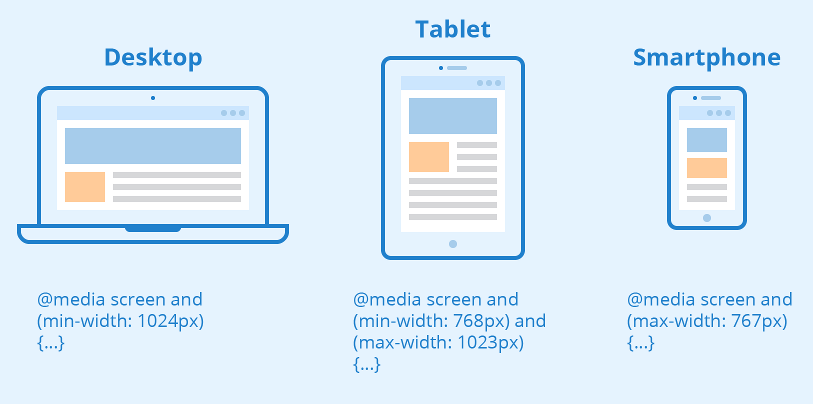

 

El **Responsive Design** es una técnica de desarrollo web que permite que un sitio web se adapte automáticamente al tamaño del dispositivo desde el cual se accede. Su objetivo principal es mejorar la experiencia del usuario asegurando que el contenido sea accesible, legible y funcional en todo tipo de dispositivos (teléfonos móviles, tabletas, monitores de escritorio...).

El **Responsive Design** se logra con las `Media Queries` y `los breakpoints` al definir reglas de estilo según las características del viewport. De esta manera, se pueden modificar la distribución, los tamaños de fuente, los márgenes, el espaciado y otros aspectos visuales. 

# 3. Fluid design
El `Fluid Design` es una forma de crear páginas web que permite que el diseño y el contenido se ajusten automáticamente a cualquier tamaño de pantalla. 

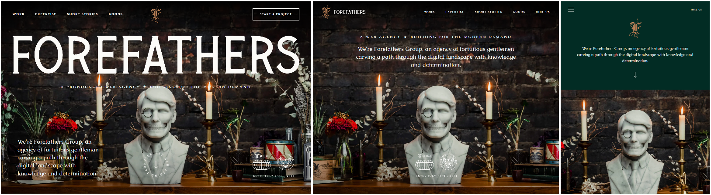

Una forma de definir el `Fluid Design` es compararlo con otros modelos. En UI/UX, es bastante común usar otros diseños, como el responsivo, el adaptativo, el fijo, etc.  
A continuación, se muestra una tabla que detalla las diferencias entre los diferentes diseños. 

# 4. Fluid Design vs Fixed Design vs Responsive Design

|| Diseño Fluido | Diseño Fijo | Diseño Responsive |
|-|-|-|-| 
|**Comportamiento**|Se ajusta suavemente a cualquier tamaño de pantalla o ventana.|Permanece del mismo tamaño, sin importar la pantalla. | Usa puntos de ruptura predefinidos para ajustarse.|  
|**Flexibilidad**|Altamente flexible y escalado proporcional.| No es flexible y causa desplazamiento horizontal con la barra de desplazamiento. | Flexible, pero se reajusta al pasar por los puntos de ruptura.|  
|**Coste de desarrollo**|Moderado. | Muy fácil de desarrollar. | Complejo.| 
|**Recomendado para**|Sitios web que necesiten adaptarse suavemente a distintos tamaños. | Sitios siempre enfocados a una misma resolución. | Diseños para múltiples dispositivos.|  
|**Experiencia del Usuario**|Consistente en todos los tamaños de pantalla. | Deficiente en pantallas más pequeñas. | Muy buena. |

# 5. Fluid Grid Layout (Fluid Design + Responsive Design)
El `Fluid Grid Layout` incluye tres elementos principales: columnas, filas y márgenes. Los porcentajes de cada uno de estos elementos determinan la legibilidad del sitio web.  
Un diseño de cuadrícula divide el ancho de la página en columnas de tamaño igual. De este modo, cuando la página se reduce, ya sea de forma manual o según el tamaño del dispositivo, estas columnas ajustan su espacio. Al aplicar principios de fluidez, las cuadrículas que estructuran el contenido de la página pueden expandirse y contraerse en consecuencia.

 

  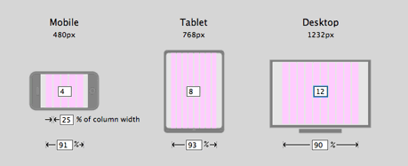

 

**Ejemplo Fluid Grid Layout con Breakpoints**  
:one: Diseño a 4 columnas

  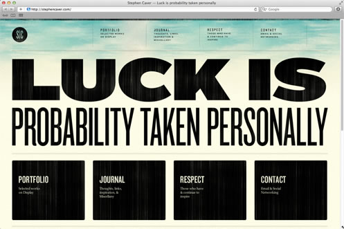

 

:two: Diseño a 2 columnas  

  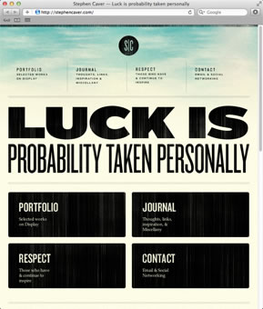

 

:three: Diseño a 1 columna  

  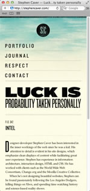

 

# 6. Pixel perfect 
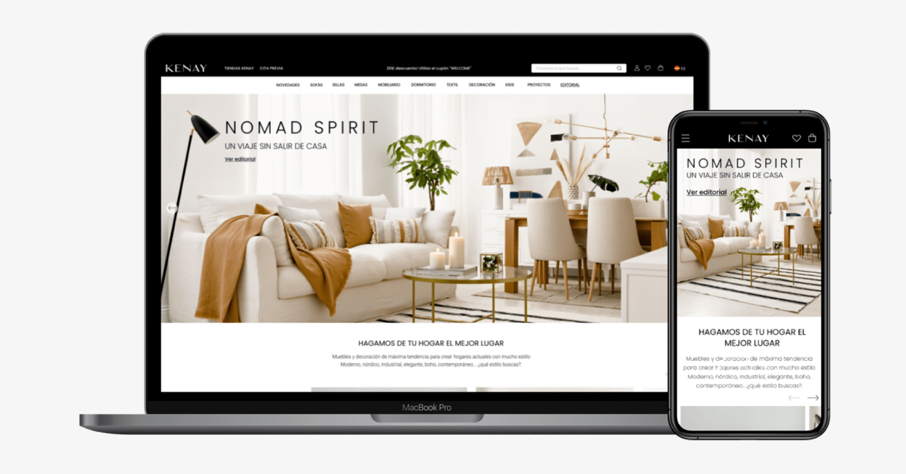
## 6.1. - Introducción
**Pixel Perfect** es una técnica de diseño web en la que la maquetación de una página se ajusta exactamente a un diseño previamente definido. Aunque hoy en día el diseño web tiende a ser más **responsive**, aún hay sitios que aplican este principio en ciertas secciones. 
Algunas páginas que han sido reconocidas por su precisión en el diseño incluyen:

- **Apple ([apple.com](https://www.apple.com))**  
- **Google Store ([store.google.com](https://store.google.com))**  
- **Dropbox ([dropbox.com](https://www.dropbox.com))**  
- **Adobe ([adobe.com](https://www.adobe.com))**  

## 6.2. - Beneficios del diseño Pixel Perfect
El Diseño Pixel Perfect, aunque exigente en términos de precisión, ofrece una serie de beneficios valiosos para los diseñadores, los usuarios y la marca en su conjunto. 
1. Apariencia profesional y cuidada:
El Diseño Pixel Perfect asegura que cada elemento visual se alinee y renderice con precisión en cada pixel de la pantalla. Esto resulta en una apariencia pulida y profesional que transmite confianza y credibilidad a los usuarios. 

2. Experiencia del usuario mejorada:
Los usuarios son altamente sensibles a los detalles visuales y a la coherencia en un sitio web o aplicación. Cuando los elementos están perfectamente alineados y los textos son nítidos, la experiencia del usuario mejora significativamente. 

3. Consistencia en todos los dispositivos:
El Diseño Pixel Perfect garantiza que la apariencia y la alineación de los elementos sean consistentes en todas las resoluciones de pantalla. Esto es especialmente valioso en un mundo en el que los usuarios acceden a sitios y aplicaciones desde una variedad de dispositivos y tamaños de pantalla.

4. Mayor atención al detalle:
Al implementar el Diseño Pixel Perfect, los diseñadores se ven obligados a prestar atención a los detalles más pequeños. Esto promueve una mentalidad centrada en la calidad y en la búsqueda de la perfección en cada aspecto del diseño. 

5. Fidelidad al diseño original:
El Diseño Pixel Perfect asegura que el diseño final refleje fielmente la visión original del diseñador. Evita que los elementos se distorsionen, se vean borrosos o se desalineen en la pantalla. Esta fidelidad a la visión del diseñador es esencial para transmitir el mensaje y la estética deseados.

6. Ventaja competitiva:
La implementación del Diseño Pixel Perfect puede destacar a una marca por encima de la competencia. Una apariencia visual excepcional y coherente genera una impresión duradera en los usuarios y puede influir en su elección de permanecer en un sitio o aplicar para futuras interacciones.

## 6.3. - Técnicas de Pixel Perfect
El logro de un diseño pixel perfect requiere atención meticulosa a los detalles y la implementación de técnicas específicas que garanticen la alineación y la precisión visual en cada elemento de la composición.

1. Utilizar columnas y cuadrículas y una alineación precisa de los elementos.

   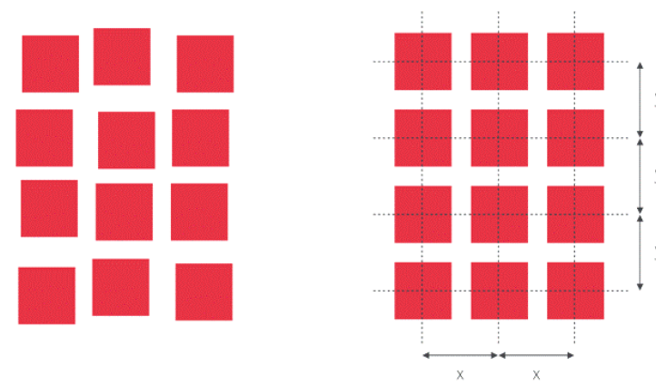
 

2. Controlar los espacios y márgenes.
   
   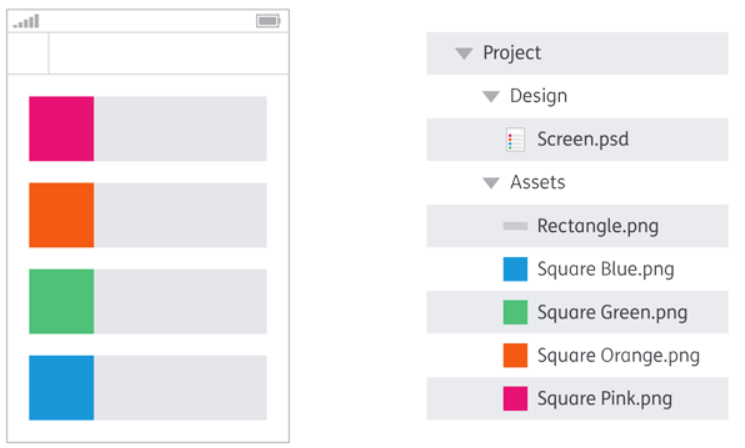
 
   
3. Verificar el diseño web en múltiples resoluciones y realizar pruebas exhaustivas en diversos navegadores y dispositivos.

   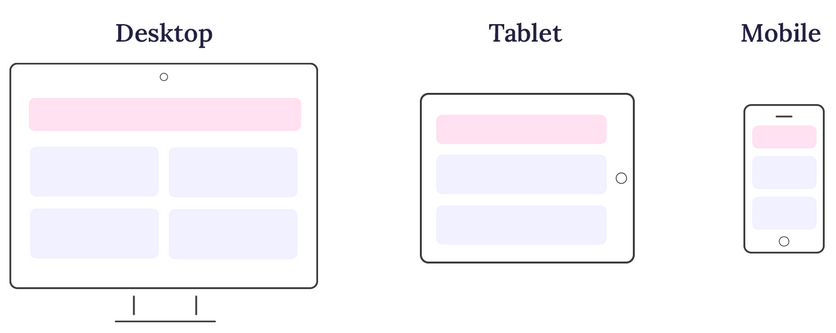
    
 

4. Inspección de píxeles y retina. Utilizar herramientas de inspección de píxeles para asegurarse de que las imágenes se rendericen correctamente en pantallas de alta resolución (pantallas Retina).
  
        
    
 

5. Perfección en elementos de texto. Asegúrarse de que las fuentes de texto utilizadas se rendericen correctamente en todo tipo de tamaños de pantalla.

    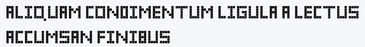
 
 

6. Evitar escalar imágenes.

    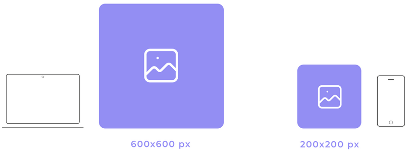

# 7. Mobile First design

  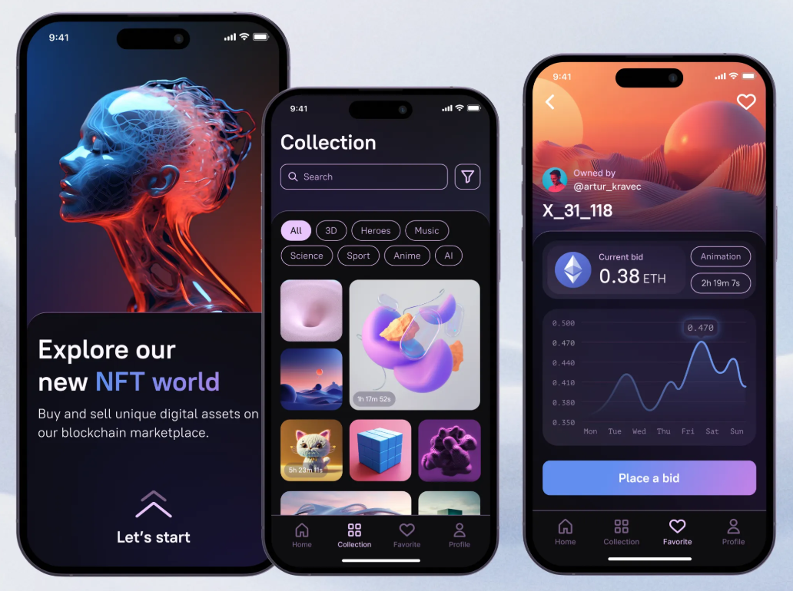

 

El **Mobile First design** es una metodología de diseño web que **prioriza** la experiencia de los usuarios de dispositivos móviles. Se basa en la idea de que cada vez más personas acceden a internet desde sus teléfonos.

Para implementar el diseño mobile first, se **diseña primero** la página web para dispositivos móviles y luego se escala hacia dispositivos de escritorio utilizando `media-queries`. 