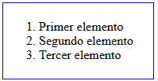
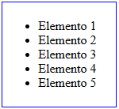
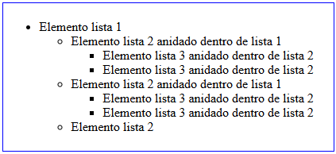
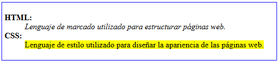
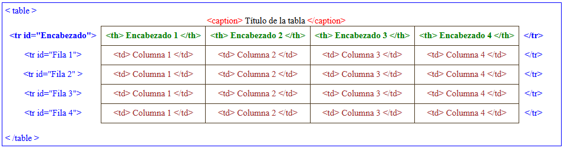
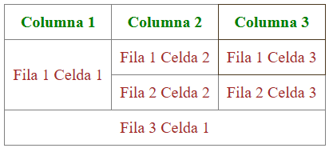

# 1. Introducción
 HTML5 es la **quinta versión** del lenguaje de marcado HTML (HyperText Markup Language), que se utiliza para estructurar y presentar contenido en la web. 
 Fue oficialmente lanzado en octubre de 2014 por el <a href="https://www.w3.org/"> World Wide Web Consortium (W3C) </a> y representa una evolución significativa respecto a sus predecesores, introduciendo nuevas características y mejoras que facilitan la creación de aplicaciones web más dinámicas e interactivas.

# 2. Características principales de HTML5:

- Nuevos elementos semánticos. 

- Soporte nultimedia nativo. 

- Canvas. El elemento `<canvas>` permite la renderización dinámica de gráficos 2D y 3D. 

- Almacenamiento local. HTML5 ofrece APIs como `localStorage` y `sessionStorage` para almacenar datos en el lado del cliente (de forma persistente o solo durante la sesión).
  
- Formularios mejorados. 

- Geolocalización.

- Compatibilidad con dispositivos móviles. 

- ... 

**Ejemplo básico de una estructura HTML5**

```html
<!DOCTYPE html>
<html lang="es">
<head>
    <meta charset="UTF-8">
    <meta name="viewport" content="width=device-width, initial-scale=1.0">
    <title>Mi primera página HTML5</title>
</head>
<body>
    <header>
        <h1>Bienvenido a mi página web</h1>
        <nav>
            <ul>
                <li><a href="#">Inicio</a></li>
                <li><a href="#">Acerca de</a></li>
                <li><a href="#">Contacto</a></li>
            </ul>
        </nav>
    </header>

    <section>
        <article>
            <h2>Artículo 1</h2>
            <p>Este es el contenido del primer artículo.</p>
        </article>
        <article>
            <h2>Artículo 2</h2>
            <p>Este es el contenido del segundo artículo.</p>
        </article>
    </section>

    <footer>
        <p>Derechos reservados &copy; 2023</p>
    </footer>
</body>
</html>
```

# 3. DOM 

## 3.1 - Introducción
El <a href="https://es.wikipedia.org/wiki/Document_Object_Model">**DOM** (Document Object Model)</a> representa la estructura del documento HTML como un árbol de nodos (etiquetas), donde cada nodo es un objeto que representa una parte del documento.  
El DOM permite a los desarrolladores interactuar **con el contenido, la estructura y el estilo** de una página web de manera dinámica mediante lenguajes como JavaScript.


## 3.2 - Estructura del DOM

El DOM organiza los elementos de un documento HTML en una estructura de árbol, donde:

- **Document**: Es el nodo raíz que representa todo el documento HTML.
- **Elementos**: Son nodos que representan las etiquetas HTML (por ejemplo, `<div>`, `<p>`, `<h1>`).
- **Atributos**: Son nodos que representan los atributos de los elementos (por ejemplo, `class`, `id`, `src`).
- **Texto**: Son nodos que representan el contenido textual dentro de los elementos.


**Importante**  
El uso correcto de los elementos HTML para representar el propósito y la jerarquía del contenido de la página web es especialmente importante por los siguientes motivos:  

- **Accesibilidad:**  
Los elementos semánticos ayudan a los lectores de pantalla y otras tecnologías de asistencia a entender la estructura y el propósito del contenido.

- **SEO (Search Engine Optimization)**  
Los motores de búsqueda como Google utilizan la semántica del DOM para entender el contenido de una página y clasificarla en los resultados de búsqueda.

- **Mantenibilidad del código:**  
Un código semántico es más fácil de leer y entender, lo que facilita la colaboración entre desarrolladores y el mantenimiento del proyecto.

- **Consistencia y claridad:**  
La semántica ayuda a definir claramente la estructura del documento, lo que reduce la ambigüedad y mejora la organización del contenido.

# 4. Etiquetas en HTML5

## 4.1 - Estructura de una etiqueta HTML
La estructura de las etiquetas HTML es la siguiente:
- Etiqueta de apertura y atributo(s)
- Contenido
- Etiqueta de cierre  


Cada etiqueta define un elemento. Estos elementos pueden ser inline (en línea) o block (en bloque).  
Ambos hacen referencia a cómo se muestra el resultado en el navegador.

## 4.2 - Elementos en bloque y en línea  
En HTML, cada etiqueta define un elemento, y estos elementos pueden ser **inline** (en línea) o **block** (en bloque). La diferencia entre ellos radica en cómo se muestran en el navegador:

1. **Elementos en línea (inline):** Estos elementos no comienzan en una nueva línea y solo ocupan el espacio necesario para su contenido. Ejemplos comunes incluyen `<span>`, `<a>`, `<strong>`, `<em>`, etc.

2. **Elementos en bloque (block):** Estos elementos siempre comienzan en una nueva línea y ocupan todo el ancho disponible de su contenedor. Ejemplos comunes incluyen `<div>`, `<p>`, `<h1>` a `<h6>`, `<ul>`, `<li>`, etc.

Ambos tipos de elementos afectan cómo se muestra el contenido en el navegador, y es importante entender sus diferencias para controlar el diseño y la estructura de una página web.


## 4.3 - Etiquetas HTML

### 4.3.1 - Etiquetas contenedores y estructura de una página
Las etiquetas de agrupación son elementos que se utilizan para organizar y estructurar el contenido de una página web.  
 Estas etiquetas no tienen un significado visual por sí mismas, pero ayudan a los navegadores y a los desarrolladores a entender la relación entre diferentes partes del contenido.

> **Etiquetas de agrupación más comunes:**

| Etiqueta      | Descripción |
|---------------|------------|
| `<div>`       | Se utiliza para crear un contenedor genérico que puede agrupar cualquier tipo de contenido. Se utiliza a menudo para aplicar estilos CSS a un grupo de elementos o para manipularlos con JavaScript. |
| `<span>`      | Contenedor en línea sin semántica. |
| `<p>`         | Define un párrafo de texto. |
| `<hr>`        | Línea horizontal. Indica una separación temática del texto. |
| `<main>`      | Contenedor para englobar la parte principal de la página. |
| `<ul>`        | Lista no ordenada. |
| `<ol>`        | Lista ordenada. |
| `<li>`        | Elemento de una lista. |
| `<dl>`        | Lista de definiciones. |
| `<dt>`        | Término de una definición. |
| `<dd>`        | Descripción de un término. |
| `<pre>`       | Establece un texto preformateado (respetando espacios y saltos de línea). |
| `<blockquote>`| Agrupa información y características de una cita (autor, fuente, etc...). |
| `<article>`   | Representa un artículo independiente en un documento, como una publicación de blog o un comentario. |
| `<aside>`     | Representa contenido relacionado con el contenido principal, pero que podría considerarse independiente, como una barra lateral. |
| `<nav>`       | Representa una sección de enlaces de navegación. |
| `<header>`    | Representa la cabecera de un documento o sección. |
| `<footer>`    | Representa el pie de página de un documento o sección. |
| `<figure>`    | Agrupa un elemento visual en una figura o ilustración. |
| `<figcaption>`| Establece una leyenda a una figura o ilustración. |
| `<header>`    | Cabecera de una sección o documento. |
| `<nav>`       | Navegación. |
| `<section>`   | Sección de contenido. |
| `<article>`   | Artículo independiente. |
| `<aside>`     | Contenido relacionado (barra lateral). |
| `<footer>`    | Pie de página. |
| `<main>`      | Contenido principal. |
| `<summary>`   | Resumen de un `<details>`. |
| `<details>`   | Elemento desplegable. |
| `<dialog>`    | Cuadro de diálogo/modal. |


### 4.3.2 - Enlaces y etiquetas multimedia  
Los enlaces y las etiquetas multimedia aportan interactividad a la página web y son elementos fundamentales en cualquier diseño.  
- **Los enlaces** permiten conectar diferentes páginas web, navegar dentro de una misma página o descargar archivos.  
- **Las etiquetas multimedia** permiten la inclusión de contenido audiovisual, como imágenes, audio y video, enriqueciendo la experiencia del usuario.  

> **Etiquetas de enlaces y multimedia más comunes:**

| Etiqueta      | Descripción |
|---------------|------------|
| `<a>`         | Enlace a otra página o recurso. |
| ``       | Imagen. |
| `<figure>`    | Contenedor para elementos gráficos. |
| `<figcaption>`| Leyenda de un `<figure>`. |
| `<map>`       | Mapa de imagen. |
| `<area>`      | Definición de áreas en un mapa de imagen. |
| `<picture>`   | Contenedor para imágenes con diferentes fuentes. |
| `<source>`    | Fuente alternativa para `<picture>` y `<video>`. |
| `<audio>`     | Contenedor de audio. |
| `<video>`     | Contenedor de video. |
| `<source>`    | Fuente alternativa para `<audio>` y `<video>`. |
| `<track>`     | Subtítulos o pistas de texto para `<video>`. |
| `<iframe>`    | Incrustar otra página. |
| `<embed>`     | Incrustar contenido externo. |
| `<object>`    | Contenedor de objetos embebidos. |
| `<param>`     | Parámetro de un `<object>`. |

### 4.3.3 - Etiquetas de texto  
Las etiquetas de texto permiten estructurar, dar formato y resaltar contenido y se dividen en varias categorías según su función.

> **Etiquetas de texto más comunes:**

| Etiqueta       | Descripción |
|----------------|------------|
| `<h1>` a `<h6>`| Encabezados de distintos niveles. |
| `<hgroup>`     | Grupo de encabezados. |	
| `<br>`         | Salto de línea. |
| `<cite>`       | Referencia a la fuente de una cita. |
| `<q>`          | Cita corta en línea. |
| `<abbr>`       | Abreviatura con una descripción. |
| `<address>`    | Información de contacto. |
| `<b>`          | Texto en negrita (sin semántica). |
| `<strong>`     | Texto en negrita con importancia semántica. |
| `<i>`          | Texto en cursiva (sin semántica). |
| `<em>`         | Texto enfatizado (cursiva con semántica). |
| `<small>`      | Texto en tamaño reducido. |
| `<mark>`       | Texto resaltado. |
| `<del>`        | Texto tachado. |
| `<ins>`        | Texto subrayado (contenido insertado). |
| `<sub>`        | Subíndice. |
| `<sup>`        | Superíndice. |
| `<code>`       | Fragmento de código. |
| `<pre>`        | Texto preformateado. |
| `<kbd>`        | Entrada de teclado. |
| `<samp>`       | Salida de programa. |
| `<mark>`       | Destaca (marca) un texto. |
| `<var>`        | Variable en programación. |
| `<s>`          | Tacha un texto. |
| `<u>`          | Subraya un texto. |
| `<kbd>`        | Representa una entrada de datos por el usuario. |
| `<time>`       | Permite indicar la fecha y la hora. |

### 4.3.4 - Etiquetas semánticas
Las etiquetas semánticas en HTML proporcionan **significado** al contenido de una página web, facilitando su interpretación tanto para los desarrolladores como para los motores de búsqueda y tecnologías de asistencia.  
A diferencia de las etiquetas genéricas como `<div>` o `<span>`, las etiquetas semánticas indican **la función específica** del contenido que contienen.

> **Etiquetas semanticas más comunes:**

| Etiqueta      | Descripción |  
|---------------|------------|  
| `<article>`   | Contenido independiente (artículos, comentarios, foros). |  
| `<nav>`       | Zona de navegación (enlaces a secciones o categorías). |  
| `<header>`    | Cabecera con logotipo, título, etc. No confundir con `<head>`. |  
| `<footer>`    | Pie de página del documento o sección. |  
| `<h1 ... h6>` | Encabezados de nivel 1 al 6. |  
| `<section>`   | Sección temática de contenido. |  
| `<main>`      | Contenido principal del documento. |  
| `<aside>`     | Contenido relacionado pero secundario. |  
| `<search>`    | Área de búsqueda en la página. |  
| `<address>`   | Información de contacto o ubicación. |  

### 4.3.5 - Etiquetas de tablas
Las tablas permiten organizar datos en filas y columnas. Se estructuran con varias etiquetas para definir su contenido y formato.

> **Etiquetas de tablas más comunes:**

| Etiqueta    | Descripción |  
|-------------|------------|  
| `<table>`   | Tabla. |
| `<th>`      | Celda de encabezado. |
| `<tr>`      | Fila de la tabla. |
| `<td>`      | Celda de datos. |
| `<caption>` | Título de la tabla. |
| `<thead>`   | Encabezado de la tabla. |
| `<tbody>`   | Cuerpo de la tabla. |
| `<tfoot>`   | Pie de la tabla. |
| `<colgroup>`| Grupo de columnas. |
| `<col>`     | Define propiedades de una columna. |

### 4.3.6 - Formularios e inputs
Los formularios en HTML permiten a los usuarios ingresar y enviar datos.

> **Etiquetas de formularios e inputs:**

| Etiqueta     | Descripción |  
|--------------|------------|  
| `<form>`     | Define un formulario. |
| `<input>`    | Campo de entrada de datos. |
| `<textarea>` | Área de texto. |
| `<button>`   | Botón interactivo. |
| `<label>`    | Etiqueta asociada a un campo. |
| `<fieldset>` | Agrupa elementos de un formulario. |
| `<legend>`   | Título de un `<fieldset>`. |
| `<select>`   | Menú desplegable. |
| `<option>`   | Opción dentro de `<select>`. |
| `<optgroup>` | Grupo de opciones dentro de `<select>`. |
| `<datalist>` | Lista de opciones para un `<input>`. |
| `<output>`   | Resultado de un cálculo. |
| `<progress>` | Barra de progreso. |
| `<meter>`    | Indicador de medición. |

### 4.3.7 - Elementos de scripting y datos
Permiten integrar scripts y manejar datos estructurados dentro de una página web.

> **Etiquetas de scripting y datos:**

| Etiqueta    | Descripción |  
|-------------|------------|  
| `<canvas>`  | Dibujo gráfico con JavaScript. |
| `<svg>`     | Gráficos vectoriales escalables. |
| `<math>`    | Contenido matemático. |
| `<template>`| Plantilla reutilizable en JavaScript. |
| `<slot>`    | Contenedor en Web Components. |


### **4.3.8 - Elementos básicos de una hoja HTML**

> **Elementos de cabecera de un documento web.**

| Etiqueta     | Descripción |  
|--------------|------------|  
| `<!DOCTYPE>` | Declara el tipo de documento (HTML5, XHTML, etc.). |  
| `<html>`     | Define el documento HTML y es el contenedor principal de la página. |  
| `<head>`     | Contiene metadatos sobre el documento (como título, enlaces a archivos externos, etc.). |  
| `<body>`     | Contiene el contenido visible de la página (texto, imágenes, etc.). |  

**Nota**:  
- `<!DOCTYPE>` no es exactamente parte del `<head>`, pero debe ir antes de la etiqueta `<html>` para declarar el tipo de documento.

> **Metadatos y enlaces a contenido externo**

| Etiqueta     | Descripción |  
|--------------|------------|  
| `<title>`    | Define el título de la página, que aparece en la pestaña del navegador. |  
| `<meta>`     | Proporciona metadatos (como charset, viewport, autor, keywords, etc.). |  
| `<link>`     | Vincula archivos externos, generalmente hojas de estilo CSS. |  
| `<style>`    | Contiene reglas CSS internas para el documento. |  
| `<script>`   | Contiene o enlaza scripts JavaScript (internos o externos). |  
| `<noscript>` | Define contenido alternativo si JavaScript está deshabilitado. |  
| `<base>`     | Define la URL base para los enlaces relativos en el documento. |


# 5. Símbolos especiales
Los **símbolos especiales o entidades de caracteres** se utilizan para representar caracteres incompatibles con la sintaxis HTML o que no están disponibles en el teclado. 
Se escriben con un **ampersand (`&`)**, seguido de un **nombre o número de referencia**, y terminan con un **punto y coma (`;`)**.

🔹 **Tipos de símbolos especiales en HTML**
## 5.1 - Símbolos reservados
Estos caracteres tienen un significado especial en HTML, por lo que deben representarse con entidades para evitar errores:
- `&lt;` → `<` (Menor que)
- `&gt;` → `>` (Mayor que)
- `&amp;` → `&` (Ampersand)
- `&quot;` → `"` (Comillas dobles)
- `&apos;` → `'` (Comillas simples, no funciona en HTML4)

## 5.2 - Símbolos de monedas
Ejemplo de símbolos monetarios:
- `&euro;` → € (Euro)
- `&dollar;` → $ (Dólar)
- `&pound;` → £ (Libra esterlina)
- `&yen;` → ¥ (Yen)

## 5.3 -  Símbolos matemáticos
Permiten escribir expresiones matemáticas:
- `&plusmn;` → ± (Más/menos)
- `&times;` → × (Multiplicación)
- `&divide;` → ÷ (División)
- `&sum;` → ∑ (Suma)
- `&infin;` → ∞ (Infinito)

## 5.4 - Flechas y signos gráficos
Se usan para indicar direcciones o mejorar la apariencia del contenido:
- `&larr;` → ← (Flecha izquierda)
- `&rarr;` → → (Flecha derecha)
- `&uarr;` → ↑ (Flecha arriba)
- `&darr;` → ↓ (Flecha abajo)

## 5.5 - Símbolos de copyright y marcas registradas
- `&copy;` → © (Copyright)
- `&reg;` → ® (Marca registrada)
- `&trade;` → ™ (Marca comercial)

## 5.6 - Símbolos de espacios y saltos de línea**
Permiten ajustar la presentación del texto:
- `&nbsp;` → Espacio en blanco (No rompe la línea)
- `&ensp;` → Espacio medio
- `&emsp;` → Espacio largo
- `&shy;` → Guion suave (Se muestra si es necesario dividir la palabra)

## 5.7 - Otros caracteres útiles
- `&check;` → ✓ (Marca de verificación)
- `&cross;` → ✗ (Cruz)
- `&hearts;` → ♥ (Corazón)
- `&star;` → ★ (Estrella)

# 6. Enlaces de interés
- <a href="https://developer.mozilla.org/es/docs/Web/HTML/Element">**MDN** Web Docs</a>   
- <a href="https://lenguajehtml.com/html/introduccion/tabla-periodica-html5/">**Tabla periódica de etiquetas HTML**</a>  
- <a href="https://lenguajehtml.com/html/cheatsheets/download/?amount=0&cmd=_donations&hosted_button_id=6XU7D2MX6ZJCA&business=joseromanhernandez%40gmail.com&return=https%3A%2F%2Flenguajehtml.com%2Fhtml%2Fcheatsheets%2Fdownload%2F&item_name=HTML5+Cheatsheet+%28Donation%29&currency_code=EUR">**HTML cheatsheets**</a>


# 7. Listas
Las listas permiten organizar y presentar información de manera estructurada. Existen tres tipos básicos de listas:

- **Listas ordenadas:** Los elementos tienen un orden específico que se puede mostrar mediante números, letras, números romanos, etc. Son útiles cuando el orden es importante, como en instrucciones, clasificaciones, etc.
- **Listas no ordenadas:** Los elementos no siguen ningún orden específico. Están representados visualmente por puntos, círculos, cuadrados u otros estilos. Se utilizan cuando el orden no es relevante, como en una lista de compras o una lista de elementos de una categoría.
- **Listas de definición:** Cada elemento de la lista consta de un término o clave, seguido de una descripción o valor asociado. Este tipo de lista se usa principalmente para definir conceptos o vocabulario.

## 7.1 - Listas ordenadas
Las listas ordenadas se crean utilizando la etiqueta `<ol>`, y cada elemento de la lista se define dentro de la etiqueta `<li>` (list item).  
El orden predeterminado de los elementos es numérico, pero es posible personalizarlo mediante el atributo `type` de la etiqueta `<ol>`.

### 7.1.1 - Sintaxis básica de una lista ordenada

```html
<ol>
  <li>Primer elemento</li>
  <li>Segundo elemento</li>
  <li>Tercer elemento</li>
</ol>
```

### 7.1.2 - Personalización del tipo de numeración  
Se puede cambiar el estilo de la numeración usando el atributo `type` en la etiqueta `<ol>`: 

- `1`: Números arábigos (1, 2, 3, ...).
- `A`: Letras mayúsculas (A, B, C, ...).
- `a`: Letras minúsculas (a, b, c, ...).
- `I`: Números romanos en mayúsculas (I, II, III, ...).
- `i`: Números romanos en minúsculas (i, ii, iii, ...).

> **Ejemplo de una lista ordenada con numeración personalizada:**

```html
<ol type="A">
  ... 
</ol>
```

### 7.1.3 - Listas ordenadas con numeración automática
Si no se especifica un valor en el atributo `type`, la numeración será automática con números arábigos:

Si escribimos el siguiente código:
```html
<ol>
  <li>Primer elemento</li>
  <li>Segundo elemento</li>
  <li>Tercer elemento</li>
</ol>
```

Obtendremos el siguiente resultado en pantalla:  



### 7.1.4 - Numeración inversa de una lista
Con el atributo `reversed` de `<ol>` invertiremos el sentido de numeración de la lista. 

Si escribimos el siguiente código:
```html
<ol reversed>
  <li>Elemento 1</li>
  <li>Elemento 2</li>
  <li>Elemento 3</li>
</ol>
```

Obtendremos:  


### 7.1.5 - Valor inicial de numeración de una lista
Con el atributo `start` de `<ol>` definiremos el valor inicial de la lista. 

Si escribimos el siguiente código:
```html
<ol start="5">
  <li>Elemento 5</li>
  <li>Elemento 6</li>
  <li>Elemento 7</li>
  <li>Elemento 8</li>
  <li>Elemento 9</li>
</ol>
```

Obtendremos:  


### 7.1.6 - Alteración de los valores de una lista
Con el atributo `value` de `<li>` podemos alterar los valores de una lista **dentro de una lista**. 

Con el siguiente ejemplo:
```html
<ol>
  <li>Elemento 1</li>
  <li>Elemento 2</li>
  <li>Elemento 3</li>
  <li value="10">Elemento 10</li>
  <li>Elemento 11</li>
  <li>Elemento 12</li>
</ol>
```

Obtendremos:  


### 7.1.7 - Anidamiento de listas

También es posible crear sublistas (listas anidadas). Para crearlas, simplemente anidaremos más etiquetas `<ol>` o `<ul>` dentro de un `<li>`.

**Ejemplo:**

```html
<ol>
  <li>Elemento lista 1
    <ol type="A">
      <li>Elemento lista 2 anidado dentro de lista 1 
        <ol type="i">
          <li>Elemento lista 3 anidado dentro de lista 2</li>
          <li>Elemento lista 3 anidado dentro de lista 2</li>
        </ol>
      </li>
      <li>Elemento lista 2 anidado dentro de lista 1
        <ol type="I">
          <li>Elemento lista 3 anidado dentro de lista 2</li>
          <li>Elemento lista 3 anidado dentro de lista 2</li>
        </ol>
      </li>
      <li>Elemento lista 2</li>
      <li>Elemento lista 2</li>
    </ol>
  </li>
  <li>Elemento lista 1
    <ol reversed>
      <li>Elemento lista 2 anidado dentro de lista 1</li>
      <li>Elemento lista 2 anidado dentro de lista 1</li>
      <li>Elemento lista 2 anidado dentro de lista 1</li>
      <li>Elemento lista 2 anidado dentro de lista 1</li>
    </ol>
  </li>
</ol>
```

En pantalla, veremos:  


## 7.2 - Listas no ordenadas

Las listas no ordenadas se crean usando la etiqueta `<ul>` (unordered list), y cada ítem dentro de la lista se define con la etiqueta `<li>`. Los elementos de una lista no ordenada se presentan por defecto con un punto, aunque este estilo se puede personalizar mediante CSS.

### 7.2.1 - Sintaxis básica de una lista no ordenada

```html
<ul>
  <li>Elemento 1</li>
  <li>Elemento 2</li>
  <li>Elemento 3</li>
</ul>
```  



### 7.2.2 - Personalización de los elementos de las listas no ordenadas

La etiqueta `<ul>` no soporta argumentos que permitan cambiar el tipo de marcador. Sin embargo, la mayoría de navegadores cambian el tipo de marcador en función de la profundidad de anidamiento de la lista no ordenada. 

**Ejemplo**
```html
<ul>
  <li>Elemento lista 1
    <ul type="A">
      <li>Elemento lista 2 anidado dentro de lista 1 
        <ul>
          <li>Elemento lista 3 anidado dentro de lista 2</li>
          <li>Elemento lista 3 anidado dentro de lista 2</li>
        </ul>
      </li>
      <li>Elemento lista 2 anidado dentro de lista 1
        <ul>
          <li>Elemento lista 3 anidado dentro de lista 2</li>
          <li>Elemento lista 3 anidado dentro de lista 2</li>
        </ul>
      </li>
      <li>Elemento lista 2</li>
    </ul>
  </li> 
</ul>
```
**Resultado**  


**Nota:** La propiedad `list-style-type` de **CSS** permite definir el estilo de los marcadores. Algunos de los valores más comunes incluyen:

- `disc`: Puntos (por defecto).
- `circle`: Círculos vacíos.
- `square`: Cuadrados.
- `none`: Sin marcador.

**Ejemplo:**

```html
<ul style="list-style-type: square;">
  <li>Elemento 1</li>
  <li>Elemento 2</li>
  <li>Elemento 3</li>
</ul>
```

## 7.3 - Listas de definición

Las listas de definición se utilizan para definir términos, conceptos o elementos junto con sus definiciones o explicaciones. Se crean con las etiquetas `<dl>` (definition list), `<dt>` (definition term) y `<dd>` (definition description).

- **`<dl>`**: Define la lista de definiciones.
- **`<dt>`**: Define un término o concepto.
- **`<dd>`**: Proporciona la definición o explicación del término.

**Ejemplo de una lista de definición**

```html
<dl>
  <dt><article><strong>HTML:</strong></article></dt>
  <dd><span><i>Lenguaje de marcado utilizado para estructurar páginas web.</i></span></dd>
  <dt><article><strong>CSS:</strong></article></dt>
  <dd><span><mark>Lenguaje de estilo utilizado para diseñar la apariencia de las páginas web.</mark></span></dd>
</dl>
```

**Esto se verá como:**  
 

# 8. Tablas
Las **tablas** se definen con la etiqueta `<table>` y permiten estructurar la información en filas y columnas (celdas).

De una manera que recuerda a un documento HTML, las tablas se organizan en grupos con las etiquetas `<caption>`, `<thead>`, `<tbody>` y `<tfoot>`.

> **Estructura general de una tabla**  
  


> **Código HTML de la tabla anterior**
```html
<table>    
  <caption>Título de la tabla</caption>    
  <thead>
    <tr>
      <th>Encabezado 1</th>
      <th>Encabezado 2</th>
      <th>Encabezado 3</th>
      <th>Encabezado 4</th>
    </tr>
  </thead>
  <tbody>
    <tr>
      <td>Columna 1</td>
      <td>Columna 2</td>
      <td>Columna 3</td>
      <td>Columna 4</td>         
    </tr>
   <tr>  
     <td>Columna 1</td>
     <td>Columna 2</td>
     <td>Columna 3</td>
     <td>Columna 4</td>
   </tr>
   <tr>
     <td>Columna 1</td>
     <td>Columna 2</td>
     <td>Columna 3</td>
     <td>Columna 4</td>
   </tr>
   <tr>
     <td>Columna 1</td>
     <td>Columna 2</td>
     <td>Columna 3</td>
     <td>Columna 4</td>       
   </tr>
  </tbody>
  <tfoot >
    <tr >
      <td colspan="6">Final de la tabla</td>
    </tr>
  </tfoot>
</table>
```

> **Etiquetas clave**:
- `<table>`: Define el inicio de la tabla.
- `<thead>`: Define la sección de encabezado de la tabla.
- `<tbody>`: Contiene el cuerpo de la tabla.
- `<tfoot>`: Define la sección de pie de la tabla. 
- `<tr>` (table row): Define una fila de la tabla.
- `<th>` (table header): Representa una celda de encabezado.
- `<td>` (table data): Representa una celda de datos.

<br>

> **Atributos útiles en las tablas**
- `colspan="n"` → Une varias columnas en una celda.
- `rowspan="n"` → Une varias filas en una celda.

**Ejemplo:**

```html
<table border=”1″> 
  <tr> 
    <th>Columna 1</th> 
    <th>Columna 2</th> 
    <th>Columna 3</th> 
  </tr> 
  <tr> 
    <td  rowspan="2"> Fila 1 Celda 1</td>
    <td>Fila 1 Celda 2</td> 
    <td> Fila 1 Celda 3</td> 
  </tr> 
  <tr>
    <td> Fila 2 Celda 2</td>  
    <td> Fila 2 Celda 3</td> 
  </tr> 
  <tr> 
    <td colspan="3"> Fila 3 Celda 1</td>
  </tr> 
</table>
```

**Resultado:**  



# 9. Formularios
Conjuntos de campos o fieldsets

# 10. Tarea RA2 CE1


