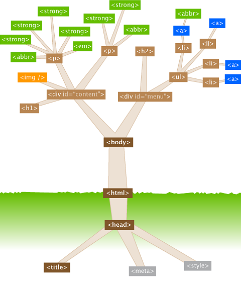

# 1. Introducción
 HTML5 es la **quinta versión** del lenguaje de marcado HTML (HyperText Markup Language), que se utiliza para estructurar y presentar contenido en la web. 
 Fue oficialmente lanzado en octubre de 2014 por el <a href="https://www.w3.org/"> World Wide Web Consortium (W3C) </a> y representa una evolución significativa respecto a sus predecesores, introduciendo nuevas características y mejoras que facilitan la creación de aplicaciones web más dinámicas e interactivas.

# 2. Características principales de HTML5:

- Nuevos elementos semánticos. 

- Soporte nultimedia nativo. 

- Canvas. El elemento `<canvas>` permite la renderización dinámica de gráficos 2D y 3D. 

- Almacenamiento local. HTML5 ofrece APIs como `localStorage` y `sessionStorage` para almacenar datos en el lado del cliente (de forma persistente o solo durante la sesión).
  
- Formularios mejorados. 

- Geolocalización.

- Compatibilidad con dispositivos móviles. 

- ... 

**Ejemplo básico de una estructura HTML5**

```html
<!DOCTYPE html>
<html lang="es">
<head>
    <meta charset="UTF-8">
    <meta name="viewport" content="width=device-width, initial-scale=1.0">
    <title>Mi primera página HTML5</title>
</head>
<body>
    <header>
        <h1>Bienvenido a mi página web</h1>
        <nav>
            <ul>
                <li><a href="#">Inicio</a></li>
                <li><a href="#">Acerca de</a></li>
                <li><a href="#">Contacto</a></li>
            </ul>
        </nav>
    </header>

    <section>
        <article>
            <h2>Artículo 1</h2>
            <p>Este es el contenido del primer artículo.</p>
        </article>
        <article>
            <h2>Artículo 2</h2>
            <p>Este es el contenido del segundo artículo.</p>
        </article>
    </section>

    <footer>
        <p>Derechos reservados &copy; 2023</p>
    </footer>
</body>
</html>
```

# 3. DOM 

## 3.1 - Introducción
El <a href="https://es.wikipedia.org/wiki/Document_Object_Model">**DOM** (Document Object Model)</a> representa la estructura del documento HTML como un árbol de nodos (etiquetas), donde cada nodo es un objeto que representa una parte del documento.  
El DOM permite a los desarrolladores interactuar **con el contenido, la estructura y el estilo** de una página web de manera dinámica mediante lenguajes como JavaScript.


## 3.2 - Estructura del DOM

El DOM organiza los elementos de un documento HTML en una estructura de árbol, donde:

- **Document**: Es el nodo raíz que representa todo el documento HTML.
- **Elementos**: Son nodos que representan las etiquetas HTML (por ejemplo, `<div>`, `<p>`, `<h1>`).
- **Atributos**: Son nodos que representan los atributos de los elementos (por ejemplo, `class`, `id`, `src`).
- **Texto**: Son nodos que representan el contenido textual dentro de los elementos.



**Importante**  
El uso correcto de los elementos HTML para representar el propósito y la jerarquía del contenido de la página web es especialmente importante por los siguientes motivos:  

- **Accesibilidad:**  
Los elementos semánticos ayudan a los lectores de pantalla y otras tecnologías de asistencia a entender la estructura y el propósito del contenido.

- **SEO (Search Engine Optimization)**  
Los motores de búsqueda como Google utilizan la semántica del DOM para entender el contenido de una página y clasificarla en los resultados de búsqueda.

- **Mantenibilidad del código:**  
Un código semántico es más fácil de leer y entender, lo que facilita la colaboración entre desarrolladores y el mantenimiento del proyecto.

- **Consistencia y claridad:**  
La semántica ayuda a definir claramente la estructura del documento, lo que reduce la ambigüedad y mejora la organización del contenido.

# 4. Etiquetas en HTML5

## 4.1 - Estructura de una etiqueta HTML
La estructura de las etiquetas HTML es la siguiente:
- Etiqueta de apertura y atributo(s)
- Contenido
- Etiqueta de cierre  


Cada etiqueta define un elemento. Estos elementos pueden ser inline (en línea) o block (en bloque).  
Ambos hacen referencia a cómo se muestra el resultado en el navegador.

## 4.2 - Elementos en bloque y en línea  
En HTML, cada etiqueta define un elemento, y estos elementos pueden ser **inline** (en línea) o **block** (en bloque). La diferencia entre ellos radica en cómo se muestran en el navegador:

1. **Elementos en línea (inline):** Estos elementos no comienzan en una nueva línea y solo ocupan el espacio necesario para su contenido. Ejemplos comunes incluyen `<span>`, `<a>`, `<strong>`, `<em>`, etc.

2. **Elementos en bloque (block):** Estos elementos siempre comienzan en una nueva línea y ocupan todo el ancho disponible de su contenedor. Ejemplos comunes incluyen `<div>`, `<p>`, `<h1>` a `<h6>`, `<ul>`, `<li>`, etc.

Ambos tipos de elementos afectan cómo se muestra el contenido en el navegador, y es importante entender sus diferencias para controlar el diseño y la estructura de una página web.


## 4.3 - Etiquetas HTML

### 4.2.1 - Etiquetas de agupación
Las etiquetas de agrupación son elementos que se utilizan para organizar y estructurar el contenido de una página web.  
 Estas etiquetas no tienen un significado visual por sí mismas, pero ayudan a los navegadores y a los desarrolladores a entender la relación entre diferentes partes del contenido.

> **Etiquetas de agrupación más comunes:**

| Etiqueta       | Descripción |
|---------------|------------|
| `<div>`       | Se utiliza para crear un contenedor genérico que puede agrupar cualquier tipo de contenido. Se utiliza a menudo para aplicar estilos CSS a un grupo de elementos o para manipularlos con JavaScript. |
| `<p>`         | Define un párrafo de texto. |
| `<hr>`        | Indica una separación temática del texto. |
| `<main>`      | Contenedor para englobar la parte principal de la página. |
| `<ul>`        | Se utiliza para crear una lista no ordenada (con viñetas). |
| `<ol>`        | Se utiliza para crear una lista ordenada (con números). |
| `<li>`        | Contiene uno de los ítems de una lista numerada o sin numerar. |
| `<dl>`        | Se utiliza para crear una lista de definiciones. |
| `<dt>`        | Establece el término de una definición. |
| `<dd>`        | Establece la descripción de un término de una definición. |
| `<pre>`       | Establece un texto preformateado (respetando espacios y saltos de línea). |
| `<blockquote>`| Agrupa información y características de una cita (autor, fuente, etc...). |
| `<article>`   | Representa un artículo independiente en un documento, como una publicación de blog o un comentario. |
| `<aside>`     | Representa contenido relacionado con el contenido principal, pero que podría considerarse independiente, como una barra lateral. |
| `<nav>`       | Representa una sección de enlaces de navegación. |
| `<header>`    | Representa la cabecera de un documento o sección. |
| `<footer>`    | Representa el pie de página de un documento o sección. |
| `<figure>`    | Agrupa un elemento visual en una figura o ilustración. |
| `<figcaption>`| Establece una leyenda a una figura o ilustración. |


- `<!DOCTYPE`>: Tipo de documento.	
- `<html>`: Define el documento HTML.
- `<head>`: Contiene metadatos y enlaces a scripts o estilos.
- `<body>`: Contiene el contenido visible de la página.

### 4.2.2 - Metadatos y enlaces
- `<title>`: Define el título de la página (visible en la pestaña del navegador). 
- `<meta>`: Proporciona metadatos sobre el documento (charset, viewport, autor, keywords etc.).
- `<link>`: Vincula archivos externos, como hojas de estilo CSS.
- `<style>`: Contiene reglas CSS internas.
- `<script>`: Contiene o enlaza scripts JavaScript.
- `<noscript>`: Define contenido alternativo si JavaScript está deshabilitado.
- `<base>`: Define la URL base para los enlaces relativos en el documento.

### 4.2.3 - Texto y contenido
- **`<h1>` a `<h6>`: Encabezados de distintos niveles.
- `<hgroup>`: Grupo de encabezados	
- `<p>`: Párrafo de texto.
- `<hr>`: Línea horizontal.
- `<br>`: Salto de línea.
- `<blockquote>`: Cita en bloque.
- `<cite>`: Referencia a la fuente de una cita.
- `<q>`: Cita corta en línea.
- `<abbr>`: Abreviatura con una descripción.
- `<address>`: Información de contacto.
- `<b>`: Texto en negrita (sin semántica).
- `<strong>`: Texto en negrita con importancia semántica.
- `<i>`: Texto en cursiva (sin semántica).
- `<em>`: Texto enfatizado (cursiva con semántica).
- `<small>`: Texto en tamaño reducido.
- `<mark>`: Texto resaltado.
- `<del>`: Texto tachado.
- `<ins>`: Texto subrayado (contenido insertado).
- `<sub>`: Subíndice.
- `<sup>`: Superíndice.
- `<code>`: Fragmento de código.
- `<pre>`: Texto preformateado.
- `<kbd>`: Entrada de teclado.
- `<samp>`: Salida de programa.
- `<var>`: Variable en programación.

### 4.2.4 - Listas
- `<ul>`: Lista desordenada.
- `<ol>`: Lista ordenada.
- `<li>`: Elemento de una lista.
- `<dl>`: Lista de definiciones.
- `<dt>`: Término de la definición.
- `<dd>`: Descripción de un término.

### 4.2.5 - Enlaces e imágenes
- `<a>`: Enlace a otra página o recurso.
- ``: Imagen.
- `<figure>`: Contenedor para elementos gráficos.
- `<figcaption>`: Leyenda de un `<figure>`.
- `<map>`: Mapa de imagen.
- `<area>`: Definición de áreas en un mapa de imagen.
- `<picture>`: Contenedor para imágenes con diferentes fuentes.
- `<source>`: Fuente alternativa para `<picture>` y `<video>`.

### 4.2.6 - Tablas
- `<table>`: Tabla.
- `<caption>`: Título de la tabla.
- `<thead>`: Encabezado de la tabla.
- `<tbody>`: Cuerpo de la tabla.
- `<tfoot>`: Pie de la tabla.
- `<tr>`: Fila de la tabla.
- `<th>`: Celda de encabezado.
- `<td>`: Celda de datos.
- `<colgroup>`: Grupo de columnas.
- `<col>`: Define propiedades de una columna.

### 4.2.7 - Formularios e inputs
- `<form>`: Define un formulario.
- `<input>`: Campo de entrada de datos.
- `<textarea>`: Área de texto.
- `<button>`: Botón interactivo.
- `<label>`: Etiqueta asociada a un campo.
- `<fieldset>`: Agrupa elementos de un formulario.
- `<legend>`: Título de un `<fieldset>`.
- `<select>`: Menú desplegable.
- `<option>`: Opción dentro de `<select>`.
- `<optgroup>`: Grupo de opciones dentro de `<select>`.
- `<datalist>`: Lista de opciones para un `<input>`.
- `<output>`: Resultado de un cálculo.
- `<progress>`: Barra de progreso.
- `<meter>`: Indicador de medición.

### 4.2.8 - Contenedores y estructura de la página
- `<div>`: División genérica de contenido.
- `<span>`: Contenedor en línea sin semántica.
- `<header>`: Cabecera de una sección o documento.
- `<nav>`: Navegación.
- `<section>`: Sección de contenido.
- `<article>`: Artículo independiente.
- `<aside>`: Contenido relacionado (barra lateral).
- `<footer>`: Pie de página.
- `<main>`: Contenido principal.
- `<summary>`: Resumen de un `<details>`.
- `<details>`: Elemento desplegable.
- `<dialog>`: Cuadro de diálogo/modal.

### 4.2.9 - Elementos multimedia
- `<audio>`: Contenedor de audio.
- `<video>`: Contenedor de video.
- `<source>`: Fuente alternativa para `<audio>` y `<video>`.
- `<track>`: Subtítulos o pistas de texto para `<video>`.

### 4.2.10 - Contenido interactivo y embebido**
- `<iframe>`: Incrustar otra página.
- `<embed>`: Incrustar contenido externo.
- `<object>`: Contenedor de objetos embebidos.
- `<param>`: Parámetro de un `<object>`.

### 4.2.11 - Elementos de scripting y datos
- `<canvas>`: Dibujo gráfico con JavaScript.
- `<svg>`: Gráficos vectoriales escalables.
- `<math>`: Contenido matemático.
- `<template>`: Plantilla reutilizable en JavaScript.
- `<slot>`: Contenedor en Web Components.

# 5. Símbolos especiales
Los **símbolos especiales o entidades de caracteres** se utilizan para representar caracteres incompatibles con la sintaxis HTML o que no están disponibles en el teclado. 
Se escriben con un **ampersand (`&`)**, seguido de un **nombre o número de referencia**, y terminan con un **punto y coma (`;`)**.

🔹 **Tipos de símbolos especiales en HTML**
## 5.1 - Símbolos reservados
Estos caracteres tienen un significado especial en HTML, por lo que deben representarse con entidades para evitar errores:
- `&lt;` → `<` (Menor que)
- `&gt;` → `>` (Mayor que)
- `&amp;` → `&` (Ampersand)
- `&quot;` → `"` (Comillas dobles)
- `&apos;` → `'` (Comillas simples, no funciona en HTML4)

## 5.2 - Símbolos de monedas
Ejemplo de símbolos monetarios:
- `&euro;` → € (Euro)
- `&dollar;` → $ (Dólar)
- `&pound;` → £ (Libra esterlina)
- `&yen;` → ¥ (Yen)

## 5.3 -  Símbolos matemáticos
Permiten escribir expresiones matemáticas:
- `&plusmn;` → ± (Más/menos)
- `&times;` → × (Multiplicación)
- `&divide;` → ÷ (División)
- `&sum;` → ∑ (Suma)
- `&infin;` → ∞ (Infinito)

## 5.4 - Flechas y signos gráficos
Se usan para indicar direcciones o mejorar la apariencia del contenido:
- `&larr;` → ← (Flecha izquierda)
- `&rarr;` → → (Flecha derecha)
- `&uarr;` → ↑ (Flecha arriba)
- `&darr;` → ↓ (Flecha abajo)

## 5.5 - Símbolos de copyright y marcas registradas
- `&copy;` → © (Copyright)
- `&reg;` → ® (Marca registrada)
- `&trade;` → ™ (Marca comercial)

## 5.6 - Símbolos de espacios y saltos de línea**
Permiten ajustar la presentación del texto:
- `&nbsp;` → Espacio en blanco (No rompe la línea)
- `&ensp;` → Espacio medio
- `&emsp;` → Espacio largo
- `&shy;` → Guion suave (Se muestra si es necesario dividir la palabra)

## 5.7 - Otros caracteres útiles
- `&check;` → ✓ (Marca de verificación)
- `&cross;` → ✗ (Cruz)
- `&hearts;` → ♥ (Corazón)
- `&star;` → ★ (Estrella)

# 6. Enlaces de interés
- <a href="https://developer.mozilla.org/es/docs/Web/HTML/Element">**MDN** Web Docs</a>   
- <a href="https://lenguajehtml.com/html/introduccion/tabla-periodica-html5/">**Tabla periódica de etiquetas HTML**</a>  
- <a href="https://lenguajehtml.com/html/cheatsheets/download/?amount=0&cmd=_donations&hosted_button_id=6XU7D2MX6ZJCA&business=joseromanhernandez%40gmail.com&return=https%3A%2F%2Flenguajehtml.com%2Fhtml%2Fcheatsheets%2Fdownload%2F&item_name=HTML5+Cheatsheet+%28Donation%29&currency_code=EUR">**HTML cheatsheets**</a>

# 6. Listas
Disponemos de, al menos, tres tipos de listas:
- **Listas ordenadas:** Los elementos tienen un orden, que puede venir dado por números arábigos, letras, números romanos, etc. 
- **Listas no ordenadas:** Los elementos no muestran ninguna ordenación y vienen identificadas por puntos, cuadrados, etc.
- **Listas de definición:** Los elementos se representan por una clave y un valor asociado. 

## 6.1 - Listas ordenadas


# 7. Tarea RA2 CE1


Etiquetas de secciones
Tablas, enlaces y multimedia
Formularios
Listas
Conjuntos de campos o fieldsets