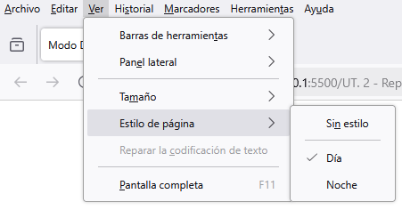

<div align=center>
  
</div>


| **Resultados de aprendizaje de la unidad didáctica:** |
|-|
| **RA. 2:** Crea interfaces web homogéneos definiendo y aplicando estilos.|

|**Criterios de evaluación de la unidad didáctica:**|
|-|
| **CE. b&#41;** Se han definido estilos de forma directa.|
| **CE. c&#41;** Se han definido y asociado estilos globales en hojas externas.|
| **CE. d&#41;** Se han definido hojas de estilos alternativas.|


<br>

| **Licencia Creative Commons:** ||
| - | - |
|  | **Reconocimiento-NoComercial-CompartirIgual CC BY-NC-SA:** No se permite un uso comercial de la obra original ni de las posibles obras derivadas, la distribución de la cuales se debe hace con una licencia igual a la que regula la obra original. |
---

# 1. Introducción
**CSS3 (Cascading Style Sheets, nivel 3)** es la versión más reciente del lenguaje de estilos que permite controlar la apariencia y el diseño de las páginas web mediante hojas de estilos.

Para definir un estilo, se utilizan lo que se conocen como reglas. Cada regla está compuesta por un selector (el nombre del elemento al que se aplicará el estilo) y un bloque de declaraciones, donde se especifican los estilos a aplicar (como tipo de letra, tamaño, color o bordes). Cada declaración consta de una propiedad y un valor (o varios valores) asociado a esa propiedad.

**Ejemplo de regla de estilos sobre el elemento `<p>`.** 
```css
p {
  color: blue;       /* Propiedad para el color del texto */
  font-size: 16px;   /* Propiedad para el tamaño de la fuente */
  text-align: center; /* Propiedad para alinear el texto al centro */
  background-color: lightgray; /* Propiedad para el color de fondo */
}
``` 

Los estilos se organizan en hojas de estilos, donde definimos cómo se verá nuestra página web. Aunque es posible escribir los estilos directamente dentro del documento HTML (usando la etiqueta `<style>` en el `<head>` o con atributos `style` en los elementos), esto no se considera una buena práctica. Por ello, lo recomendable es almacenarlos en un archivo separado (por ejemplo, `estilos.css`) y enlazarlo a la página web mediante la etiqueta `<link>` dentro del `<head>`.

**Ejemplo de enlace a la hoja de estilos externa, `estilos.css`.**

```html
<!DOCTYPE html>
<html lang="es">
<head>
    <meta charset="UTF-8">
    <meta name="viewport" content="width=device-width, initial-scale=1.0">
    <link rel="stylesheet" type="text/css" href="estilos.css">
    <title>Sitio Web de Noticias</title>
</head>
```

**Formas de aplicar estilos:**
| Mediante...                       | Descripción                                                |
|------------------------------------|------------------------------------------------------------|
| Etiqueta `<link rel="stylesheet">` en el `<head>`  | Archivo CSS externo: El código se escribe en un archivo `.css` aparte. |
| Etiqueta `<style>`                 | Bloque de estilos: El código se escribe en una etiqueta `<style>` dentro del documento HTML. |
| Atributo HTML `style="..."`        | Estilos en línea: El código se escribe en un atributo `style` dentro de una etiqueta HTML. |

# 2. Sintaxis CSS
Como hemos visto, la sintaxis de CSS se basa en **reglas** que definen cómo se debe aplicar el estilo a los elementos de una página web. Cada regla está compuesta por **selectores**, **propiedades** y **valores**.  

## 2.1. - Elementos de la sintaxis CSS
1. **Selector:** Indica a qué elementos HTML se aplicarán los estilos.  
2. **Propiedad:** Define la característica visual que se va a modificar.  
3. **Valor:** Especifica cómo se aplicará la propiedad.  
4. **Bloque de declaraciones:** Se encuentra entre llaves `{}` y agrupa las declaraciones de las propiedades y sus valores.   
5. **Comentarios:** Contiene información aclaratoria sobre el contenido del selector.

 **Estructura básica de una regla CSS**  
```css
selector {
  propiedad: valor;
  propiedad: valor;
}
```

## 2.2. - Tipos de selectores
Existen diversas maneras de definir selectores, desde los más básicos hasta los más avanzados. A continuación, se mostraran los más habituales.

### 2.2.1. - Selectores de etiqueta (Tag Selectors)
También llamados **selectores de tipo**, se utilizan para aplicar estilos a **todas las instancias** de una etiqueta.  

**Ejemplo**  
```css
p {
  color: blue;
}
```
:arrow_right: Todos los elementos `<p>` de la página tendrán el texto en color azul.  

---

### 2.2.2. - Selectores de identificadores (`id`)
Se usan para aplicar estilos a un **elemento `id` (identificador) único** en la página.   

**Ejemplo**  
```css
#titulo {
  font-size: 24px;
  font-weight: bold;
}
```
```html
<h1 id="titulo">Este es un título</h1>
```
:arrow_right: Solo el elemento con `id="titulo"` tendrá el tamaño de 24px y estará en negrita.  

### 2.2.3. - Selectores de clases (`class`)
Permiten aplicar estilos a múltiples elementos con la misma clase.  

**Ejemplo**  
```css
.destacado {
  background-color: yellow;
}
```
```html
<p class="destacado">Este párrafo tiene fondo amarillo.</p>
<div class="destacado">Este div también tiene fondo amarillo.</div>
```
:arrow_right: Tanto el `<p>` como el `<div>` con la clase `.destacado` tendrán un fondo amarillo.  


### 2.2.4. - Selectores de pseudoclases
Las pseudoclases permiten aplicar estilos a elementos en función de su estado o posición en el documento.  

**Ejemplo**  
```css
a:hover {
  color: red;
}
```
```html
<a href="#">Pasa el ratón por aquí</a>
```
:arrow_right:** Cuando el usuario pase el ratón sobre el enlace, el color cambiará a rojo.  

**Pseudoclases más comunes**  
- `:hover` → Cuando el usuario pasa el ratón sobre un elemento.  
- `:focus` → Cuando un campo de formulario está enfocado.  
- `:nth-child(n)` → Selecciona un hijo específico de un contenedor.  
- `:first-child`, `:last-child` → Selecciona el primer o último hijo de un elemento padre.  

### 2.2.5. - Selectores de pseudoelementos
Los pseudoelementos permiten aplicar estilos a partes específicas de un elemento. Se utilizan para **crear elementos virtuales que no existen en el DOM**, pero que se pueden estilizar como si fueran elementos reales.

```css
a::before {
  content: "→"; 
  margin-right: 5px; 
  color: blue; 
}
```
:arrow_right: Cada enlace `<a>` tendrá una flecha azul antes del texto separada del contenido con un margen de 5px. 

**Pseudo-elementos más comunes**

* `::before`: Inserta contenido antes del contenido del elemento seleccionado.
* `::after`: Inserta contenido después del contenido del elemento seleccionado.
* `::first-letter`: Selecciona la primera letra del contenido del elemento.
* `::first-line`: Selecciona la primera línea del contenido del elemento.
* `::selection`: Selecciona la parte del contenido del elemento que el usuario ha seleccionado.
* `::marker`: Estiliza los marcadores de las listas (`<li>`).
* `::placeholder`: Estiliza el texto de marcador de posición de los campos de formulario.
* `::file-selector-button`: Estiliza el botón de selección de archivos de los campos de entrada de tipo `file`.

### 2.2.6. - Selector Universal (`*`)  
Aplica estilos a todos los elementos de la página.  
```css
* {
  margin: 0;
  padding: 0;
}
```

### 2.2.7. - Selectores de atributos  
Permiten aplicar estilos a elementos con atributos específicos.  

**Ejemplo:**  
```css
a[target="_blank"] {
    color: green;
}
```
```html
<a href="https://ejemplo.com" target="_blank">Abrir en nueva pestaña</a>
```
 :arrow_right: Seleccionar todos los enlaces con el atributo `target="_blank"` (se abren en una nueva pestaña) y aplicarles un color de texto verde.  
    
- **Otros selectores de atributos:**  
  - `[type="text"]` → Aplica estilos solo a `<input type="text">`.  
  - `[disabled]` → Selecciona elementos con el atributo `disabled`.  
  - `[href^="https"]` → Selecciona enlaces que comiencen con "https".  
  - `[href$=".png"]` → Selecciona enlaces que terminen con `.png`". 

## 2.3. - Combinación de selectores
Se usan principalmente para seleccionar elementos dentro de otros elementos permitiendo una aplicación precisa del estilo.

**Ejemplo:**
```css
div p {
    color: red;
}
```
```html
<div>
    <p>Este párrafo es rojo.</p>
</div>
<p>Este párrafo no es rojo.</p>
```
:arrow_right: Solo los `<p>` dentro de `<div>` tendrán el texto en rojo.  

### 2.3.1. - Combinador descendiente (espacio)
El combinador de espacio, permite seleccionar elementos HTML basados en su relación jerárquica dentro del documento. 

* **Sintaxis:**  
    `selector_padre selector_descendiente`. El espacio en blanco entre los selectores indica la relación de descendencia.

**Ejemplo**
```css
div p {
  color: blue;
}
```
:arrow_right: Selecciona todos los elementos `<p>` que están dentro de cualquier elemento `<div>` en la página y les aplica el color azul.

  ### 2.3.2. - Combinador hijo (>)
Los combinadores hijo permiten seleccionar elementos que son hijos directos de otro elemento especificado. Esto significa que **solo seleccionan elementos que están inmediatamente anidados dentro de otro elemento**, sin importar si hay otros elementos intermedios.

* **Sintaxis:**
    `selector_padre > selector_hijo`

**Ejemplo**
```css
ul > li {
  color: red;
}
```
:arrow_right: Selecciona solo los elementos `<li>` que **son hijos directos de elementos** `<ul>` y les aplica el color rojo. Los elementos `<li>` que estén anidados dentro de otros elementos dentro del `<ul>` no se verán afectados.

### 2.3.3. - Combinador hermano adyacente (+)
El combinador de hermano adyacente permite seleccionar un elemento que **sigue inmediatamente a otro elemento especificado**, siempre y cuando ambos compartan el mismo elemento padre.

* **Sintaxis:**
    `selector_anterior + selector_siguiente`
    
**Ejemplo**
```css
h2 + p {
  color: green;
}
```
:arrow_right: Selecciona solo el elemento `<p>` que viene justo después de un elemento `<h2>` y le aplica el color verde. Si hay otros párrafos después del `<h2>` pero no inmediatamente, no se verán afectados.

### 2.3.4. - Combinador hermano general (~)
El combinador de hermano general permite seleccionar elementos que **comparten el mismo padre y que siguen a otro elemento específico, sin importar si están inmediatamente adyacentes a él**.

* **Sintaxis:**
    `selector_anterior ~ selector_siguiente`

**Ejemplos**
```css
h2 ~ p {
  color: purple;
}
```
:arrow_right: Selecciona todos los elementos `<p>` que siguen a un elemento `<h2>` **sin importar cuántos elementos haya entre ellos**, y les aplica el color púrpura.

### 2.3.5. - Tabla resumen
| **Combinador** | **Símbolo** | **Ejemplo** | **Descripción** |  
|--|--|--|--|
| **Combinador descendiente** | (espacio) | div p | Selecciona elementos dentro de otros (cualquier nivel). |  
| **Combinador hijo** | > | ul > li | Selecciona hijos directos (primer nivel). |  
| **Combinador hermano adyacente** | + | h2 + p | Selecciona elementos contiguos a otros (mismo nivel). |  
| **Combinador hermano general** | ~ | h2 ~ p | Selecciona elementos que siguen a otros (mismo nivel). |  
    
**Ejemplo**
```html
<div class="contenedor">
  <p>Párrafo 1 (dentro del contenedor)</p>
  <section>
    <p>Párrafo 2 (dentro de la sección)</p>
    <div>
      <p>Párrafo 3 (dentro del div anidado)</p>
    </div>
  </section>
  <h2>Encabezado 1</h2>
  <p>Párrafo 4 (hermano adyacente de h2)</p>
  <p>Párrafo 5 (hermano general de h2)</p>
  <div>
    <p>Párrafo 6 (dentro de otro div)</p>
  </div>
  <p>Párrafo 7 (otro hermano general de h2)</p>
</div>
<p>Párrafo 8 (fuera del contenedor)</p>
```
```css
/* Combinador descendiente (espacio): selecciona todos los descendientes */
.contenedor p {
  color: blue;
}

/* Combinador hijo (>): selecciona solo los hijos directos */
.contenedor > section > p {
  font-weight: bold;
}

/* Combinador hermano adyacente (+): selecciona el hermano siguiente inmediato */
h2 + p {
  background-color: lightgreen;
}

/* Combinador hermano general (~): selecciona todos los hermanos siguientes */
h2 ~ p {
  text-decoration: underline;
}
```

### 2.3.6. - Ejemplo prácticos
Pinchando en el siguiente <a href="./code/Ejemplos_1_CSS.html">**enlace**</a> encontraréis un ejemplo de código de combinadores, tablas y pseudo elementos.

# 3. Prácticas evaluables

## 3.1. - Tarea RA2 CEb-1
se han definido estilos de forma directa.
## 3.2. - Tarea RA2 CEb-2
se han definido estilos de forma directa.

## 3.3. - Tarea RA2 CEc-1
se han definido estilos globales en hojas externas 
## 3.4. - Tarea RA2 CEc-2
se han definido estilos globales en hojas externas 


# 4. Hojas de estilos alternativas
Las hojas de estilos alternativas permiten definir diferentes estilos para un mismo documento, ofreciendo al usuario la posibilidad de elegir entre distintas apariencias predefinidas. Se implementan utilizando el atributo `rel="alternate stylesheet"` en la etiqueta `<link>`.  

**Usos comunes:**  
- Cambios de tema (modo claro/oscuro).  
- Diferentes estilos para mejorar la accesibilidad.  
- Personalización de la interfaz según las preferencias del usuario.  

**Ejemplo:**  
```html
<head>
  <link rel="stylesheet" href="estilos-principal.css" title="Estilo por defecto">
  <link rel="alternate stylesheet" href="estilos-alternativo.css" title="Estilo alternativo">
</head>
```  

Para cambiar entre estilos alternativos, es necesario utilizar **JavaScript** o **configuraciones específicas en el navegador**.  
  
El soporte para **hojas de estilos alternativas** es limitado en los navegadores modernos. Aunque la especificación de HTML permite definirlas con `rel="alternate stylesheet"`, la mayoría de los navegadores actuales no ofrecen una interfaz nativa para cambiar entre ellas.  

## 4.1. - Soporte en navegadores:  
- **Firefox (versión 135.0.1)** Permite cambiar entre hojas de estilos a través del menú "Ver" → "Estilo de página".  
- **Safari**: Soporta hojas de estilos alternativas, pero no proporciona una interfaz de usuario para cambiarlas. Solo es posible hacerlo mediante JavaScript.  
- **Google Chrome, Edge, Opera y otros basados en Chromium**: No soportan hojas de estilos alternativas de forma nativa, por lo que el cambio debe hacerse mediante JavaScript.  

 ## 4.2. - Cambiar hojas de estilo con JavaScript  
Dado que la mayoría de los navegadores no permiten seleccionar estilos alternativos de forma nativa, se usará JavaScript para gestionarlos manualmente:  

**Ejemplo:**

>**Archivo index.html**
```html
<!DOCTYPE html>
<html lang="es">
<head>
  <meta charset="UTF-8">
  <meta name="viewport" content="width=device-width, initial-scale=1.0">
  <title>Modo Día/Noche</title>
  <!-- Estilo que se aplican siempre -->
  <link rel="stylesheet" href="./css/global.css"> 
  <!-- Estilo principal (modo día por defecto) -->
  <link rel="stylesheet" href="./css/dia.css" title="Día">
  <!-- Estilo alternativo (modo noche) -->
  <link rel="alternate stylesheet" href="./css/noche.css" title="Noche" disabled>
  <!-- Cargar el script de JS -->
  <script src="./js/script.js"></script>
</head>

<body>
    <h1>Alternar modo Día/Noche</h1>
    <button id="btn" onclick="toggleMode()">Modo noche</button>
</body>
</html>
```  
  
>**Archivo dia.css**
```css
body {
  background-color: white;
  color: black;
}
button {
  background-color: black;
  color: white;
}

>**Archivo noche.css**
```css
body {
  background-color: black;
  color: white;
}
button {
  background-color: white;
  color: black;
}
```

>**Archivo global.css**
```css
body {
  text-align: center;
  font-family: Arial, sans-serif;
  padding: 50px;
}
button {
  padding: 10px 20px;
  font-size: 16px;
  cursor: pointer;
  border: none;
  border-radius: 5px;
}
```
>**Archivo script.js**
```js
function toggleMode() {
  const hojaDia = document.querySelector('link[title="Día"]');
  const hojaNoche = document.querySelector('link[title="Noche"]');
  const texto = document.getElementById("btn");

  if (hojaDia.disabled) {
    hojaDia.disabled = false;
    hojaNoche.disabled = true;
    texto.innerHTML = "Modo noche";

  } else {
    hojaDia.disabled = true;
    hojaNoche.disabled = false;
    texto.innerHTML = "Modo día";
  }
}
```

>**Cambio de hoja de estilos desde firefox**  
  


## 4.3. - Tarea RA2 CEd
se han definido hojas de estilo alternativas 