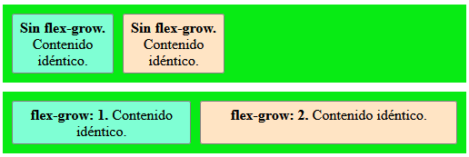
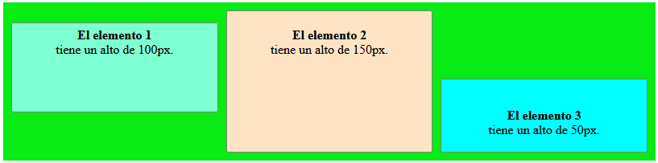

# 1. Introducción
En el desarrollo web, la **maquetación** permite diseñar y estructurar interfaces atractivas y funcionales.  
Existen diversas técnicas para distribuir los elementos en una página web, entre las más utilizadas destacan:

- **Modelo de cajas**: Todos los elementos en HTML se representan como cajas rectangulares.
- **Posicionamiento con CSS**: Se pueden emplear valores como `static`, `relative`, `absolute`, `fixed` y `sticky` para definir cómo se ubican los elementos respecto a su contenedor o a la ventana del navegador.
- **Flexbox**: Es un sistema de diseño flexible que permite distribuir elementos de manera eficiente en una fila o columna.
- **Grid Layout**: Es un sistema más avanzado que permite crear diseños complejos dividiendo el espacio en filas y columnas.


# 2. Modelo de cajas
Cada elemento HTML se encuentra rodeado de una caja con varias propiedades que pueden ser modificadas.  


CSS permite definir las características de cada una de estas cajas (altura, anchura, posición, color…). Para ello, hemos de tener en cuenta que cada caja se compone de ciertos elementos:

- El contenido de la caja.
- Border: Borde (visible o no) que enmarca el contenido.
- Padding: Espacio entre el contenido y el borde.
- Margin, espacio entre cajas adyacentes.
- Width y height: Tamaño de la caja (ancho y alto).
- Background: Color o imagen de fondo del elemento. 

## 2.1. - Margin collapse
El **margin collapse** es un comportamiento de CSS en el que los márgenes verticales de elementos adyacentes o anidados pueden combinarse en lugar de sumarse. Esto sucede para evitar que los espacios entre elementos se vuelvan innecesariamente grandes y facilitar una disposición más coherente del contenido.

**Casos en los que ocurre el Margin Collapse**  
1. **Entre elementos hermanos**  
Si dos elementos situados uno encima del otro tienen márgenes verticales, en lugar de sumarse, se superponen y se toma el valor más grande.  
```css
  .caja1 {
    margin-bottom: 30px;
  }

  .caja2 {
    margin-top: 20px;
  }
```
:arrow_right: El espacio entre `caja1` y `caja2` será **30px**, no 50px.

2. **Entre un elemento padre e hijo**  
Si un elemento hijo tiene un `margin-top`, este puede colapsar con el `margin-top` del padre en lugar de sumarse.  
```css
  .padre {
    margin-top: 40px;
  }

  .hijo {
    margin-top: 20px;
  }
```
:arrow_right: El margen superior del padre se fusiona con el del hijo, tomando el mayor valor en vez de sumarse.

3. **Márgenes vacíos en elementos anidados**  
Si un contenedor no tiene contenido ni `padding`, su `margin-top` o `margin-bottom` podría colapsar con los márgenes de su elemento hijo.

4. **Evitar el margin collapse**
- **Propiedad `padding`**: Agregar `padding` al contenedor impide el colapso.
- **Bordes (`border`)**: Un `border` en el contenedor impide el colapso de márgenes.
- **Propiedad `display: flex` o `display: grid`**: Con estos modelos de maquetación no se aplica el margin collapse. 

## 2.2. - Ejercicios

# 3. Posicionamiento CSS
El posicionamiento CSS se refiere a cómo los elementos HTML se colocan en la página web y cómo se relacionan con otros elementos.   
La propiedad `position` puede adoptar los siguientes valores:
| Valor | Definición |
|---|---|
|Static| Valor por defecto. Los elementos van apareciendo según el orden del documento HTML.|
|Relative|Se desplaza la caja respecto a lo que sería su posicionamiento normal.|
|Absolute|La caja se sitúa en una posición absoluta respecto de su elemento contenedor.|
|Fixed|La caja se sitúa en una posición fija en pantalla, independientemente de si el usuario sube o baja la página.|
|Float|La caja se sitúa todo lo posible a la izquierda o derecha, dentro de la línea horizontal en que se encuentra.|
|Sticky|La caja se desplaza cuando hacemos scroll hasta quedarse pegada en la parte superior cuando se alcanza cierta posición.|
|z-index|Permite controlar la profundidad y el orden de apilamiento de los elementos que tienen la propiedad position, siempre que la propiedad position sea distinta de static.|

## 3.1. - Posicionamiento con Static
Por defecto, todos los elementos HTML tienen el posicionamiento `static`. Esto significa que el elemento se coloca en el flujo normal del documento, es decir, en el lugar que le corresponde según el orden en que aparece en el código.

- **Propiedad:** `position: static;` 
- **Comportamiento:** Los elementos no pueden ser desplazados con las propiedades `top`, `right`, `bottom` o `left`.  
> **Ejemplo:**

```css
.caja1 {
  background-color: rgba(0, 0, 255, 0.192);
  width: 25vw;
  text-align:center;    
  margin: 20px;
  padding: 10px;
}

.caja2 {
  background-color: rgba(255, 0, 0, 0.192);
  width: 25vw;
  text-align:center;
  margin: 20px;
  padding: 10px;
}
```
> **Resultado:**  


## 3.2. - Posicionamiento con Relative
Cuando se aplica `position: relative;`, el elemento se coloca en su posición normal dentro del flujo del documento, pero puede moverse respecto a su posición original usando las propiedades `top`, `right`, `bottom`, o `left`.

- **Propiedad:** `position: relative;`
- **Comportamiento:** El elemento se mueve respecto a su ubicación original, pero aún mantiene su lugar en el flujo del documento. Esto significa que no afecta a otros elementos que están en el flujo.  

>**Ejemplo:**

```css
.caja1 {
  background-color: rgba(0, 0, 255, 0.192);
  width: 25vw;
  text-align:center;    
  margin: 20px;
  padding: 10px;
}

.caja2 {
  background-color: rgba(255, 0, 0, 0.192);
  width: 25vw;
  text-align: center;
  margin: 20px;
  padding: 10px;
  position: relative; /* Posicionamiento relativo a su ubicación original */
  left: 20px; /* Desplazamiento 20px derecha */
  top: 10px;  /* Desplazamiento 10px hacia abajo */
}
```

>**Resultado:**  


## 3.3. - Posicionamiento con Absolute
Un elemento con `position: absolute;` se posiciona en relación con el contenedor más cercano que tenga `position: relative;`, `absolute;` o `fixed;`. Si no existe tal contenedor, el elemento se posiciona en relación con el elemento `<html>`.  

- **Propiedad:** `position: absolute;`
- **Comportamiento:** El elemento se saca **del flujo normal del documento y no ocupa espacio**. Puede ser colocado en cualquier parte del contenedor usando `top`, `right`, `bottom`, o `left`.

>**Ejemplo:**
```css
.contenedor {
  position: relative; /* Contenedor relative para que caja2 se posicione dentro de él */
  width: 35vw;
  height: 20vh;
  background-color: antiquewhite;
  padding: 1px; /* solo para dar contenido al contenedor */
}

.caja1 {
  background-color: rgba(0, 0, 255, 0.192);
  width: 25vw;
  text-align: center;    
  margin: 10px;
  padding: 10px;
}

.caja2 {
  background-color: rgba(255, 0, 0, 0.192);
  width: 25vw;
  text-align: center;
  padding: 10px;
  position: absolute; /* elemento con posición absolute relativo a .contenedor */
  top: 40px;  /* 40px hacia abajo desde el contenedor relative */
  left: 50px; /* 50px hacia la izquierda desde el contenedor relative */
}
```

```html
<body>
  <div class="contenedor">
    <div class="caja1">Contenido caja 1</div>
    <div class="caja2">Contenido caja 2</div>
  </div>
</body>
``` 

>**Resultado:**  


## 3.4. - Posicionamiento con Fixed
El posicionamiento fijo hace que el elemento se quede en una posición específica en la pantalla, independientemente de si el usuario hace scroll en la página.  
**Importante:** El elemento se posiciona respecto a la ventana del navegador (viewport) y sus dimensiones también son relativas al viewport (no al contenedor padre).

- **Propiedad:** `position: fixed;`
- **Comportamiento:** El elemento se posiciona respecto a la ventana del navegador y permanece visible cuando el usuario hace scroll.  

>**Ejemplo:**
```css
.contenedor {
  width: 50vw;
  height:400vh;
  background-color: antiquewhite;
  padding: 1px;
}
.caja1 {
  background-color: rgba(0, 0, 255, 0.192);
  width: 75%;
  text-align: center;    
  margin-top: 50px;
  margin-left: 10px;
  padding: 10px;
}
.caja2 {
  background-color: rgba(255, 0, 0, 0.7);
  width: 50%; /* 50% del viewport al salirse del flujo del documento */
  text-align: center;
  padding: 10px;
  position: fixed; /* Se fija a la ventana del navegador */
  top: 0px;  /* Se ubica a 0px del borde superior de la ventana */
  left: 0px; /* Se ubica a 0px del borde derecho de la ventana */
}
```

```html
<div class="contenedor">
  <div class="caja1">Contenido caja 1</div>
  <div class="caja2">Contenido caja 2 (Fija)</div>
  <div class="caja1">Contenido caja 1</div>
  <div class="caja1">Contenido caja 1</div>
  <div class="caja1">Contenido caja 1</div>
</div>
```

>**Resultado:**  
<video controls src="./img/fixed.mp4" title="Title"></video>


## 3.5. - Posicionamiento con Float
La propiedad `float` permite que un elemento se desplace hacia la izquierda o la derecha dentro de su contenedor, permitiendo que otros elementos fluyan a su alrededor.  

**Importante:** A diferencia de `position: fixed;`, los elementos flotantes **siguen formando parte del flujo del documento** y su tamaño sigue dependiendo de su contenedor padre.  

- **Propiedad:** `float: left;` o `float: right;`  
- **Comportamiento:** El elemento flota a un lado y los elementos siguientes se acomodan alrededor de él.  

> **Ejemplo:**  
```css
.contenedor {
  width: 40vw;
  height:30vh;
  background-color: antiquewhite;
  padding: 1px;
}
.caja1 {
  background-color: rgba(143, 223, 140, 0.192);
  width: 25%;
  text-align: center;    
  margin: 5px;
  padding: 10px;
  float: none; /* no flota */
}
.caja2 {
  background-color: rgba(0, 0, 255, 0.192);
  width: 25%;
  text-align: center;    
  margin: 5px;
  padding: 10px;
  float: left; /* flota a la izquierda */
}
.caja3 {
  background-color: rgba(255, 0, 0, 0.7);
  width: 25%; 
  text-align: center;
  margin: 5px;
  padding: 10px;
  float: right; /* flota a la derecha */
}
```

```html
<div class="contenedor">
  <div class="caja1">Contenido caja 1</div>
  <div class="caja2">Contenido caja 2</div>
  <div class="caja3">Contenido caja 3</div>
</div>
```

>**Resultado:**  


## 3.5. - Posicionamiento con Sticky  
La propiedad `position: sticky;` permite que un elemento se comporte como `relative` hasta que alcanza un determinado umbral de desplazamiento, momento en el cual se mantiene "pegado" en su posición dentro del contenedor padre.  

**Importante:** A diferencia de `position: fixed;`, los elementos con `sticky` **siguen estando dentro del flujo del documento** y solo se fijan cuando se desplazan más allá del umbral definido.  

- **Propiedad:** `position: sticky;` con un valor para `top`, `left`, `right` o `bottom`  
- **Comportamiento:** El elemento se mantiene en su posición original hasta que el usuario hace scroll, momento en el que se fija en el punto definido.  

> **Ejemplo:**  
```css
.contenedor {
  width: 40vw;
  height: 300vh;
  background-color: antiquewhite;
  padding: 50px;  
}
.caja1 {
  background-color: rgb(143, 223, 140);
  width: 60%;
  text-align: center;    
  margin: 5px;
  padding: 10px;
  position: sticky;
  top: 25px; /* se queda a 25px de la parte superior al hacer scroll */
}
.caja2 {
  background-color: rgba(0, 0, 255, 0.192);
  width: 60%;
  text-align: center;    
  margin: 5px;
  padding: 10px;
}
.caja3 {
  background-color: rgba(255, 0, 0, 0.7);
  width: 60%; 
  text-align: center;
  margin: 5px;
  padding: 10px;
}
```

```html
<div class="contenedor">
  <div class="caja2">Contenido caja 1</div>
  <div class="caja1">Caja sticky</div>
  <div class="caja3">Contenido caja 2</div>
  <div class="caja2">Contenido caja 3</div>
  <div class="caja3">Contenido caja 4</div>    
</div>
```

>**Resultado:**  
<video controls src="./img/sticky.mp4" title="Title"></video>

## 3.6. - Posicionamiento con z-index  
La propiedad `z-index` en CSS se usa para **controlar la profundidad y el orden de apilamiento** de los elementos en la pantalla. Funciona solo en elementos que tienen una propiedad `position` distinta de `static`, es decir, que la propiedad sea `relative`, `absolute`, `fixed` o `sticky`.  

Los valores de `z-index` pueden ser:  
- **Positivos** (`z-index: 10;`): El elemento se coloca por encima de los que tienen un valor menor.  
- **Negativos** (`z-index: -1;`): El elemento se coloca detrás de otros elementos con valores superiores.  
- **`auto`**: Usa el mismo valor de `z-index` que su elemento padre.  

>**Ejemplo:**  
```css
.contenedor {
  position: relative; 
  width: 50vw;
  height: 20vh;
  background-color: antiquewhite;
  padding: 1px; 
}
.caja1, .caja2, .caja3, .caja4, .caja5 {
  width: 50%;
  text-align: center;
  padding: 10px;
  position: absolute; 
}
.caja1 {
  background-color: rgb(0, 255, 242);
  top: 20px;  
  left: 20px;
  z-index: 0; 
}
.caja2 {
  background-color: rgb(255, 0, 43);   
  top: 25px;  
  left: 25px;
  z-index: 1; 
}  
.caja3 {
  background-color: rgb(217, 255, 0);
  top: 30px;  
  left: 30px;
  z-index: 2; 
}
.caja4 {
  background-color: rgb(0, 60, 255);
  top: 35px;  
  left: 35px;
  z-index: 3; 
}
.caja5 {
  background-color: rgb(225, 0, 255);
  top: 40px;  
  left: 40px;
  z-index: 4; 
}
```

>**Resultado:**
<video controls src="./img/zindex.mp4" title="Title"></video>

## 3.7. - Tarea RA2 CEf
<poner aqui un ejemplo de navbar sidebar etc>

# 4. Flexbox
## 4.1. - Introducción
**Flexbox**, coloquialmente conocida como **flex** proviene de “Flexible Box Layout”, que se traduce como “Diseño de caja flexible”. Se trata de una solución **unidimensional** para la creación de "responsive designs", ya que permite organizar un conjunto de elementos flexibles que se adaptan automáticamente a su contenedor. Además, ofrece control sobre parámetros como la alineación, la dirección (horizontal o vertical) y el ajuste de las filas según el tamaño de los elementos, entre otros."

## 4.2. - Conceptos
El <a href="https://www.w3.org/TR/css-flexbox-1/">**W3C**</a> define a esta estructura como un “flujo flexible” de elementos en **dirección unidimensional** (arriba hacia abajo o izquierda hacia derecha) y **tamaño** (anchura/altura) según los ejes principal (horizontal) y transversal (vertical).  


- **Contenedor flexible** (flex container): Es el elemento padre que contiene los ítems flexibles.   
- **Eje principal** (main axis): Los contenedores flexibles tienen una orientación específica. Por defecto, el eje principal del contenedor flex es el horizontal.  
- **Eje secundario** (cross axis): Del mismo modo, los contenedores flexibles tienen una orientación secundaria específica, perpendicular a la principal.   
- Es posible permutar la orientación de los ejes y asignar el eje principal al vertical y el secundario al horizontal.  
- **Elemento flexible** (flex item): Son los elementos que se encuentran dentro del "flex container". 

## 4.3. - Tipos de contenedores flexibles
Existen dos tipos de contenedores flexibles: `flex` (flexible) e `inline-flex` (flexible en línea). La propiedad `display` permite definir el tipo de contenedor flexible. 

|**Tipo de contenedor**|**Comportamiento de los elementos hijos**|
|-|-|
| **display:flex** |El contenedor se comporta como un bloque, es decir, ocupa todo el espacio (horizontal) disponible (similar a `block`), pero sus elementos hijos solo ocupan el espacio necesario (a menos que se especifique lo contrario).|
|**display:inline-flex**|El contenedor se comporta como un elemento en-línea, es decir, ocupa solo el espacio necesario y pueden colocarse unos detrás de otros en la misma línea (similar a inline-block). Sin embargo, sus elementos hijos siguen comportándose como en un contenedor `flex`. |

>**Ejemplo:**
```css
.container1 {
  margin: 10px;
  display: flex;
  background-color: rgb(8, 235, 20);
}
.container2 {
  margin: 10px;
  display:inline-flex;
  background-color: blueviolet;
}
.element1 {
  margin: 5px;
  padding: 5px;
  background-color: aquamarine;
}
.element2 {
  margin: 15px;
  padding: 15px;
  background-color: bisque;
}
.element3{
  margin: 10px;
  padding: 10px;
  background-color: rgb(226, 75, 30);
}
```

```html
<div class="container1">
  <div class="element1">Elemento 1</div>
  <div class="element2">Elemento 2</div>
  <div class="element3">Elemento 3</div>
</div>
<div class="container2">
  <div class="element1">Elemento 1</div>
  <div class="element2">Elemento 2</div>
  <div class="element3">Elemento 3</div>
</div>
<div class="container2">
  <div class="element1">Elemento 1</div>
  <div class="element2">Elemento 2</div>
  <div class="element3">Elemento 3</div>
</div>
```

>**Resultado:**


## 4.4. - Dirección de los elementos hijos del contenedor flexible: Flex_direction
La propiedad `flex-direction` permite definir la dirección del eje principal del contenedor flexible (padre) según el eje horizontal (por defecto) o vertical. 

Los posibles valores de `flex-direction` son: 
|**Valores de flex-direction**|**Comportamiento**|
|-|-|
|**flex_direction: row** |Los elementos se visualizan **de izquierda a derecha** (valor por defecto).|
|**flex_direction: row-reverse** |Los elementos se visualizan de **derecha a izquierda**.|
|**flex_direction: column** |Los elementos se visualizan de **arriba hacia abajo**.|
|**flex_direction: column-reverse** |Los elementos se visualizan de **abajo hacia arriba**.|

>**Ejemplo:**
```css
.container1, .container2, .container3, .container4 {
  margin: 10px;
  padding: 5px;
  display: inline-flex;
}
.element1, .element2, .element3 {
  width: 50px;
  height: 50px;
  margin: 5px;
  padding: 5px;  
  border: 1px solid gray;
  border-radius: 3px;    
}
.container1 {
  flex-direction: row;
  background-color: rgb(8, 235, 20);
}
.container2 {
  flex-direction:row-reverse;
  background-color: blueviolet;
}
.container3 {      
  flex-direction: column;
  background-color: rgb(21, 230, 150);
}
.container4 {
  flex-direction: column-reverse;
  background-color: rgb(196, 166, 35);
}
.element1 {
  background-color: aquamarine;
}
.element2 {
  background-color: bisque;
}
.element3{
  background-color: rgb(226, 75, 30);
}
```
```html
<div class="container1">  
  <div class="element1">1</div>
  <div class="element2">2</div>
  <div class="element3">3</div>
</div>

<div class="container2">
  <div class="element1">1</div>
  <div class="element2">2</div>
  <div class="element3">3</div>
</div>

<div class="container3">
  <div class="element1">1</div>
  <div class="element2">2</div>
  <div class="element3">3</div>
</div>

<div class="container4">
  <div class="element1">1</div>
  <div class="element2">2</div>
  <div class="element3">3</div>
</div>
```

>**Resultado:**


## 4.5. - Ajuste en línea de los elementos flexibles: flex-warp
La propiedad `flex-wrap` establece si los elementos se colocan en una sola línea o en varias.

Los posibles valores de la propiedad `flex-wrap` son:
|**Valores de flex-wrap**|**Comportamiento**|
|-|-|
|**flex_wrap: nowrap** | Los elementos se muestran en línea, en una sola fila. Su tamaño se ajusta al contenedor siempre que la suma de todos ellos sea mayor que el 100% de la anchura del contenedor. Si es inferior, se muestran en línea pero conservan su tamaño. No se permite el desbordamiento en varias líneas.|
|**flex_wrap: wrap** | Los elementos se muestran en línea, en una sola fila. Su tamaño se ajusta al contenedor siempre que la suma de todos ellos sea inferior al 100% de la anchura del contenedor. Si es superior, se muestran en varias líneas (desbordamiento).|
|**flex_wrap: wrap-reverse** | Similar a `warp` pero esta vez, si hay desbordamiento, las filas de elementos se muestran en orden inverso.|

>**Ejemplo:**
```css
.container1, .container2, .container3 {
  margin: 10px;
  padding: 5px;
  display: flex;      
}
.element1, .element2, .element3 {
  width: 50px;
  height: 50px;
  margin: 5px;
  padding: 5px;  
  border: 1px solid gray;
  border-radius: 3px;  
  text-align: center;        
}
.container1 {
  flex-wrap: nowrap;
  background-color: rgb(8, 235, 20);
}
.container2 {
  flex-wrap: wrap;
  background-color: blueviolet;
}
.container3 {      
  flex-wrap: wrap-reverse;
  background-color: rgb(21, 230, 150);
}   
.element1 {
  background-color: aquamarine;
}
.element2 {
  background-color: bisque;
}
.element3{
  background-color: rgb(226, 75, 30);
}
```
```html
<div class="container1">  
  <div class="element1">1</div>
  <div class="element2">2</div>
  <div class="element3">3</div>
  <div class="element1">4</div>
  <div class="element2">5</div>
  <div class="element3">6</div>
  <div class="element1">7</div>
  <div class="element2">8</div>
  <div class="element3">9</div>
</div>

<div class="container2">  
  <div class="element1">1</div>
  <div class="element2">2</div>
  <div class="element3">3</div>
  <div class="element1">4</div>
  <div class="element2">5</div>
  <div class="element3">6</div>
  <div class="element1">7</div>
  <div class="element2">8</div>
  <div class="element3">9</div>
</div>

<div class="container3">  
  <div class="element1">1</div>
  <div class="element2">2</div>
  <div class="element3">3</div>
  <div class="element1">4</div>
  <div class="element2">5</div>
  <div class="element3">6</div>
  <div class="element1">7</div>
  <div class="element2">8</div>
  <div class="element3">9</div>
</div>
```

>**Resultado:**
<video controls src="./img/wrap.mp4" title="Title"></video>

## 4.6. - Ajuste bidireccional de los elementos flexibles: flex-flow
La propiedad `flex-flow` establece simultáneamente las propiedades `flex-direction` y `flex-wrap`.

Los posibles valores de la propiedad `flex-flow` son:  
| **Valores de flex-flow** | **Comportamiento** |  
|--------------------------|--------------------|  
| **flex-flow: row nowrap** | Los elementos se organizan en una sola fila (horizontalmente) y no se permite el desbordamiento en varias líneas. |  
| **flex-flow: row wrap** | Los elementos se organizan en una fila principal, pero si no caben en el contenedor, se envuelven en varias líneas. |  
| **flex-flow: row wrap-reverse** | Similar a `row wrap`, pero las nuevas líneas aparecen en la parte superior en lugar de la parte inferior. |  
| **flex-flow: column nowrap** | Los elementos se organizan en una sola columna (verticalmente) sin desbordamiento. |  
| **flex-flow: column wrap** | Los elementos se organizan en una columna y pueden desbordarse en varias columnas si es necesario. |  
| **flex-flow: column wrap-reverse** | Similar a `column wrap`, pero las nuevas columnas aparecen en el lado izquierdo en lugar del derecho. |  

## 4.7. - Ordenación de los elementos flexibles: Order
Si asignamos un valor a la propiedad order, los elementos hijos no seguirán el orden en el que fueron definidos originalmente, sino que se organizarán según el valor de `order`.

>**Fragmento de código con la propiedad order:**
```css
.element1 {
  order: 3;
  background-color: aquamarine;
  ...
}
```

## 4.8. - Tamaño de los elementos flexibles
### 4.8.1. - Ajustando el tamaño inicial de los elementos: flex-basis
Habitualmente, el tamaño de los elementos flexibles viene determinado por su contenido. Si no hay espacio suficiente en la dirección principal, el espacio disponible se distribuye de forma desigual entre todos los elementos, dando más espacio a los elementos con más contenido y siempre minimizando el tamaño de los elementos en la dirección secundaria.
La propiedad `flex-basis` permite establecer el tamaño inicial de los elementos, antes de que se reparta el espacio libre.

Los posibles valores de la propiedad `flex-basis` son:  
| **Valores de flex-basis** | **Comportamiento** |  
|--------------------------|--------------------|  
| **flex-basis: content** | El tamaño inicial del elemento viene determinado por su contenido. |  
| **flex-basis: auto** | El tamaño inicial viene determinado por las propiedades `width` y `height`. |  
| **flex-basis: valor** | Define el tamaño inicial del elemento. La unidad del valor puede ser, `px`, `rem`, `%`, etc. |  

>**Ejemplo:**
```css
.container1 {
  margin: 10px;
  padding: 5px;
  display: flex;      
  width: 80vw;
  flex-wrap: nowrap;
  background-color: rgb(8, 235, 20);
}
.element1, 
.element2, 
.element3
  {
  margin: 5px;
  padding: 5px;  
  border: 1px solid gray;
  border-radius: 3px;  
  text-align: center;        
} 
.element1 {
  width: 200px;
  flex-basis:auto;
  background-color: aquamarine;
}
.element2 {
  flex-basis:content; 
  background-color: bisque;
}
.element3{
  flex-basis: 300px;
  background-color: rgb(226, 75, 30);
}
```
```html
<div class="container1">  
  <div class="element1"><strong>auto: </strong>El ajuste del elemento viene definido por la propiedad <strong>width</strong> y la distribución puede dar resultados sorprendentes. </div>
  <div class="element2"><strong>content: </strong>El elemento tiene un tamaño inicial pero siempre se intenta poner todo el contenido en una misma línea.</div>
  <div class="element3"><strong>300px: </strong>El ancho inicial está predefinido y no se puede cambiar, por mucho contenido que haya en el elemento.</div>  
</div>
```
>**Resultado:**  


**Diferencias clave entre valores de flex-basis.**  

| **Propiedad** | **¿Cómo se calcula el tamaño inicial?** | **¿Depende del contenido?** |
|-----------|--------------------------------------|------------------------|
| **flex-basis: auto** | Usa el valor de `width` o `height` si están definidos. Si no, el tamaño del contenido. | ✅ Sí (si no hay `width` o `height`). |
| **flex-basis: content** | Se basa solo en el tamaño del contenido, sin importar `width` o `height`. | ✅ Sí |
| **flex-basis: 100px** (valor fijo) | Usa exactamente el valor especificado. | ❌ No |


### 4.8.2. - Ajustando el tamaño inicial de los elementos: `flex-grow`  

La propiedad `flex-grow` define el **factor de crecimiento** de los elementos flexibles cuando hay espacio adicional disponible en el contenedor.  

- **Si `flex-grow` es `0`** (valor por defecto), el elemento no crecerá más allá de su tamaño inicial (`flex-basis`).  
- **Si `flex-grow` es mayor que `0`**, el elemento crecerá proporcionalmente al espacio libre disponible en el contenedor.  
- **Si varios elementos tienen `flex-grow` con diferentes valores**, el espacio libre se distribuirá en proporción a estos valores.  

>**Nota:**
`flex-grow` funciona junto con `flex-basis`, ya que el tamaño final del elemento se calculará como:  
- **Tamaño final = `flex-basis` + (espacio disponible * `flex-grow`)**  

>**Fragmento de código con la propiedad flex-grow:** 
```css
...
 .element1 {
  flex-basis: 100px;
  flex-grow: 1;
  background-color: aquamarine;
}
.element2 {
  flex-basis:100px;
  flex-grow: 2;
  background-color: bisque;
}
...
```
```html
...
<div class="container1">  
  <div class="element1"><strong>flex-grow: 1. </strong>Contenido identico.</div>
  <div class="element2"><strong>flex-grow: 2. </strong>Contenido identico.</div>
</div>
...
``` 


🔹 `element1` y `element2` comienzan con **100px** de tamaño base.  
🔹 Si el contenedor tiene 500px de ancho y solo se han ocupado 200px, quedan **300px de espacio libre**.  
🔹 `element1` y `element2` crecerán para ocupar ese espacio en proporción a sus valores de `flex-grow`:  
 :arrow_right: `elemento1` obtiene **100px extra** (1 parte de 3).  
 :arrow_right: `elemento2` obtiene **200px extra** (2 partes de 3).  


### 4.8.3. - Ajustando el tamaño inicial de los elementos: `flex-shrink`  

La propiedad `flex-shrink` especifica **el factor de contracción** (siempre entero, no puede ser decimal) de un elemento flexible.  
Cuando el tamaño de los elementos flexibles sea mayor al de su contenedor, los elementos flexibles se encogerán para llenar el contenedor de acuerdo al valor `flex-shrink`.

>**Fragmento de código con la propiedad flex-shrink:** 
```css
...
.element1 {
  flex-shrink: 1;
  background-color: aquamarine;
}
.element2 {
  flex-shrink: 4;
  background-color: bisque;
}
.element3 {
  flex-shrink: 2;
  background-color:aqua;
}
...
```
```html
...
<div class="container1">  
  <div class="element1"><strong>flex-shrink: 1. </strong>Contenido idéntico.</div>
  <div class="element2"><strong>flex-shrink: 4. </strong>Contenido idéntico.</div>     
  <div class="element3"><strong>flex-shrink: 2. </strong>Contenido idéntico.</div>     
</div>
...
```  

>**Resultado:**  


### 4.8.4. - Propiedad compuesta `flex` 
La propiedad compuesta `flex` es una forma abreviada de definir las propiedades vistas anteriormente de un elemento flexible dentro de un contenedor con `display: flex` o `display: inline-flex`.  
Se recomienda utilizar la propiedad compuesta `flex` en vez de definir individualmente `flex-grow`, `flex-shrink` y `flex-basis`, para asegurar que se definen las tres propiedades y evitar renderizados inesperados.  

**Sintaxis de `flex`**  
```css
/*los valores pasados se interpretan en ese orden*/
flex: flex-grow flex-shrink flex-basis;
```

**Ejemplos de uso**  

1️⃣ **Valor: initial**  
```css
flex: 0 1 auto;
/*también se puede escribir*/
flex: initial;
```
- No crece (`flex-grow: 0`).
- Se encoge si es necesario (`flex-shrink: 1`).
- Su tamaño inicial depende del contenido (`flex-basis: auto`).

2️⃣ **Valor: auto**  
```css
flex: 1 1 auto;
/*también se puede escribir*/
flex: auto;
```
- Puede crecer (`flex-grow: 1`).
- Se encoge si es necesario (`flex-shrink: 1`).
- Su tamaño inicial depende del contenido (`flex-basis: auto`).

:three: **Valor: none**  
```css
flex: 0 0 auto;
/*también se puede escribir*/
flex: none;
```
- No crece (`flex-grow: 0`).
- No se encoje (`flex-shrink: 0`).
- Su tamaño inicial depende del contenido (`flex-basis: auto`).

:four: **Hacer que un elemento crezca en proporción**  
```css
flex: 1 1 0%;
```
- Puede crecer (`flex-grow: 1`).
- Puede encogerse (`flex-shrink: 1`).
- Su tamaño inicial es `0%`, lo que significa que no tiene un tamaño predefinido.

:five: **Evitar que un elemento se encoja**  
```css
flex: 1 0 auto;
```
- Crece si hay espacio disponible (`flex-grow: 1`).
- No se encoge (`flex-shrink: 0`).
- Su tamaño inicial depende del contenido (`flex-basis: auto`).

:six: **Distribuir elementos en partes iguales**  
Si queremos que todos los elementos ocupen el mismo espacio disponible, usamos:
```css
flex: 1;
/*también se puede escribir*/
flex: 1 1 0%;
```
- Todos los elementos pueden crecer (`flex-grow: 1`).
- Todos pueden encogerse (`flex-shrink: 1`).
- No tienen un tamaño base (`flex-basis: 0%`).

## 4.9. - Alineación de elementos: propiedad `justify-content`  
La propiedad `justify-content` se usa en **contenedores flex (`display: flex;`)** y **grid (`display: grid;`)** (que veremos más adelante) para **controlar la alineación horizontal** de los elementos dentro del contenedor.  

**Valores habituales de `justify-content`:**
| **Valor** | **Descripción** | **Ejemplo en un `display: flex`** |
|--------|-------------|--------------------------------|
| **`flex-start`** *(por defecto)* | Alinea los elementos al **inicio** (izquierda en `row`, arriba en `column`). | ⚪⚪⚪⚪⚪⬛⬛⬛⬛ |
| **`flex-end`** | Alinea los elementos al **final** (derecha en `row`, abajo en `column`). | ⬛⬛⬛⬛⚪⚪⚪⚪⚪ |
| **`center`** | Centra los elementos en el contenedor. | ⬛⬛⚪⚪⚪⚪⚪⬛⬛ |
| **`space-between`** | Distribuye los elementos con **el máximo espacio posible entre ellos** (sin margen en los extremos). | ⚪⬛⬛⬛⚪⬛⬛⬛⚪ |
| **`space-around`** | Distribuye los elementos con **espacio igual alrededor** (bordes tienen la mitad del espacio). | ⬛⚪⬛⬛⚪⬛⬛⚪⬛ |
| **`space-evenly`** | Distribuye los elementos con **espacios iguales entre ellos y en los bordes**. | ⬛⚪⬛⚪⬛⚪⬛⚪⬛ |

**Sintaxis**
```css
.container {
  display: flex;
  justify-content: /*valor*/;
}
```


## 4.10. - Alineación de elementos en la dirección secundaria: propiedad `align-items`
La propiedad `align-items` se usa en **contenedores flex (`display: flex;`)** y **grid (`display: grid;`)** para **controlar la alineación vertical de los elementos hijos** dentro del contenedor.

**Valores habituales de `align-items`**

| **Valor** | **Descripción** |
|--------|-------------|
| **`stretch`** *(por defecto)* | Los elementos se estiran para ocupar todo el alto del contenedor. |
| **`flex-start`** | Alinea los elementos **arriba** del contenedor (en `row`) o a la **izquierda** (en `column`). | 
| **`flex-end`** | Alinea los elementos **abajo** del contenedor (en `row`) o a la **derecha** (en `column`). |
| **`center`** | Centra los elementos verticalmente en el contenedor. |
| **`baseline`** | Alinea los elementos según su línea base del texto. |  

**Sintaxis**
```css
.container {
  display: flex; 
  align-items: /*valor*/;
}
```

**Ejemplos**
>**align-items: strech**
```css
    .container1 {
      margin: 10px;
      padding: 5px;
      display:flex;
      justify-content: center;
      align-items: strech;      
      width: 800px;
      background-color: rgb(8, 235, 20);      
    }
    .element1, 
    .element2,
    .element3     
    {
      margin: 5px;
      padding: 5px;  
      border: 1px solid gray;
      border-radius: 3px;                           
      text-align: center; 
    } 
    .element1 {
      height: 100px;
      background-color: aquamarine;
    }
    .element2 {
      background-color: bisque;
    }
    .element3 {
      background-color:aqua;
    }
```
**Resultado:**


>**align-items: flex-start**
```css
.container1 {
  margin: 10px;
  padding: 5px;
  display:flex;
  justify-content:center;
  align-items:flex-start;      
  width: 800px;
  background-color: rgb(8, 235, 20);      
}
.element1, 
.element2,
.element3     
{
  margin: 5px;
  padding: 5px;  
  border: 1px solid gray;
  border-radius: 3px;                           
  text-align: center; 
} 
.element1 {
  flex: 1 1 0%;
  height: 100px;
  background-color: aquamarine;
}
.element2 {
  flex: 1 1 0%;
  height: 150px;
  background-color: bisque;
}
.element3 {
  flex: 1 1 0%;
  height:50px;
  background-color:aqua;
}
```
**Resultado:**


>**align-items: flex-end**
```css
...
.container1 {
  margin: 10px;
  padding: 5px;
  display:flex;
  justify-content:center;
  align-items:flex-end;      
  width: 800px;
  background-color: rgb(8, 235, 20);      
}
...
```
**Resultado:**  


>**align-items: center**
```css
.container1 {
  margin: 10px;
  padding: 5px;
  display:flex;
  justify-content:center;
  align-items:center;      
  width: 800px;
  background-color: rgb(8, 235, 20);      
}
```

>**align-items: baseline**
Con `align-items: baseline;` los elementos se alinean en la dirección secundaria según **la primera línea de texto**. Para ilustrar el ejemplo, se ha añadido la propiedad `padding-top` con distintos valores para cada elemento.  
```css
.container1 {
      margin: 10px;
      padding: 5px;
      display:flex;
      justify-content:center;
      align-items:baseline;      
      width: 800px;
      background-color: rgb(8, 235, 20);      
    }
    .element1, 
    .element2,
    .element3     
    {
      margin: 5px;
      padding: 5px;  
      border: 1px solid gray;
      border-radius: 3px;                           
      text-align: center; 
    } 
    .element1 {
      padding-top: 5px;
      flex: 1 1 0%;
      height: 100px;
      background-color: aquamarine;
    }
    .element2 {
      padding-top: 20px;
      flex: 1 1 0%;
      height: 150px;
      background-color: bisque;      
    }
    .element3 {
      padding-top: 35px;
      flex: 1 1 0%;
      height:50px;
      background-color:aqua;
    }
```
**Resultado:**  


## 4.11. - Alineación individual de los elementos en la dirección secundaria: propiedad `align-self`
La propiedad `align-self` permite **modificar la alineación vertical de un solo elemento hijo** dentro de un contenedor `flex` o `grid`, **sin afectar a los demás elementos**.  

**Valores habituales de `align-self`**
| **Valor** | **Descripción** |
|--------|-------------|
| **`auto`** *(por defecto)* | Toma el valor de `align-items` del contenedor padre. |
| **`stretch`** | El elemento se **estira** para ocupar todo el alto del contenedor (si no tiene altura definida). |
| **`flex-start`** | Alinea el elemento **arriba** del contenedor (en `row`) o a la **izquierda** (en `column`). | **`flex-end`** | Alinea el elemento **abajo** del contenedor (en `row`) o a la **derecha** (en `column`). |
| **`center`** | Centra el elemento **verticalmente** en el contenedor. |
| **`baseline`** | Alinea el elemento según su **línea base del texto**. | 

**Sintaxis**
```css
.elemento {
  align-self: /*valor*/;
}
```

**Ejemplo con `align-self: flex-end`**
Como podemos ver en los fragmentos de código, todos los elementos hijos tienen la propiedad `align-items:baseline;` pero adicionalmente el elemento con la clase `elemento3` tiene el `align-self: self-end;`. Como consecuencia de ese valor el elemento se posiciona a partir de la base del elemento `flex` padre.   
```css
...
.container1 {
  margin: 10px;
  padding: 5px;
  display:flex;
  justify-content:center;
  align-items:baseline;      
  width: 800px;
  background-color: rgb(8, 235, 20);      
}
...
.element3 {
  padding-top: 35px;
  flex: 1 1 0%;
  height:50px;
  align-self: self-end;
  background-color:aqua;
}
...
```

>**resultado:**


## 4.12. - Alineación en la dirección secundaria: propiedad `align-content`
La propiedad `align-content` en CSS se usa en **contenedores flex (`display: flex;`) y grid (`display: grid;`)** para **controlar la distribución del espacio entre las líneas** cuando hay múltiples filas.  

**Valores habituales de `align-content`**
| Valor | Descripción |
|--------|-------------|
| **`stretch`** *(por defecto)* | Las líneas se estiran para ocupar todo el alto disponible del contenedor. |
| **`flex-start`** | Todas las líneas se agrupan **arriba** del contenedor. |
| **`flex-end`** | Todas las líneas se agrupan **abajo** del contenedor. |
| **`center`** | Las líneas se **agrupan en el centro** verticalmente. |
| **`space-between`** | Máximo espacio entre filas, sin margen en los bordes. |
| **`space-around`** | Espacio igual alrededor de cada fila. |
| **`space-evenly`** | Espacio **idéntico** entre filas y en los bordes. |

**Sintaxis**
```css
.container {
  display: flex;  
  flex-wrap: wrap; 
  align-content: /*valor*/;
}
```

**Ejemplo con `align-content:flex-end`**
```css
container1 {
  margin: 10px;
  padding: 5px;
  height: 25vh;
  display:flex;
  flex-wrap: wrap;
  justify-content:left;
  align-content:flex-end;
  background-color: rgb(8, 235, 20);             
}
.container2 {
  margin: 10px;
  padding: 5px;
  height: 25vh;
  display:flex;
  flex-wrap: wrap;
  justify-content:left;
  background-color: rgb(8, 235, 20);             
}
.element1, 
.element2,
.element3,     
.element4,    
.element5,     
.element6,     
.element7,
.element8,
.element9     
{
  margin: 5px;
  padding: 5px;  
  height: 25px;
  border: 1px solid gray;
  border-radius: 3px;                           
  text-align: center; 
} 
.element1 {
  background-color: aquamarine;
}
.element2 {
  background-color: bisque;      
}
.element3 {
  background-color:aqua;
}
```

```html
...
<div class="container2">  
  <div class="element1"><strong>Elemento 1</strong></div>
  <div class="element2"><strong>Elemento 2</strong></div>     
  <div class="element3"><strong>Elemento 3</strong></div>     
  <div class="element1"><strong>Elemento 4</strong></div>     
  <div class="element2"><strong>Elemento 5</strong></div>     
  <div class="element3"><strong>Elemento 6</strong></div>     
  <div class="element1"><strong>Elemento 7</strong></div>     
  <div class="element2"><strong>Elemento 8</strong></div>     
  <div class="element3"><strong>Elemento 9</strong></div>     
</div> 
<div class="container1">  
  <div class="element1"><strong>Elemento 1</strong></div>
  <div class="element2"><strong>Elemento 2</strong></div>     
  <div class="element3"><strong>Elemento 3</strong></div>     
  <div class="element1"><strong>Elemento 4</strong></div>     
  <div class="element2"><strong>Elemento 5</strong></div>     
  <div class="element3"><strong>Elemento 6</strong></div>     
  <div class="element1"><strong>Elemento 7</strong></div>     
  <div class="element2"><strong>Elemento 8</strong></div>     
  <div class="element3"><strong>Elemento 9</strong></div>     
</div>
 ...
```
>**Resultado:**  
El contenedor de arriba no tiene asignado ningún valor para `align-content`.  
El contenedor de abajo tiene asignado el valor `align-content:flex-end`.

<video controls src="./img/aligncontent.mp4" title="Title"></video>

# 5. Tarea RA2-CEg-1
<placa base>

# 6. Grid layout 
## 6.1. - Introducción
**Grid** es un sistema de diseño avanzado que permite crear estructuras de diseño **bidimensionales**, organizando elementos tanto **en filas como en columnas** de manera flexible. Se introdujo en CSS3 y es una de las formas más potentes para maquetar páginas web.

>**Ejemplo de disposición grid (rejilla)**


>**Ejemplo de aplicacion del concepto de grid al diseño web**


## 6.2. - Nomenclatura de grid CSS
Para utilizar Grid correctamente, es necesario conocer los términos clave que describen sus diferentes partes y cómo interactúan entre sí.  

| **Concepto**    | **Descripción** |
|----------------|---------------|
| **Container** | Elemento padre que define el grid. |
| **Ítem** | Elementos hijos del container. |
| **Grid cells** | Unidad más pequeña dentro del grid. Conceptualmente, es similar a una celda de una tabla. |
| **Grid track** | Es el espacio entre dos líneas en una cuadrícula (pueden ser verticales o horizontales). |
| **Grid lines** | Separador horizontal o vertical de las celdas de la cuadrícula. |
| **Grid area**   | Elemento que puede ocupar una o más celdas, tanto en filas como en columnas, creando un área de cuadrícula (*grid area*). Las áreas de cuadrícula solo pueden ser rectangulares, por ejemplo, no es posible crear una cuadrícula forma en "L". |
| **Grid row**    | Una fila de cuadrícula (*grid row*) es una pista horizontal, similar a `flex-direction: row` en Flexbox. Se define con la propiedad `grid-template-rows`. |
| **Grid column** | Una columna de cuadrícula (*grid column*) es una pista vertical, similar a `flex-direction: column` en Flexbox. Se define con la propiedad `grid-template-columns`. |
| **Grid gap**    | La propiedad `gap` de CSS define los espacios entre filas y columnas. |


**CSS Grid** es un sistema de diseño avanzado que permite crear estructuras de diseño bidimensionales en la web, organizando elementos tanto en filas como en columnas de manera flexible. Se introdujo en CSS3 y es una de las formas más potentes para maquetar páginas web de manera eficiente.

## 6.3. - Modalidades de grid
Para activar CSS Grid en un **elemento contenedor**, se usa la propiedad `display: grid` o `display: inline-grid`.

| Tipo de elemento | Descripción |
|-|-|
| **grid** | Crea un contenedor de cuadrícula cuyo comportamiento es similar a `display: block`, ocupando todo el ancho disponible del contenedor padre. |
| **inline-grid** | Crea un contenedor de cuadrícula con un comportamiento similar a `display: inline-block`, lo que significa que solo ocupará el espacio necesario según su contenido. |

>**Contenedor display:grid**


>**Contenedor display:inline-grid**


>**Ejemplo completo:**  
```html
<!DOCTYPE html>
<html lang="es">
<head>
    <meta charset="UTF-8">
    <meta name="viewport" content="width=device-width, initial-scale=1.0">
    <title>Grid e Inline-Grid</title>
    <style>
        .contenedor-grid {
            display: grid;
            grid-template-columns: repeat(1, auto);
            gap: 10px;
            background-color: lightblue;
            padding: 10px;            
            border: 1px solid rgba(0, 0, 255, 0.404);
        }

        .contenedor-inline-grid {
            display: inline-grid;
            grid-template-columns: repeat(2, auto);
            gap: 10px;
            background-color: lightcoral;
            padding: 10px;
        }

        .item {
            background-color: antiquewhite;
            padding: 20px;
            text-align: center;
            border: 1px solid black;
        }
    </style>
</head>
<body>
    <h2>Display: Grid</h2>
    <p><strong>El contenedor padre (azul)</strong> ocupa todo el espacio disponible.</p>
    <p><strong>Los elementos hijos (items)</strong>, si no es especifica lo contrario, ocuparan todo el espacio disponible.</p>
    <div class="contenedor-grid">
        <div class="item">Item 1</div>
        <div class="item">Item 2</div>
        <div class="item">Item 3</div>
        <div class="item">Item 4</div>
    </div>

    <h2>Display: Inline-Grid</h2>
    <p><strong>El contenedor padre (rojo)</strong> se comporta como un elemento en línea, es decir, solo ocupa el espacio necesario.</p>
    <p><strong>Los elementos hijos</strong>, solo ocupan el espacio necesario definido por su contenido.</p>
    <div class="contenedor-inline-grid">
        <div class="item">A</div>
        <div class="item">B</div>
        <div class="item">C</div>
        <div class="item">D</div>       
    </div>
    <p>Texto después del inline-grid.</p>
</body>
</html>
```


## 6.4. - Grid Items, elementos dentro del grid
Los elementos hijos directos del contenedor se convierten automáticamente en "grid items" y se pueden colocar en la cuadrícula.

## 6.5. - Definir Columnas y Filas
### 6.5.1. - Filas y columnas fijas
Se usa `grid-template-columns` y `grid-template-rows` para definir el tamaño de las columnas y filas.

>**Ejemplo**
```css
.contenedor {
  display: grid;
  grid-template-columns: 200px 300px;
  grid-template-rows: 100px auto;
}
```
>**Explicación del código**
- La primera columna mide **200px** de ancho.
- La segunda columna mide **300px** de ancho.
- La primera fila tiene mide **100px** de alto y la segunda se ajusta automáticamente al espacio restante.

**Nota:**
Es común encontrar la unidad `fr` (fraction unit) como medida en CSS Grid para definir el tamaño de determinadas celdas. Esta unidad representa una fracción del espacio disponible dentro del contenedor de la cuadrícula, permitiendo distribuir automáticamente el espacio entre columnas o filas de manera flexible y proporcional.
>**Ejemplo:**
```css
.contenedor {
  display: grid;
  grid-template-columns: 200px 1fr 2fr;
  grid-template-rows: 100px auto;
}
``` 
>**Donde:**
- La primera columna mide 200px.
- La segunda columna usa 1fr (fracción del espacio restante).
- La tercera columna usa 2fr (doble del espacio de la segunda).
- Las filas tienen un alto de 100px para la primera y un alto automático para la segunda.

### 6.5.2. - Gutters: Espacio entre columnas y filas
Las propiedades `grid-row-gap` y `grid-column-gap` se utilizan para definir el espacio entre filas y columnas dentro de una cuadrícula. Sin embargo, actualmente han sido reemplazadas por la propiedad `gap`, que combina ambas en una sola.  


:one: **`grid-row-gap`**  
- Define el espacio entre las filas de la cuadrícula.  
- Se especifica en unidades como `px`, `em`, `%`, etc.  
>**Ejemplo:**  

```css
.grid-container {
  display: grid;
  grid-template-rows: 100px, 250px, 25px;
  grid-row-gap: 20px; /* Espaciado entre filas */
}
```

:two: **`grid-column-gap`**  
- Define el espacio entre las columnas de la cuadrícula.  
- Funciona de la misma manera que `grid-row-gap`, pero aplicado a las columnas.  

>**Ejemplo:**  

```css
.grid-container {
  display: grid;
  grid-template-columns: repeat(3, 1fr);
  grid-column-gap: 15px; /* Espaciado entre columnas */
}
```

:three: **Definir márgenes con `gap`**  
`grid-row-gap` y `grid-column-gap` han quedado obsoletas y se recomienda usar la propiedad `gap`:  

```css
.grid-container {
    display: grid;
    grid-template-columns: repeat(3, 1fr);
    grid-template-rows: repeat(3, 100px);
    gap: 20px 15px; /* Primera medida: filas, Segunda medida: columnas */
}
```

🔹 **Nota:**  
- Si se especifica solo un valor en `gap`, se aplicará tanto a filas como a columnas (`gap: 20px;`).  
- Para valores diferentes, el primero se aplicará a las filas y el segundo a las columnas (`gap: 20px 15px;`).  

### 6.5.3. - Filas y columnas repetitivas
Cuando queremos definir varias filas o columnas con un mismo tamaño o patrón, podemos utilizar la función `repeat()`.  

>**Ejemplo de uso de `repeat()` en columnas**  
Crear 4 columnas de 100px cada una.  
```css
.grid-container {
    display: grid;
    grid-template-columns: repeat(4, 100px);
}
```

>**Ejemplo de uso de `repeat()` en filas**  
Del mismo modo, podemos definir filas repetitivas dentro de `grid-template-rows`.  
Crear 3 filas de 200px cada una.  
```css
.grid-container {
    display: grid;
    grid-template-rows: repeat(3, 200px);
}
```

**Uso de `repeat()` con `auto-fill` y `auto-fit`**  
Podemos usar `auto-fill` o `auto-fit` para generar columnas dinámicamente según el ancho disponible.  

>**Ejemplo con `auto-fill`**  
```css
.grid-container {
    display: grid;
    grid-template-columns: repeat(auto-fill, minmax(150px, 1fr));
}
```
:arrow_right: Se crean tantas columnas de al menos **150px** como sea posible dentro del contenedor.  
:arrow_right: Si sobra espacio, este se distribuye **entre** las columnas existentes.  

>**Ejemplo con `auto-fit`**  
```css
.grid-container {
    display: grid;
    grid-template-columns: repeat(auto-fit, minmax(150px, 1fr));
}
```
:arrow_right: Similar a `auto-fill`, pero si hay espacio sobrante, las columnas **se expanden** para ocuparlo.  

### 6.5.4. - Propiedad `grid-template-areas`
Permite definir un diseño con nombres de áreas.

>**Fragmento de código:**
```css
.contenedor {
  display: grid;
  grid-template-areas:
    "navbar navbar"
    "main sidebar"
    "footer footer";
  grid-template-columns: 2fr 1fr;
  grid-template-rows: auto;
}

.navbar { grid-area: navbar; }
.main { grid-area: main; }
.sidebar { grid-area: sidebar; }
.footer { grid-area: footer; }
```


### 6.5.5. - Gutters, espacios entre celdas
Auque es muy habitual usar la propiedad `margin` para definir la separación entre celdas, no resulta del todo correcta dentro de un `grid`. En este caso resulta más adecuado usar las propiedades `column-gap` para el espacio entre columnas, `row-gap` para el espacio entre filas  y su generalización `gap` donde se definen las 2 propiedades a la vez.  

|**Propiedad**|**Descripción**|**Información adicional**|
|-|-|-|
|**column-gap**| Separación entre **columnas**|Solo se define la **separación entre columnas**, no entre columnas y contendor padre.|
|**row-gap**| Separación entre **filas**|Solo se define la **separación entre filas**, no entre filas y contendor padre.|
|**gap**| Separación entre **columnas y filas**|Sintaxis: size_columns size_rows|

>**Ejemplo:**  

```html
<!DOCTYPE html>
<html lang="es">
<head>
    <meta charset="UTF-8">
    <meta name="viewport" content="width=device-width, initial-scale=1.0">
    <title>Gaps</title>
    <style>
        .contenedor-sin-gutters {
            display: grid;
            grid-template-columns: repeat(2, auto);
            background-color: lightblue;
            border: 1px solid rgba(0, 0, 255, 0.404);
        }

        .contenedor-con-gutters {
            display: grid;
            grid-template-columns: repeat(2, auto);
            background-color: lightblue;
            border: 1px solid rgba(0, 0, 255, 0.404);
            gap: 5px 5px;
        }
        .item {
            background-color: antiquewhite;
            padding: 20px;
            text-align: center;
            border: 1px solid black;
        }
        .marging{
            margin: 5px;            
        }
    </style>
</head>
<body>
    <h2>Contenedor sin gutters</h2>
      <div class="contenedor-sin-gutters">
        <div class="item">Item 1</div>
        <div class="item">Item 2</div>
        <div class="item">Item 3</div>
        <div class="item">Item 4</div>
    </div>

    <h2>Contenedor con gutters</h2>
    <p>Como se puede ver el gap <strong>solo afecta al espacio entre celdas.</strong></p>
    <div class="contenedor-con-gutters">
        <div class="item">Item 1</div>
        <div class="item">Item 2</div>
        <div class="item">Item 3</div>
        <div class="item">Item 4</div>
    </div>    
    <h2>Contenedor con gutters y margin</h2>
    <p>Como se puede ver el margin <strong>se suma al gutter.</strong></p>
      <div class="contenedor-con-gutters">
        <div class="item marging">Item 1</div>
        <div class="item marging">Item 2</div>
        <div class="item marging">Item 3</div>
        <div class="item marging">Item 4</div>
    </div>    
</body>
</html>
```

### 6.5.6. - Alineación de las celdas dentro del grid
Controlar dónde se muestran las celdas dentro del grid se logra con **las propiedades de justificación y alineación**.  

La alineación y justificación son útiles cuando los elementos del grid no llenan completamente el contenedor, dejando espacios no esperados afectando negativamente a la UI/UX.  

Es importante tener en cuenta que la propiedad de justificación afecta **al eje horizontal del grid** mientras que la propiedad de alineación lo hace en el **eje vertical**.

|**Propiedad**|**Descripción**|**Valores**|
|-------------|---------------|-----------|
| **justify-items**   | Alinea horizontalmente los elementos hijos **dentro de cada celda de un contenedor grid**. | `start`, `end`, `center`, `stretch` |
| **align-items**     | Alinea verticalmente los elementos hijos **dentro de cada celda de un contenedor grid**. | `start`, `end`, `center`, `stretch` |
| **justify-content** | Alinea horizontalmente el contenido de los elementos **dentro del contenedor padre**. | `start`, `end`, `center`, `space-between`, `space-around`, `space-evenly` |
| **align-content**   | Alinea verticalmente el contenido dentro del **contenedor padre**. | `start`, `end`, `center`, `space-between`, `space-around`, `space-evenly`, `stretch` |

>**Ejemplo:**  
```html
<!DOCTYPE html>
<html lang="es">
<head>
  <meta charset="UTF-8">
  <meta name="viewport" content="width=device-width, initial-scale=1.0">
  <title>Justify-Align</title>
  <style>
    body {
      font-family: 'arial', 'Liberation Serif';
      background-color: beige;
    }
    .container {
      display: grid;
      grid-template-columns: repeat(3, 80px);
      grid-template-rows: repeat(3, 80px);
      width: 16rem;
      height: 16rem;
      border: 2px solid black;
      margin-left: 7rem;
      background-color: #8ecfde39;
    }
    .item {
      background-color: rgb(230, 183, 173);
      border: 1px solid blue;
      display: flex;
      align-items: center; 
      justify-content: center;
      font-weight: bold;
    }
    .subHeader {
      text-decoration: underline;
      padding-left: 1rem;
    }
    li {
      padding: 0.5rem;
    }
    select {
      background-color: aquamarine;
    }
    </style>
</head>
<body>
  <h2>Alineación de las celdas dentro del grid</h2>
  <p class="subHeader">Propiedades de justificación:</p>
  <ul>
    <li>
      <label>justify-items:
        <select id="justifyItems">
          <option>start</option>
          <option selected>center</option>
          <option>end</option>
          <option>stretch</option>
        </select>
      </label>
    </li>
    <li>
      <label>justify-content:
        <select id="justifyContent">
          <option>start</option>
          <option selected>center</option>
          <option>end</option>
          <option>space-between</option>
          <option>space-around</option>
          <option>space-evenly</option>
        </select>
      </label>
    </li>
  </ul>
  <p class="subHeader">Propiedades de alineación:</p>
  <ul>
    <li>
      <label>align-items:
        <select id="alignItems">
          <option>start</option>
          <option selected>center</option>
          <option>end</option>
          <option>stretch</option>
        </select>
      </label>
    </li>
    <li>
      <label>align-content:
        <select id="alignContent">
          <option>start</option>
          <option selected>center</option>
          <option>end</option>
          <option>space-between</option>
          <option>space-around</option>
          <option>space-evenly</option>
          <option>stretch</option>
        </select>
      </label>
    </li>
  </ul>    
  <div class="container" id="gridContainer">
    <div class="item">1</div>
    <div class="item">2</div>
    <div class="item">3</div>
    <div class="item">4</div>
    <div class="item">5</div>
    <div class="item">6</div>
    <div class="item">7</div>
    <div class="item">8</div>
    <div class="item">9</div>
  </div>
  <script>
    const container = document.getElementById("gridContainer");
    const updateGridStyles = () => {
      container.style.justifyItems = document.getElementById("justifyItems").value;
      container.style.alignItems = document.getElementById("alignItems").value;
      container.style.justifyContent = document.getElementById("justifyContent").value;
      container.style.alignContent = document.getElementById("alignContent").value;
    };    
    document.querySelectorAll("select").forEach(select => {
      select.addEventListener("change", updateGridStyles);
    });    
    window.addEventListener("load", updateGridStyles);
  </script>
</body>
</html>
```

### 6.5.7. - Orden de los elementos
**Order** es una función que, al igual que en `flex` establece el orden de aparición de los elementos, independientemente de su ordenación dentro del documento HTML.

>**Modificación (ampliación) del código del ejemplo anterior**
```css
.item:nth-child(4) { background-color:red; order: 6; }
.item:nth-child(5) { background-color: blue; order: 4; }
.item:nth-child(6) { background-color: yellow; order: 5; }
```
Con esta modificación los items 4, 5 y 6, con un order superior al resto de items (order por defecto: 1) aparecerán los últimos dentro del `grid` quedando de la siguiente manera:  


### 6.5.8. - Creacion de grid layouts irregulares (o personalizados)
Hasta ahora hemos definido un grid (rejilla) regular, es decir, todas las celdas de una misma fila o columna ocupan el mismo espacio.  

Con las propiedades `grid-column-start`, `grid-column-end`, `grid-row-start` y `grid-row-end` podremos alterar el tamaño (vertical u horizontal) de un elemento dentro de la cuadrícula.

|**Propiedad**|**Descripción**|
|-------------|---------------|
|**grid-column-start** |Indica en que columna empezará el ítem de la cuadrícula. |
|**agrid-column-end**|Indica en que columna terminará el ítem de la cuadrícula.|
|**grid-row-start**|Indica en que fila empezará el ítem de la cuadrícula.|
|**grid-row-end**|Indica en que fila terminará el ítem de la cuadrícula.|

>**Ejemplo:**
```html
<!DOCTYPE html>
<html lang="es">
<head>
  <meta charset="UTF-8">
  <meta name="viewport" content="width=device-width, initial-scale=1.0">
  <title>Custom Cells</title>
  <style>
    body {
      background-color: rgba(128, 128, 128, 0.232);
    }
    li, .item3 {
      font-size: 18px;
      font-weight: bold;
    }
    .contenedor {
      display: grid;
      grid-template-columns: repeat(6, auto);
      background-color: lightblue;
      border: 1px solid rgba(0, 0, 255, 0.404);
      
    }
    .item {
      background-color: antiquewhite;
      padding: 20px;
      text-align: center;
      border: 1px solid black;
    }
    .item3 {
    grid-column-start: 3;
    grid-column-end: 5;
    grid-row-start: 1;
    grid-row-end: 3;
    background-color: aquamarine;
    display: flex;
    align-items: center; 
    justify-content: center; 
    }
  </style>
</head>
<body>
  <h2>Ejemplo de rejilla regular</h2>
  <div class="contenedor">
    <div class="item">Item 1</div>
    <div class="item">Item 2</div>
    <div class="item">Item 3</div>
    <div class="item">Item 4</div>
    <div class="item">Item 5</div>
    <div class="item">Item 6</div>
    <div class="item">Item 7</div>
    <div class="item">Item 8</div>
    <div class="item">Item 9</div>
    <div class="item">Item 10</div>
    <div class="item">Item 11</div>
    <div class="item">Item 12</div>
    <div class="item">Item 13</div>
    <div class="item">Item 14</div>
    <div class="item">Item 15</div>
    <div class="item">Item 16</div>
    <div class="item">Item 17</div>
    <div class="item">Item 18</div>
  </div>
  
  <h2>Rejilla con tamaños de celdas personalizados</h2>
  <ol>
    <li>
      <p>grid-column-start: 3 y grid-column-end: 5</p>
    </li>
    <li>
      <p>grid-row-start: 1 y grid-row-end: 3</p>
    </li>
  </ol>
  <div class="contenedor">
    <div class="item">Item 1</div>
    <div class="item">Item 2</div>
    <div class="item item3">Item 3</div>
    <div class="item">Item 4</div>
    <div class="item">Item 5</div>
    <div class="item">Item 6</div>
    <div class="item">Item 7</div>
    <div class="item">Item 8</div>
    <div class="item">Item 9</div>
    <div class="item">Item 10</div>
    <div class="item">Item 11</div>
    <div class="item">Item 12</div>
    <div class="item">Item 13</div>
    <div class="item">Item 14</div>
    <div class="item">Item 15</div>
  </div>    
</body>
</html>
```

>**Resultado:**  


**Nota:**
Otras propiedades que permiten personalizar la rejilla simplificando la sintaxis: `grid-column` y `row-column`.
>**Ejemplo:**
```css
.item3 {
  grid-column: 3 / 5;
  grid-column: 3 / span 2; /*Otra sintaxis*/
  grid-row: 1 / 3;
  background-color: aquamarine;
  display: flex;
  align-items: center; 
  justify-content: center; 
}
```

### 6.5.7. - Overlapping grid items
To prevent this we can use min-max function and specify the size on the parent element. It takes two arguments, the minimum size and the max size.
https://www.scaler.com/topics/css/css-grid/
     
 
---
hasta aqui
---
 
 


https://blog.soaresdev.com/guia-rapido-css-grid/
https://lenguajecss.com/css/grid/que-es-grid/
https://css-tricks.com/snippets/css/complete-guide-grid/
https://www.joshwcomeau.com/css/interactive-guide-to-grid/
https://victorroblesweb.es/2022/10/19/como-funciona-css-grid-layout/
https://oscarmaestre.github.io/lenguajes_marcas/tema3.html#maquetacion-avanzada-con-grid-layouts

https://www.youtube.com/watch?v=Fj6BGtNvXIc

# 7. Tarea RA2-CEg-2
<placa base>


funciones de filtros para colores https://lenguajecss.com/css/efectos/filtros-css/  
formas básicas  https://lenguajecss.com/css/mascaras-y-recortes/formas-basicas/  
responsive design https://lenguajecss.com/css/responsive-web-design/que-es/  
transformaciones https://lenguajecss.com/css/transformaciones/transform/