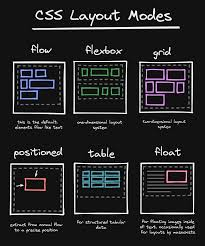

<div align=center>
  
</div>


| **Resultados de aprendizaje de la unidad didáctica:** |
|-|
| **RA. 2:** Crea interfaces web homogéneos definiendo y aplicando estilos.|

|**Criterios de evaluación de la unidad didáctica:**|
|-|
| **CE. g&#41;** Se han creado clases de estilos.|


<br>

| **Licencia Creative Commons:** ||
| - | - |
|  | **Reconocimiento-NoComercial-CompartirIgual CC BY-NC-SA:** No se permite un uso comercial de la obra original ni de las posibles obras derivadas, la distribución de la cuales se debe hace con una licencia igual a la que regula la obra original. |
---

# 1. Introducción
En el desarrollo web moderno, garantizar una experiencia de usuario óptima en una amplia variedad de **dispositivos** es esencial. Para lograrlo, se emplean dos enfoques principales: **diseño responsive** y **diseño adaptativo**. 
 

El **diseño responsive** (o diseño responsivo) se basa en el uso de **CSS flexible** para que una misma estructura de página se adapte dinámicamente al tamaño de pantalla del usuario. Utiliza técnicas como **media queries, flexbox y grid** para reorganizar y escalar los elementos de la interfaz sin necesidad de versiones específicas para cada dispositivo.  

Por otro lado, el **diseño adaptativo** se fundamenta en la creación de **varias versiones predefinidas de la misma página**, cada una diseñada para un rango de tamaños de pantalla específicos. En lugar de reajustarse de manera continua, el diseño adaptativo carga una versión distinta según el tipo de dispositivo detectado, lo que puede ofrecer mayor control sobre la apariencia en distintos contextos.  

Ambos enfoques tienen sus ventajas y desventajas. Mientras que el diseño responsive ofrece mayor **flexibilidad y mantenimiento más sencillo**, el diseño adaptativo permite un **mayor control sobre la experiencia de usuario en cada dispositivo**. La elección entre uno u otro dependerá de factores como el tipo de contenido, el público objetivo y los recursos disponibles para el desarrollo.

# 2. Responsive design
## 2.1. - Pros del diseño responsive  
- Elimina la necesidad de desarrollar diferentes diseños para cada dispositivo de visualización.   
- Los sitios web responsivos redimensionan imágenes, contenido, formas y botones para maximizar el espacio en pantalla. Esto hace que el contenido sea fácil de visualizar, que las imágenes se ajusten al tamaño de la pantalla y que los botones sean fácilmente seleccionables.  
- Un diseño responsive se adapta fácilmente a los estándares web modernos.  
- En un diseño responsive facilita el mantenimiento al solo existir una versión del sitio web.   
- Mejora **SEO** del sitio web, ya que los motores de búsqueda no necesitan rastrear versiones separadas para dispositivos móviles y escritorio.  

## 2.2. - Contras del diseño responsive  
- Las páginas web responsivas pueden tardar más en cargarse (lo que penaliza el **SEO**).  
- Dado que el sitio **se organiza verticalmente** para ajustarse al espacio reducido de la pantalla, el usuario puede pasar por alto elementos esenciales de la página debido al **scrolling excesivo**.

# 3. Adaptative design
## 3.1. - Pros del diseño adaptativo
- **Carga de página más rápida**. Los contenidos se ajustan para mostrar solo las características necesarias para cada dispositivo y optimizar todo el contenido según el tamaño y la resolución de la pantalla.  
- **Interfaz optimizada para cada tamaño de dispositivo**. El diseño adaptativo permite **personalizar el contenido y su distribución** para mejorar la experiencia de usuario. Esto permite mostrar un diseño específico para cada tipo de dispositivo, a diferencia del diseño responsive, donde se mantiene el mismo diseño para todos.  
- **Mejor experiencia para una audiencia más amplia**. No todos los usuarios tienen dispositivos modernos capaces de ejecutar o interpretar el código complejo y las propiedades CSS avanzadas de un diseño responsive, lo que puede afectar negativamente la experiencia de usuario.   

## 3.2. - Contras del diseño adaptativo  
- **Mayor esfuerzo de desarrollo**. El diseño adaptativo implica **trabajo repetitivo** ya que implica, tantos diseños como dispositivos.  
- **Requiere desarrolladores especializados** al necesitar un buen conocimiento de los distintos dispositivos. 

# 4. Grid y flexbox en el diseño responsive y adaptativo  
En el desarrollo web moderno, **CSS Grid** y **Flexbox** son herramientas fundamentales para la creación de diseños responsivos y adaptativos. Ambos modelos de diseño en CSS facilitan la disposición de los elementos en una página web, permitiendo que la interfaz se ajuste dinámicamente a distintos dispositivos y resoluciones de pantalla.  

El **diseño responsive**, que busca una adaptación fluida de la interfaz sin necesidad de versiones específicas, se beneficia enormemente de **Flexbox y Grid**. **Flexbox** es ideal para la alineación y distribución de elementos en una sola dimensión (filas o columnas), mientras que **Grid** permite diseñar estructuras más complejas en dos dimensiones, proporcionando un control avanzado sobre el espaciado y la distribución de los componentes. Gracias a estas herramientas, los elementos pueden reorganizarse automáticamente según el tamaño del viewport, sin necesidad de cambios manuales.  

Por otro lado, el **diseño adaptativo**, que se basa en versiones predefinidas de la misma página según el dispositivo, también puede aprovechar **Flexbox y Grid** para ajustar los elementos de cada diseño específico. En este enfoque, Grid facilita la creación de layouts personalizados para cada versión de la página, mientras que Flexbox permite una distribución eficiente dentro de cada sección de la interfaz.  

Para hacer que estos diseños sean verdaderamente efectivos, es necesario complementar Grid y Flexbox con **puntos de quiebre** y **media queries**.  


# 5. Puntos de quiebre.

## 5.1. - Introducción
Los **puntos de quiebre** o **breakpoints** en CSS son valores predefinidos de ancho de pantalla que determinan cuándo aplicar estilos específicos para optimizar el diseño de una página en distintos dispositivos. Se utilizan en conjunto con **media queries** para modificar la disposición de los elementos y mejorar la experiencia del usuario según el tamaño de la pantalla.

## 5.2. - Funcionamiento de los breakpoints  
Cuando el viewport de un dispositivo alcanza un determinado **ancho mínimo o máximo**, los estilos definidos en la media query correspondiente entran en acción. Esto permite, por ejemplo, cambiar la estructura de un diseño **de una columna en móvil a varias columnas en pantallas más grandes** o ajustar el tamaño de los elementos para mejorar la legibilidad.  

### 5.3. - Breakpoints más utilizados 
Si bien los valores exactos pueden variar según el proyecto, los siguientes breakpoints suelen ser muy comunes al estar basados en tamaños estándar de dispositivos:  

| Dispositivo         | Ancho Aproximado |
|---------------------|-----------------|
| Móviles pequeños   | 320px - 480px    |
| Teléfonos grandes  | 481px - 767px    |
| Tabletas          | 768px - 1023px   |
| Escritorios       | 1024px - 1279px  |
| Pantallas grandes  | 1280px en adelante |

### 5.4. - Breakpoints según diversos frameworks CSS 
>**Bootstrap**  

| **Breakpoint** | **Resolución** | **Clase** |
|---------------------|-----------------|-|
| **Extra small**   | <576px | - |
| **Small** | ≥576px | sm |
| **Medium** | ≥768px | md |
| **Large** | ≥992px | lg |
| **Extra large** | ≥1200px | xl |
| **Extra extra large** | ≥1400px | xxl |

>**Foundation**  

| **Breakpoint** | **Resolución** | **Clase** |
|---------------------|-----------------|-|
| **Small** | <640px | sm |
| **Medium** | ≥640px | md |
| **Large** | ≥1024px | lg |
| **Extra large** | ≥1200px | xl |
| **Extra extra large** | ≥1440px | xxl |

>**Bulma**  

| **Breakpoint** | **Resolución** |
|---------------------|-----------------|
| **mobile** | <768px |
| **tablet** | ≥769px |
| **desktop** | ≥1024px |
| **widescreen** | ≥1216px |
| **fullhd** | ≥1408px |

# 6. Media queries  
## 6.1. - Introducción
Las **media queries** permiten aplicar estilos diferentes según el tamaño del dispositivo o las características de la pantalla. Gracias a ellas, se pueden definir puntos de quiebre (**breakpoints**) que ajustan el diseño de la página para mejorar la experiencia del usuario en distintos dispositivos. En combinación con **Grid y Flexbox**, las media queries permiten crear **layouts flexibles y adaptativos**, asegurando que la interfaz se vea bien en cualquier pantalla, desde móviles hasta monitores de gran tamaño.

## 6.2. - Regla @media
La regla de consulta de medios `@media` (*media query*) permite aplicar estilos específicos en función de las características del dispositivo o la ventana del navegador.

>**Sintaxis**  

| **Regla** |	**Descripción** |
| - | - |
| **@media (condición)**	| Si se cumple la condición, se aplican los estilos de su interior. |
| **@media not (condición)** |	Si no se cumple la condición, se aplican los estilos de su interior. |
| **@media only (condición)**	| Si se cumple la condición y es un navegador moderno, se aplican los estilos. |
| **@media (condición) and (condición)** |	Si se cumplen ambas condiciones, se aplican los estilos. |
| **@media (condición) , (condición)** |	Si se cumple alguna de las condiciones, se aplican los estilos. |

>**Ejemplo:**
```css
body {
  background-color: white;
}

@media (max-width: 600px) {
  body {
    background-color: lightgray;
  }
}
```
En este caso, el fondo del `body` será blanco en pantallas grandes, pero cambiará a gris claro cuando el ancho de la pantalla sea menor o igual a 600 píxeles.

## 6.3. - Tipos de consultas de medios más comunes
:one: **Ancho y alto de la pantalla**
   - `max-width`: Aplica los estilos si la pantalla tiene un ancho **máximo** especificado.
   - `min-width`: Aplica los estilos si la pantalla tiene un ancho **mínimo** especificado.
   - `max-height` / `min-height`: Funcionan igual, pero con la altura de la pantalla.

   ```css
   @media (min-width: 768px) {
     body {
       font-size: 18px;
     }
   }
   ```

:two: **Orientación de la pantalla**
   - `orientation: portrait`: Aplica estilos cuando el dispositivo está en modo vertical.
   - `orientation: landscape`: Aplica estilos cuando el dispositivo está en modo horizontal.

   ```css
   @media (orientation: landscape) {
     body {
       background-color: lightblue;
     }
   }
   ```

:three: **Resolución de pantalla**
   - `min-resolution` y `max-resolution` permiten aplicar estilos dependiendo de la resolución en `dpi` o `dppx`.
   ```css
   @media (min-resolution: 300dpi) {
     img {
       width: 200px;
       height: auto;
     }
   }
   ```

:four: **Detectar modo oscuro del sistema**
   ```css
   @media (prefers-color-scheme: dark) {
     body {
       background-color: black;
       color: white;
     }
   }
   ```
:five: **Combinar múltiples condiciones**
- **AND (`and`)** → Ambas condiciones deben cumplirse.
- **OR (`,`)** → Cualquiera de las condiciones se cumple.
- **NOT (`not`)** → Se usa para negar las condiciones.


```css
@media (min-width: 600px) and (max-width: 1200px) {
  body {
    background-color: yellow;
  }
}
```


```css
@media (max-width: 600px), (orientation: portrait) {
  body {
    font-size: 14px;
  }
}
```

## 6.4. - Usos poco frecuentes
Es posible encontrarse con reglas `@media` dentro de una etiqueta `<style>` o en atributos de `<link>`:
```html
<link rel="stylesheet" href="estilos.css" media="screen and (max-width: 768px)">
```

# 7. - Tarea RA2-CEg-4