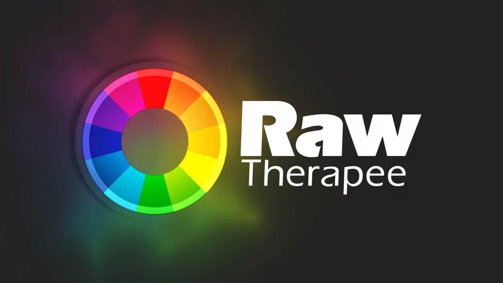
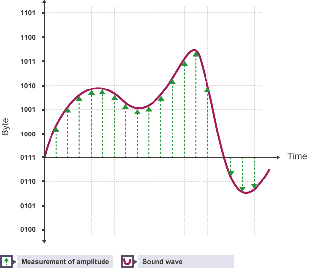
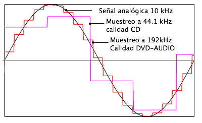

# 1. Introducción
La gran popularidad de internet reside en el uso de contenidos multimedia, como imagenes, audios y videos. De hecho, se ha demostrado que estos contribuyen ampliamente a mejorar la experiencia del usuario (UX).  

No obstante, el uso o abuso de contenidos multimedia en una página web puede presentar diversos problemas como, por ejemplo, ralentizar la carga de la misma, presentar problemas de compatibilidad, etc. Por ese motivo es importante identificar correctamente los formatos adecuados para optimizar la carga, calidad y compatibilidad entre diferentes navegadores y dispositivos.

# 2. Formatos de Imagen
En las interfaces web, las imágenes son un componente visual clave. Disponemos de muchos formatos, cada uno tiene sus propias características en términos de calidad, vistosidad y tamaño.  

Este apartado se dividirá entre las imágenes rasterizadas y las imagenes vectoriales. 
-  Los **formatos de imagen rasterizados** (JPEG, PNG, WebP, ...) están compuestos por una matriz de píxeles, donde cada píxel tiene un color específico. Son ideales para fotografías y gráficos complejos con muchos detalles, pero pierden calidad cuando se amplían, ya que la resolución es fija.  

      

       
-  Los **formatos de imagen vectoriales** (SVG) están formados por fórmulas matemáticas que definen formas, líneas y colores. **Son escalables sin pérdida de calidad**, lo que los hace perfectos para logotipos, iconos y gráficos simples.

    

## 2.1. - Formatos de imagenes rasterizadas
### 2.1.1. - Formato de imagen JPG y JPEG  
  

El formato JPEG (Joint Photographic Experts Group) es un formato de imagen muy común debido a su eficiencia en la compresión de imágenes fotográficas. Utiliza compresión **con pérdida**, al reducir el tamaño del archivo eliminando información de la imagen que el ojo humano no puede percibir fácilmente. 
  
>**Casos típicos de uso de imágenes en formato JPG JPEG:**
  
- **Imágenes de contenido:** Ya sea para el blog, páginas web o nuestras redes sociales.

- **Imágenes de producto:** Siempre que los mismos **no requieran de fondo transparente**.

- **Imágenes de fondo:** Al permitir una buena optimización su uso es típico en fondos y efectos decorativos.  
---

### 2.1.2. - Formato de imagen PNG  
  

El formato PNG (Portable Network Graphics) destaca por la posibilidad de comprimir imágenes **sin pérdidas** y de ofrecer una profundidad de color de hasta 24 bits por píxel. Con el formato PNG **no se pueden generar animaciones**.    

El formato PNG soporta tanto la transparencia como la semitransparencia (gracias al canal alfa integrado).    

Los mecanismos de corrección del color y del brillo garantizan que los archivos de imagen en formato PNG tengan más o menos la misma apariencia en los diferentes sistemas.    

A causa del proceso de compresión sin pérdidas, los archivos son relativamente grandes, de modo que el formato no resulta tan adecuado para la presentación de fotografías.    
  
>**Casos típicos de uso de imágenes en formato PNG:**  
  
- **Almacenamiento y publicación** de imágenes y gráficos pequeños (logotipos, iconos, barras, etc.).
   
- **Gráficos con transparencia.**
   
- **Fotos sin pérdidas.**
---   
### 2.1.3. - Formato de imagen BMP  
  
  
El formato BMP (Windows bitmap), inicialmente desarrollado para **sistemas operativos Microsoft e IBM** es un formato de almacenamiento para mapas de bits con una profundidad de color de hasta 24 bits por píxel.  

El formato de imagen **sin comprimir** asigna a cada píxel un valor cromático, por lo que los archivos suelen ser muy grandes, motivo por el que el formato **no es adecuado** para su uso en páginas web.

>**Casos típicos de uso de imágenes en formato BMP:** 
- Almacenamiento de fotos/gráficos en el ámbito offline. 
---

### 2.1.4. - Formato de imagen GIF  
  

El formato GIF (Graphics Interchange Format) es una trama que utiliza la compresión sin pérdidas de calidad para imágenes de hasta 256 colores.  

Por ese motivo, con imágenes con más de 256 colores, la imagen debe adaptarse (reducire la cantidad de colores), lo que produce una consecuente pérdida de calidad.  

Su limitación de 8 bits hace que el tamaño del archivo sea pequeño, lo que le ideal para crear contenidos **de animación** cortos y atractivos.  

A pesar de su limitada calidad de imagen, mucha gente utiliza el GIF porque permite ofrecer un contenido visual más elaborado que una imagen estática.

>**Casos típicos de uso de imágenes en formato GIF:**  
  
- **Animaciones simples.**
   
- **Indicadores de carga.**
   
- **Memes y reacciones.**
---

### 2.1.5. - Formato de imagen HEIF  
  

El formato HEIF (High Efficiency Image Format) no es ampliamente utilizado en la web, aunque tiene potencial debido a su eficiencia en la compresión de imágenes (mayor calidad y menor tamaño que JPEG).  

HEIF es más común en dispositivos móviles, especialmente en productos de Apple, donde se usa por defecto para capturar fotos.

El formato HEIF aún no ha sido adoptado como un estándar en la web porque presenta una **compatibilidad limitada** con algunos navegadores y sobre todo porque existen **alternativas más populares** como el formato **WebP**.  
  
---   

### 2.1.6 - Formato de imagen WebP  
  

El formato WEBP es una alternativa relativamente nueva para imágenes en la web y fue desarrollada por Google. Este formato utiliza **una combinación de compresión sin pérdida y con pérdida** para lograr tamaños de archivo más pequeños que los formatos de imagen anteriores.  

El formato WEBP es compatible con transparencia y es compatible con imágenes animadas, lo que lo hace ideal para banners o publicidad en línea.  

Otra característica del formato WEBP es que puede mostrar una imagen progresivamente, lo que puede mejorar significativamente el tiempo de carga de la página web y mejorar la experiencia del usuario.  

Como **principal inconveniente** el formato WEBP no es compatible con todos los navegadores web y plataformas de redes sociales.

---

## 2.2. - Formatos de imagenes vectoriales
### 2.2.1. - Formato SVG
  

El formato SVG (Scalable Vector Graphics) es un formato de imagen vectorial basado en XML que soporta transparencia y animaciones. Esto permite que las imágenes sean escalables sin perder calidad haciendolas ideales para gráficos e iconos de alta calidad en diferentes tamaños y resoluciones.

>**Casos típicos de uso de imágenes en formato SVG:**  
  
- **Logotipos y marcas.**
   
- **Iconos y elementos gráficos.** (botones, ...)
   
- **Animaciones.** Los SVG permiten animaciones interactivas utilizando CSS o JavaScript.

---

### 2.2.2 - Formato EPS
  

El formato EPS (Encapsulated PostScript) se utiliza para guardar ilustraciones o trabajos de diseño gráfico en programas de ilustración como Adobe Illustrator y CorelDraw.  

Utilizado principalmente en gráficos profesionales es útil para crear imágenes de alta calidad. 

Aunque se pueda encontrar, no es muy común en la web y generalmente se convierte a SVG o PNG para su visualización.

---

### 2.2.3 - Formato PDF
  

El formato PDF (Portable Document Format) es muy familiar como formato de documento, pero también puede utilizarse para guardar imágenes e ilustraciones.  

Un archivo PDF se basa en el mismo lenguaje PostScript que el EPS. Es un vector con compresión sin pérdidas, lo que te permite ampliar una imagen PDF tanto como un desea.

También es la mejor opción para los informes visuales interactivos o las infografías, ya que es indexable y tiene texto que se puede buscar.  

También es posible incluir elementos interactivos en un PDF, por ejemplo, enlaces y botones CTA.

---
## 2.3 - Tabla resumen / comprativa de los 4 formatos de imágenes más populares.

| Característica         | JPG                                     | PNG                                                         | GIF                      | SVG                                          |
|------------------------|-----------------------------------------|--------------------------------------------------------------|--------------------------|----------------------------------------------|
| **Esquemas de color**   | RGB, escala de grises, CMYK             | RGB, escala de grises, colores indexados                     | Colores indexados         | RGB, nombres de color de SVG                 |
| **Número de colores**   | Hasta 16,7 mill.                        | Hasta 18 trillones                                           | Hasta 256                 | Hasta 16,7 mill.                             |
| **Canales de color**    | Tres                                    | Tres (más un canal alfa)                                     | Uno                      | Tres (más un canal alfa)                     |
| **Profundidad de bits** | 8 bits por canal                        | 1-16 bits por canal                                          | 1-8 bits                 | 8 bits por canal                             |
| **Compresión**          | Alta, con pérdidas                      | Alta, sin pérdidas                                           | Escasa                    | Ninguna                                      |
| **Tamaño de archivos**  | Muy pequeño                             | Pequeño                                                      | Grande                    | Individual                                   |
| **Animaciones**         | No                                      | No                                                           | Sí                        | Sí                                           |
| **Adecuado para**       | Fotos                                   | Imágenes y gráficos de pequeña envergadura (ej: logotipos), fotos sin pérdidas | Animaciones               | Todo tipo de gráficos (logotipos, iconos, diagramas, etc.) |

## 2.4 - Herramientas de edición de imagenes gratuitas
  
**GIMP** (GNU Image Manipulation Program) es una de las alternativas gratuitas más poderosas y completas a editores depago como Adobe Photoshop. Ofrece herramientas avanzadas de edición y diseño de imágenes.  

---   

  
**Inkscape** es principalmente **un editor de gráficos vectoriales**, pero también permite trabajar con imágenes rasterizadas.

---
   

**RawTherapee** está diseñado para la **edición de imágenes RAW** con un enfoque en la corrección de color y el procesamiento de alta calidad.

---
  

**Photopea** es una herramienta de edición de imágenes **online** que se asemeja a Adobe Photoshop.  

# 3. Formatos de Audio
El audio en las interfaces web se utiliza principalmente en contenido multimedia, como videos o podcasts. Los formatos deben ofrecer un equilibrio entre calidad y tamaño de archivo.  
Existen muchos tipos de formatos de audio (mp3, wav, ogg, mp4…). Los que más se utilizan en la web son los formatos mp3 y ogg.
## 3.1. - Definiciones
### 3.1.1. - Señales audibles por el oído humano.
El oído humano puede percibir frecuencias en un rango aproximado de **20 Hz a 20 kHz** (20.000 Hz), aunque esta capacidad varía con la edad y otros factores:  

- **Frecuencias bajas (20 Hz - 250 Hz)** → Son los **graves**, percibidos más como vibraciones que como sonido.  
- **Frecuencias medias (250 Hz - 4 kHz)** → Contienen la mayor parte de los sonidos del habla humana.  
- **Frecuencias altas (4 kHz - 20 kHz)** → Son los **agudos**, como el canto de los pájaros o sonidos metálicos.  

>**Factores que afectan la audición**  
- Con la edad, la sensibilidad a las frecuencias altas disminuye, especialmente por encima de **15 kHz**.  
- La exposición prolongada a ruidos fuertes puede reducir la percepción de ciertas frecuencias.  

### 3.1.2. - Canales de audio
- :arrow_forward: **Mono (Monofónico)**: El audio se reproduce a través de un solo canal. Se usa en radios AM, llamadas telefónicas y algunas grabaciones de voz.  

- :arrow_forward: **Estéreo (Estereofónico)**: Utiliza dos canales (izquierdo y derecho), creando una sensación de espacialidad y dirección del sonido. Es el formato más común en música, películas y videojuegos.  

- **2.1**: Es un sistema estéreo con un subwoofer adicional para frecuencias bajas, mejorando los graves.  

- **5.1**: Configuración de sonido envolvente con seis canales: frontal izquierdo/derecho, central, trasero izquierdo/derecho y un subwoofer. Se usa en cine en casa y videojuegos.  

- **7.1**: Similar al 5.1, pero con dos canales adicionales para mayor inmersión sonora, utilizado en cines y sistemas avanzados de sonido.  

- **Dolby Atmos / DTS:X**: Formatos de audio tridimensionales que posicionan sonidos en un espacio virtual, creando una experiencia más realista en cines y sistemas de sonido avanzados.  

### 3.1.3. - Digitalización de la señal de audio
Toda fuente La digitalización y tratamiento del audio digital que podemos realizar utilizando programas de software se divide en dos etapas:
   
:one: Muestrear (o discretizar) **la señal analógica** a intervalos regulares.    
:two: Asignarle a esas muestras **un valor binario** para crear una **señal digital**.

 

### 3.1.4. - Frecuencia de muestreo
La frecuencia de muestreo es el número de veces por segundo que se toma una muestra de una señal analógica para convertirla en digital. Se mide en hercios (Hz) o muestras por segundo.
  

>**Frecuencias de muestreo comunes:**  

Algunos valores estándar de frecuencia de muestreo en audio digital son:  
    8 kHz → Usado en telefonía (voz humana).  
    :arrow_forward: **22.05 kHz** → Se usa en efectos de sonido ligeros o clips de audio en aplicaciones web para reducir el peso de los archivos.  
    :arrow_forward: **44.1 kHz** → Estándar en la mayoría de archivos de audio en la web, ya que es la misma frecuencia de muestreo de los CDs de audio. Se usa en música en streaming, podcasts y efectos de sonido. 
    :arrow_forward: **48 kHz** → Común en videos y plataformas multimedia como YouTube y Vimeo, ya que es el estándar en producción de video.  
    96 kHz - 192 kHz → Usado en grabaciones de alta fidelidad y estudios de audio.  

 

>**Efectos de la frecuencia de muestreo:**
- **Frecuencia baja** → Puede generar aliasing, un efecto que distorsiona la señal original.
- **Frecuencia alta** → Aumenta la calidad, pero también el tamaño del archivo y la demanda de procesamiento.

### 3.1.6. - Resolución 
La **resolución en audio digital** es la **cantidad de bits usados para representar cada muestra de la señal analógica**. Se mide en **bits por muestra** (bit depth) y determina la **precisión y rango dinámico** del sonido digital.  

> **Valores típicos de resolución**  
- :arrow_forward: **8 bits** → Calidad baja, con un rango dinámico de **48 dB** (usado en telefonía y sonidos básicos).  
- :arrow_forward: **16 bits** → Estándar en CDs de audio, con un rango dinámico de **96 dB**.  
- **24 bits** → Usado en estudios profesionales y audio de alta fidelidad, con **144 dB** de rango dinámico.  
- **32 bits flotantes** → Calidad extrema, usada en producción profesional y aplicaciones especializadas.  

> **Efecto de la Resolución en el Audio**  
- **Mayor resolución (más bits)** → Más precisión en la representación del sonido, menor ruido de cuantización y mejor fidelidad.  
- **Menor resolución (menos bits)** → Más distorsión y ruido, menor calidad.  

En combinación con la **frecuencia de muestreo**, la resolución define la calidad final del audio digital.

### 3.1.7. - Bitrate, calidad de emisión
El **bitrate** es la cantidad de datos procesados por segundo en una señal de audio. Se mide en **kilobits por segundo (kbps)** y determina la calidad del sonido y el tamaño del archivo.  

>**Cálculo del Bitrate**  
El bitrate se calcula con la fórmula:  

**Bitrate** = **Frecuencia de muestreo** * **Resolución (bits por muestra)** * **N° de canales**

Por ejemplo, para un archivo de **CD de audio** (44.1 kHz, 16 bits, estéreo):  
44.100 * 16 * 2 = 1.411.200bps = 1411 kbps

>**Tipos de Bitrate en Audio**  

:one: **Bitrate constante (CBR - Constant Bit Rate)**  
   - Usa el mismo bitrate en todo el archivo.  
   - Mayor previsibilidad en el tamaño del archivo.     

:two: **Bitrate variable (VBR - Variable Bit Rate)**  
   - Ajusta el bitrate según la complejidad del audio.  
   - Mejora la calidad en momentos de alta demanda y reduce el tamaño en partes simples.  
   - Se usa en formatos como MP3 VBR o AAC para optimizar calidad y peso.  

:three: **Bitrate adaptativo (ABR - Average Bit Rate)**  
   - Mezcla de CBR y VBR: mantiene un bitrate promedio, pero ajusta en momentos clave.  
   - Se usa en streaming, como en Spotify o YouTube Music.  

>**Bitrate y Calidad del Audio**  
- :arrow_forward: **96 kbps o menos** → Baja calidad, suficiente para voz o radio online.  
- :arrow_forward: **128 kbps - 192 kbps** → Calidad aceptable en MP3, común en música en streaming.  
- **256 kbps - 320 kbps** → Alta calidad en formatos comprimidos como MP3/AAC.  
- **1411 kbps (CD Audio, WAV, FLAC)** → Calidad sin pérdidas, fiel al original.  
- **Más de 2000 kbps (Hi-Res Audio, 24 bits/96 kHz o más)** → Audio profesional y audiófilo.  

>**Ejemplos de pesos de archivos en función del bitrate**

| BIT Depth|	Sample Rate|	Bit Rate|	Tamaño de archivo para un minuto de música en estéreo	|Tamaño del fichero para 3 minutos de música|  
|-|-|-|-|-|  
|16	|44,100	|1.35 Mbit/seg	|10.1 megabytes	| 30.3 megabytes|
|16	|48,000|	1.46 Mbit/seg	|11.0 megabytes	|33 megabytes|
|24	|96,000	|4.39 Mbit/seg	|33.0 megabytes|	99 megabytes|
|Fichero MP3|	128 k/bit rate	|0.13 Mbit/seg|	0.94 megabytes	|2.82 megabytes|

## 3.2. - Formatos de archivos
Los archivos de audio digital pueden clasificarse según su compresión y calidad en tres tipos principales: sin compresión, con compresión sin pérdida y con compresión con pérdida.  
Los formatos habitualmente utilizados para la reproducción de audio son los **con compresión con perdida**, siendo el formato de compresión descompresión (CODEC) **MP3** (CODEC: **CO**mpressor- **DEC**ompressor) uno de los más populares. 

### 3.2.1. - Formato MP3
  

El formato MP3 (MPEG 1 Layer 3) fue creado por el Instituto Fraunhofer. Su extraordinario grado de compresión y alta calidad lo ha convertido en el candidato ideal para publicar audios en la web.
  - **Ventajas**: Alta compatibilidad, buena compresión con pérdida aceptable.  
  - **Desventajas**: Calidad limitada en tasas de bits bajas.
  - **Usos**: Música, podcasts, efectos de sonido.  

### 3.2.2. - Formato OGG

Desarrollado por la fundación Xiph.org, es libre y de código abierto (a diferencia del formato MP3). 
  - **Ventajas**: Libre de patentes, buena calidad y compresión.
  - **Desventajas**: Menor soporte en algunos navegadores comparado con MP3.
  - **Usos**: Alternativa a MP3 en navegadores que lo soporten.

### 3.2.3. - Formato WAV

El formato WAV (WaveForm Audio File) es un archivo que desarrolló originalmente Microsoft para guardar audio.
  - **Ventajas**: Sin pérdida de calidad, alta fidelidad.
  - **Desventajas**: Tamaño de archivo muy grande.
  - **Usos**: Audio de alta calidad, efectos de sonido breves.

## 3.3. - Herramientas de edición de audio gratuitas
  

**Audacity** es una de las herramientas de edición de audio más populares y completas.   
- **Características**: Grabación y edición multipista, efectos de audio, soporte para varios formatos (MP3, WAV, OGG, FLAC), eliminación de ruido.
---

**Ocenaudio** es una alternativa más ligera y fácil de usar que Audacity, ideal para ediciones rápidas y sencillas.
- **Características**: Edición en tiempo real, soporte para efectos VST, análisis espectral, y soporte para múltiples formatos.
---   

**Radium** es un software de edición y composición de audio principalmente para Mac. Tiene una propuesta diferente en cuanto a la organización de su interfaz, lo que puede ser un poco desconcertante al principio.

# 4. Formatos de Video  
El video es otro recurso de las interfaces web, pero su uso intensivo de datos requiere formatos que ofrezcan buena compresión sin sacrificar demasiada calidad.
Existen diversos formatos de video (MP4, WebM, AVI, MKV, MOV…), pero los más utilizados en la web son los formatos MP4 y WebM debido a su amplia compatibilidad y buen rendimiento.

## 4.1. - Componentes de un archivo de video
Un archivo de video digital está compuesto principalmente por los siguientes componentes:  

- **Video:** Contiene las imágenes en movimiento que conforman el video.  
- **Audio:** Acompaña al video proporcionando sonido.
- **Subtítulos:** Texto que se sobrepone a la imagen. Aportan información adicional sobre los contenidos, traducen si son extranjeros o simplemente replican los diálogos para facilitar la accesibilidad a personas con dificultades auditivas.   

Cada uno de estos componentes se codifica por separado utilizando diferentes códecs, como H.264 para video y AAC para audio.

##  4.2. - Resolución de video
La **resolución de video** es la cantidad de píxeles que componen cada fotograma del video, lo que afecta directamente a la calidad visual. Las resoluciones comunes incluyen:

- :arrow_forward: **480p (SD)**: Definición estándar, utilizada en televisores antiguos o conexiones lentas.  
- :arrow_forward: **720p (HD)**: Alta definición, ideal para video en línea y dispositivos móviles.  
- **1080p (Full HD)**: Full High Definition, ampliamente utilizado en plataformas de streaming y Blu-Ray.  
- **1440p (2K)**: Resolución de mayor calidad, utilizada en producción profesional.  
- **2160p (4K)**: Ultra Alta Definición, ideal para pantallas grandes y producción cinematográfica.  
- **4320p (8K)**: Resolución de altísima definición, utilizada en producción de cine de última generación.

## 4.3. -  Frame rate o fotogramas por segundo (FPS)
El **frame rate** se refiere a la cantidad de imágenes (fotogramas) que se muestran por segundo. Los FPS más comunes son:

- **24 fps**: Usado en cine, proporciona un movimiento natural.  
- **30 fps**: Común en televisión y videos en línea.  
- **60 fps**: Proporciona una experiencia fluida, ideal para videojuegos y transmisiones deportivas.

## 4.4. - Códecs de Video
El **códec** es el software encargado de comprimir y descomprimir el archivo de video. Algunos códecs populares incluyen:

- **H.264**: Códec más utilizado para video en la web, ofrece buena calidad y compresión.  
- **H.265 (HEVC)**: Códec más eficiente que H.264, ideal para 4K y videos de alta calidad, aunque no tan compatible en todos los dispositivos.  
- **VP8 / VP9**: Códecs de Google utilizados en plataformas como YouTube, con buena eficiencia y calidad.  
- **AV1**: Códec emergente con una alta tasa de compresión, especialmente útil para video en 4K y superior.

## 4.5. - Formatos de los archivos de video
### 4.5.1 - MP4 (MPEG-4)

Es el formato más popular, compatible con casi todos los dispositivos y plataformas de streaming. Los videos que usan el contenedor .MP4 pueden tener tamaños de archivo relativamente pequeños mientras conservan una alta calidad.

- **Ventajas**: Alta compresión, buena calidad, muy compatible.
- **Desventajas**: Compresión con pérdida, lo que puede reducir la calidad en tasas de bits bajas.  
- **Usos**: Video en línea, plataformas de streaming, grabaciones en dispositivos móviles. 

### 4.5.2. - WebM

WebM es un formato multimedia abierto y libre desarrollado por Google y orientado para usarse con HTML5. 
- **Ventajas**: Libre de patentes, buena compresión, compatible con HTML5.
- **Desventajas**: Menor soporte que MP4 en algunos dispositivos.
- **Usos**: Videos optimizados para web, streaming.

### 4.5.3. - AVI (Audio Video Interleave)
  

Formato más antiguo, compatible en Windows pero con un mayor tamaño de archivo.   
- **Ventajas**: Alta calidad, sin pérdida de datos.  
- **Desventajas**: Archivos grandes y mayor demanda de almacenamiento y ancho de banda.  
- **Usos**: Videos de alta calidad en entornos controlados, como edición de video.

### 4.5.4. - Formato OGG

Ogg es un formato contenedor libre y abierto, desarrollado y mantenido por la Fundación Xiph.Org. Está diseñado para proporcionar una difusión de flujo eficiente y manipulación de multimedios digitales de alta calidad.
  - **Ventajas**: Libre de patentes, buena compresión.
  - **Desventajas**: Menor calidad comparada con mp4 o WebM.
  - **Usos**: Alternativa a mp4 o WebM en navegadores compatibles.

### 4.5.5. - Formato MKV
  

El **MKV** es un contenedor flexible que puede contener múltiples pistas de audio, subtítulos y capítulos.

- **Ventajas**: Sin pérdidas, flexible y soporta múltiples idiomas y subtítulos.  
- **Desventajas**: Menor compatibilidad con algunos dispositivos.  
- **Usos**: Video en alta calidad, almacenamiento de películas y series.

## 4.6. - Compresión de Video
La **compresión de video** reduce el tamaño del archivo eliminando información redundante o irrelevante. Existen dos tipos de compresión:

- **Compresión con pérdida**: Elimina datos que no afectan perceptiblemente la calidad (ej., MP4).  
- **Compresión sin pérdida**: Mantiene todos los datos originales, pero produce archivos mucho más grandes (ej., AVI sin compresión).

>**Efectos de la Compresión de Video**  
- **Compresión con pérdida** → Menor tamaño de archivo, pero puede haber una pérdida de calidad perceptible (pixelado).  
- **Compresión sin pérdida** → Alta calidad, pero tamaños de archivo muy grandes.

## 4.7. - Bitrate de Video
El **bitrate** en video determina la cantidad de datos utilizados para representar el video durante un período de tiempo. Se mide en **kilobits por segundo (kbps)** y afecta directamente a la calidad y tamaño del archivo.
edia. 

## 4.8. - Herramientas de edición de video gratuitas
  
**VSDC Free Video Editor** es un editor de video gratuito que ofrece una amplia gama de herramientas de edición para proyectos complejos, ideal para quienes buscan una opción robusta pero gratuita.
   - **Características**: Edición no lineal, efectos visuales, corrección de color, soporte para múltiples formatos de video, exportación en alta definición.
---    
  

**DaVinci Resolve** un editor de video profesional que ofrece herramientas avanzadas para edición, corrección de color, efectos visuales, y postproducción de audio.
   - **Características**: Edición no lineal, corrección de color avanzada, edición multipista, herramientas de postproducción de audio, efectos visuales.
---    
  
**Shotcut** es un editor de video gratuito y de código abierto que ofrece una interfaz fácil de usar y soporte para una amplia gama de formatos de video.
   - **Características**: Soporte para edición de video HD, filtros y efectos de video, línea de tiempo avanzada, soporte para múltiples formatos.
---   

**Kdenlive** es un editor de video de código abierto para Linux, aunque también está disponible para Windows y macOS. Es una de las mejores opciones gratuitas para usuarios de Linux.
   - **Características**: Edición multipista, efectos de video y transiciones, soporte para múltiples formatos de video y audio, integración con FFmpeg.
---
## 4.9 - Ejemplos de ediciones de video lineal y no lineales:

<a href="https://www.youtube.com/watch?v=63vqob-MljQ&list=PLuAMrIXhypV6rSk9RAS9hwF8VoMW3OVaE&index=2">Video lineal</a>  
<a href="https://www.youtube.com/watch?v=0P4A1K4lXDo">Video no lineal</a>

# 7 - Tarea:
Realizar breves comentarios sobre las herramientas elegidas. 