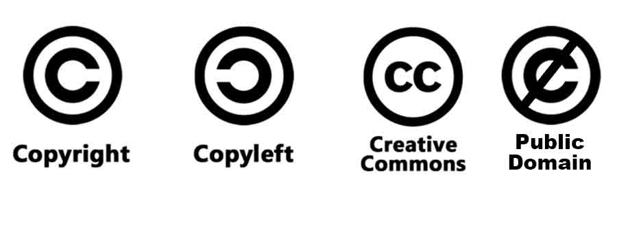

  

  

| **Resultados de aprendizaje de la unidad didáctica:** |
|-|
| **RA. 3:** Prepara archivos multimedia para la web, analizando sus características y manejando herramientas específicas.|

|**Criterios de evaluación de la unidad didáctica:**|
|-|
| **CE. a&#41;** Se han reconocido las implicaciones de las licencias y los derechos de autor en el uso de material multimedia.|

b) Se han identificado los formatos de imagen, audio y vídeo a utilizar.
c) Se han analizado las herramientas disponibles para generar contenido
multimedia.
d) Se han empleado herramientas para el tratamiento digital de la imagen.
e) Se han utilizado herramientas para manipular audio y vídeo.
f) Se han realizado animaciones a partir de imágenes fijas.
g) Se han importado y exportado imágenes, audio y vídeo en diversos
formatos según su finalidad.
h) Se ha aplicado la guía de estilo.

 

| **Licencia Creative Commons:** ||
| - | - |
|  | **Reconocimiento-NoComercial-CompartirIgual CC BY-NC-SA:** No se permite un uso comercial de la obra original ni de las posibles obras derivadas, la distribución de la cuales se debe hace con una licencia igual a la que regula la obra original. |
---

### 5.5.2 Tarea RA3-CEf-1  