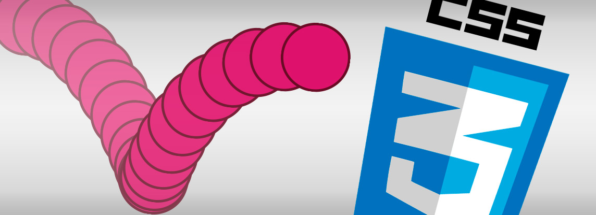

<div align=center>
  
</div>
<br> 

| **Resultados de aprendizaje de la unidad didáctica:** |
|-|
| **RA. 3:** Prepara archivos multimedia para la web, analizando sus características y manejando herramientas específicas.|

|**Criterios de evaluación de la unidad didáctica:**|
|-|
| **CE. f&#41;** Se han realizado animaciones a partir de imágenes fijas.|

<br>

| **Licencia Creative Commons:** ||
| - | - |
|  | **Reconocimiento-NoComercial-CompartirIgual CC BY-NC-SA:** No se permite un uso comercial de la obra original ni de las posibles obras derivadas, la distribución de la cuales se debe hace con una licencia igual a la que regula la obra original. |
---
# 1. Introducción

# 2. Animaciones
Una animación en CSS es una técnica que permite cambiar de manera gradual los estilos de un elemento HTML a lo largo del tiempo, creando un efecto visual dinámico. 

Los objetivos básicos de las animaciones son:   
1️⃣ **Mejorar la experiencia del usuario (UX)** generando una experiencia atractiva y fluida, incentivando al usuario a seguir explorando.  

2️⃣ **Atraer o guiar la atención del usuario**: Las animaciones permiten destacar elementos clave, guiando la atención del usuario hacia la información más relevante.  

3️⃣ **Proporcionar retroalimentación** facilitando la comprensión de las acciones realizadas, indicando si una acción fue exitosa o no. 

## 2.1. - Componentes de una animación
Las animaciones en CSS se definen con dos componentes principales:

1. Regla **@keyframes**:  
Define el comportamiento de la animación a lo largo de su duración. Especifica los estilos en diferentes momentos clave `@keyframes` de la animación (p.e. inicio y final).  
Para definir los `@keyframes`, se pueden usar porcentajes o palabras clave como `from` y `to`. 

>**Ejemplo de regla @keyframes con from y to:**

```css
@keyframes mover {
  from {
    transform: translateX(0);
  }
  to {
    transform: translateX(100px);
  }
}
```
  
>**Ejemplo de regla @keyframes con %:**

```css
@keyframes mover {
  0% {
    transform: translateX(0);
  }
  50% {
    transform: translateX(25px);
  }
  100% {
    transform: translateX(100px);
  }
}
```

2. **Propiedad `animation`**:  
Se aplica al elemento al que se le asigna la animación y permite configurar múltiples propiedades de animación en una sola declaración.   
La sintaxis de `animation` es la siguiente:

```CSS
animation: nombre duración función-de-tiempo retraso contador dirección estado mode-de-relleno;
```
**Dónde:**
- **nombre (animation-name):** Nombre de la animación definida por el desarrollador. Este nombre se puede reutilizar para más elementos que tengan la misma animación.  
- **duración (animation-duration):** Tiempo que dura una repetición de la animación. Se expresa en segundos (`s`) o milisegundos (`ms`).  
- **función-de-tiempo (animation-timing-function):** Define la aceleración que tendrá la animación a lo largo del tiempo. Los valores comunes incluyen `linear`, `ease`, `ease-in`, `ease-out`, `ease-in-out` y `cubic-bezier()`.  
- **retraso (animation-delay):** Intervalo de tiempo que pasa entre la carga de la página y el inicio de la animación.  
- **contador (animation-iteration-count):** Número de veces que se repite la animación (`1`, `2`, `infinite`, etc.).  
- **dirección (animation-direction):** Define la dirección en la que se reproduce la animación:  
  - `normal`: Se ejecuta desde el inicio hasta el final.  
  - `reverse`: Se ejecuta desde el final hasta el inicio.  
  - `alternate`: Alterna entre normal y reverse en cada repetición.  
  - `alternate-reverse`: Alterna entre reverse y normal en cada repetición.  
- **estado (animation-play-state):** Controla si la animación está en ejecución o pausada:  
  - `running`: La animación se reproduce normalmente.  
  - `paused`: La animación se detiene en el cuadro actual hasta que se reanude.
- **modo de relleno (animation-fill-mode):** Determina qué estilos son aplicados al elemento cuando la animación no se está ejecutando. Sus valores incluyen:  
  - `none`: No aplica ningún estilo fuera del tiempo de ejecución de la animación.  
  - `forwards`: Mantiene el estilo del último fotograma de la animación.  
  - `backwards`: Aplica el estilo del primer fotograma antes de que comience la animación.  
  - `both`: Combina `forwards` y `backwards`. 


>**Ejemplo de animación**  
```html
<!DOCTYPE html>
<html lang="es">
<head>
  <meta charset="UTF-8">
  <meta name="viewport" content="width=device-width, initial-scale=1.0">
  <title>Ejemplo de Animación</title>
  <style>
/* definicion de la animación */
    @keyframes mover {
      0% {
        transform: translateX(0);
      }
      100% {
        transform: translateX(200px);
      }
    }
/* fin definicion de la animación */

    .caja {
      width: 100px;
        height: 100px;
        background-color: coral;
        position: relative;
/* argumentos de la animación */
        animation: mover 2s ease-in-out infinite alternate;
/* fin argumentos de la animación */
        }
    </style>
</head>

<body>
    <div class="caja"></div>
</body>

</html>
```

- La animación `mover` cambia la posición horizontal del elemento (`translateX`).  
- Se aplica a `.caja` con `animation: mover 2s ease-in-out infinite alternate;`  
  - `mover`: Nombre de la animación.  
  - `2s`: Duración de cada repetición.  
  - `ease-in-out`: Suaviza el inicio y el final.  
  - `infinite`: La animación se repite indefinidamente.  
  - `alternate`: Alterna la dirección en cada iteración.  


Animaciones en CSS3
Transiciones en CSS3
Transformaciones en CSS3  


https://www.rafelsanso.com/animaciones-en-css3/

https://www.rafelsanso.com/transiciones-en-css3/

https://www.rafelsanso.com/transformaciones-en-css3/

https://lenguajecss.com/animaciones/


### 5.5.2 Tarea RA3-CEf-1  